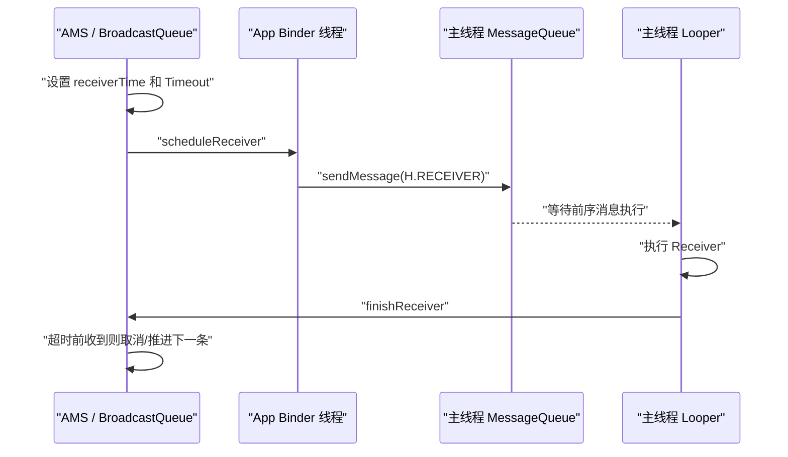

# 今日头条 ANR 优化实践第一篇总结：设计原理及影响因素

> 原文：`/Users/yanhao/Downloads/github-nots/notes/Clippings/Android ANR/第一篇：今日头条 ANR 优化实践系列 - 设计原理及影响因素.md`

## 读图情况

- 文档正文可完整读取。
- 文档共引用 24 张远程微信图片，已临时下载到 `/tmp/anr-doc-images/` 并逐张查看关键内容。
- 图片内容已纳入总结，尤其包括：ANR 超时阈值表、无序/有序广播源码截图、Broadcast 超时流程图、ANR dump 进程收集流程、SIGQUIT/SignalCatcher dump 流程、ANR Info 示例、主线程消息调度影响因素示意图。
- 本机没有 `tesseract` OCR 工具，因此细粒度代码截图未做机器 OCR；代码类图片主要按肉眼可读区域和正文上下文归纳。

## 一句话结论

ANR 不是“Trace 栈里当前正在执行的代码一定慢”，而是系统侧对组件/Input 的异步超时监控在截止时间前没有收到完成通知。真正原因可能发生在当前消息、历史消息、消息队列堆积、应用内部资源竞争，或系统/其他进程资源竞争中。因此技术方案不能只采集 ANR 时刻主线程堆栈，必须补齐“主线程调度历史 + 消息队列状态 + 系统资源环境 + 关键进程/线程状态”。

## ANR 设计本质

Android 将 ANR 设计为一种系统级 watchdog：

- 监控对象：Activity、Service、BroadcastReceiver、ContentProvider、InputEvent、Finalizer 等。
- 监控位置：AMS/Input 等系统服务端。
- 触发方式：系统向应用发送组件消息或输入事件时，在服务端设置异步超时；应用必须在超时前回调完成通知。
- 判定标准：服务端是否在超时前收到完成通知，而不是某个业务函数真实执行了多久。

这带来一个很重要的评审点：组件 ANR 的 `Reason` 指向的是“哪个系统事件未按时完成”，不是“哪个业务代码一定是根因”。

## 常见超时阈值

图片中的阈值表可以整理如下。厂商可能调整，因此方案设计里阈值应支持配置和按设备/系统版本差异化。

| 类型 | 典型超时 | 是否弹框 | 备注 |
| --- | --- | --- | --- |
| Activity | 10s | 提示 | Activity 切换时设置 Timeout |
| Broadcast | 10s / 60s | 无感知场景不会提示 | 前台广播通常 10s，后台广播通常 60s；厂商可能定制 |
| Service | 10s | 无感知场景不会提示 | 创建 Service 时设置 Timeout |
| Provider | 10s | 无感知场景不会提示 | 创建 Provider 时设置 Timeout |
| Input | 5s | 提示 | 厂商/平台可能调大，例如部分 MTK 调整至 8s |
| Finalizer | 10s | Crash | 厂商可能调整到 20s-120s |

## Broadcast 超时机制

文章用 BroadcastReceiver 解释 ANR 机制，核心差异是：

- 无序广播：系统搜集接收者后一次性并行发送，原文强调这类流程不设置逐个接收者等待完成的超时监听，应用侧何时接收和响应不是 AMS 串行等待的核心条件。
- 有序广播：系统逐个发送给接收者，记录 `receiverTime`，按 `receiverTime + timeoutPeriod` 设置超时，接收者完成后再调度下一个。原文重点讨论的是这一类有序广播的超时设计。

客户端侧流程：

1. AMS 通过 Binder 将广播发送给 App。
2. App Binder 线程收到后封装为主线程 `Message`。
3. `Message` 插入主线程 `MessageQueue`。
4. 主线程 Looper 调度 Receiver。
5. Receiver 执行完成后调用 `finishReceiver` 回调 AMS。
6. AMS 在超时前没收到完成通知，就触发 Broadcast ANR。

关键误区：Receiver 消息可能已经入队，但前面有历史慢消息或大量消息，导致 Receiver 根本还没执行；此时系统仍会认为该 Receiver 对应的广播超时。

## ANR Trace Dump 流程

发生 ANR 后，系统会搜集多类信息并写入 `data/anr/traces`、`dropbox` 等位置。流程要点：

- AMS/AppErrors 先过滤无效场景，例如进程已 ANR、正在 Crash、已被 AM kill、已死亡、系统正在关机等。
- 系统判断 ANR 是否用户可感知，后台静默 ANR 的 dump 范围可能不同。
- 优先收集 ANR 进程。
- 如果存在父进程，也会纳入。
- `system_server` 必须纳入。
- 还会收集关键系统进程、常驻进程、用户可感知进程、以及一段时间内 CPU 占用高的进程。
- dump 总耗时有上限，文中代码显示一次 dump 最多约 20s，超过后放弃后续进程，因此 trace 可能不完整。

系统为什么 dump 其他进程：ANR 很可能由跨进程 IPC 阻塞、系统服务卡顿、其他进程 CPU/IO 抢占导致。只看当前 App 不足以判断系统环境。

## SIGQUIT 与进程内 Trace

Trace 采集依赖进程协作：

1. 系统打开 trace 文件并设置追加模式。
2. 创建 socket/pipe 并设置超时监听。
3. 向目标进程发送 `SIGQUIT`。
4. 目标进程中的 `SignalCatcher` 收到信号。
5. ART/虚拟机遍历线程，标记 suspend，dump Java/Native 线程信息。
6. 写入系统指定 trace 文件。

这解释了两个现象：

- ANR dump 本身很重，复杂 App 一次 dump 可能耗时很长。
- ANR 期间经常看到 `system_server` CPU 占比高，不一定是根因，也可能是系统正在执行 dump 和 CPU 统计。

## 应用侧 ANR 判定方案

文章提到两类应用侧方案：

| 方案 | 思路 | 优点 | 风险/缺点 |
| --- | --- | --- | --- |
| 主线程 Watchdog | 定时向主线程投递探测消息，超时未执行则怀疑 ANR | 实现相对简单，可持续在线监控 | 只能判定“可能卡住”，需要结合系统 ANR 信息过滤误报 |
| 监听 `SIGQUIT` | 参考系统 trace 机制，在应用侧监听 ANR dump 信号并采集线程信息 | 更接近系统 ANR 时机，线程信息更完整 | 会覆盖虚拟机原有信号处理，需要适时恢复；dump 成本高，复杂 App 可超过 10s；还要考虑厂商兼容、稳定性和合规风险 |

应用侧还可通过 `ActivityManager.getProcessesInErrorState()` 获取 `ProcessErrorStateInfo`，判断 `NOT_RESPONDING`，并读取 `longMsg` 等 ANR 描述信息。图片中的 ANR Info 示例包含：

- `Reason`，例如 Input dispatching timed out。
- `Load`，系统负载。
- CPU 采样时间窗口。
- Top 进程 CPU 使用率。
- `kswapd`、`mmcqd` 等内核线程占用，辅助判断内存回收/IO 压力。
- 当前 App 的 user/kernel CPU 和 major/minor faults。

## 影响因素分类

文章将影响因素分为两大环境：

- 应用内部环境：主线程消息耗时、消息过多、内部线程资源竞争。
- 系统环境：系统或其他进程 CPU/IO/内存压力导致当前应用调度不及时。

更细的根因类型如下。

### 1. 当前消息严重耗时

ANR 发生时主线程正在执行的消息本身耗时很长。此类相对容易定位，Trace 当前栈更可能接近根因。

评审关注点：

- 当前主线程栈是否业务逻辑明显耗时。
- Wall time 和 CPU time 是否都高。
- 是否存在主线程 IO、锁等待、复杂计算、同步 IPC。

### 2. 历史单个消息严重耗时

真正耗时的是 ANR 前某个历史消息。该消息执行结束后，系统超时刚好在后续消息执行时触发，导致当前 Trace 栈“背锅”。

评审关注点：

- 必须采集 ANR 前一段时间主线程消息调度历史。
- 只看当前 Trace 会误归因。

### 3. 历史多个消息累计耗时

没有唯一超长消息，但多个消息连续偏慢，累计超过系统事件可等待窗口。治理上通常需要多个业务共同优化。

评审关注点：

- 需要按时间窗口聚合历史消息耗时。
- 需要支持“累计耗时归因”，不能只抓单点慢调用。

### 4. 高频重复消息导致队列堆积

单条消息不慢，但业务异常频繁向主线程发送消息，导致后续 Service/Receiver/Input 消息长期排队。

评审关注点：

- 需要统计 Message 类型、callback、target 的重复次数。
- 需要记录 pending queue 的位置、阻塞时长、队列长度。
- 需要识别业务线程与主线程高频交互。

### 5. 应用内部其他线程资源抢占

主线程代码本身不慢，但应用内部其他线程产生高 CPU、高 IO、内存抖动/频繁 GC，抢占系统资源，导致主线程 Wall time 高但 CPU time 低。

评审关注点：

- 必须采集进程内线程 CPU、IO、锁等待、GC、内存抖动。
- 关注 Wall duration 与 CPU duration 差值。
- 关注 DB、文件、图片解码、日志、后台任务等线程。

### 6. 系统或其他进程资源抢占

当前 App 只是受害者。系统整体负载高，或其他进程/内核线程占用 CPU/IO/内存回收资源，导致当前应用主线程调度迟缓。

评审关注点：

- 需要采集系统 load、Top CPU 进程、`kswapd`、`mmcqd`、`kworker` 等内核线程。
- 需要区分应用内根因与系统环境问题。
- 线上归因需要保留“外部资源竞争/系统异常”分类，避免强行甩给当前业务栈。

## 对技术方案的启发

后续 ANR 监控/治理方案至少应覆盖这些能力：

- ANR 事件基础信息：类型、Reason、组件名、进程名、前后台状态、系统版本、厂商、阈值配置。
- 主线程当前状态：当前 Message、当前栈、Wall duration、CPU duration、锁/IPC/IO 等阻塞点。
- 主线程历史调度：ANR 前 N 秒消息执行历史，支持单点慢、累计慢、高频重复消息识别。
- Pending 队列：队列长度、目标 ANR 消息位置、已阻塞时长、前序消息类型分布。
- 系统环境：Load、CPU user/sys/iowait、内存压力、IO 压力、Top 进程 CPU、关键内核线程。
- 进程内环境：线程级 CPU、IO、GC、锁竞争、后台任务。
- Trace 完整性：记录 dump 是否超时、是否缺失系统/关键进程 trace。
- 归因模型：当前消息慢、历史单点慢、历史累计慢、重复消息堆积、应用内资源竞争、系统/其他进程竞争、跨进程依赖。

## 评审检查清单

- 是否避免把 ANR Info 中的组件名直接当作根因？
- 是否能解释“Service/Receiver 逻辑很简单但仍然 ANR”的场景？
- 是否同时采集当前栈、历史消息、pending queue，而不只依赖系统 trace？
- 是否区分 Wall time 与 CPU time？
- 是否支持厂商阈值差异？
- 是否能识别系统负载、IO、内存回收造成的外部影响？
- 是否有 trace 不完整、dump 超时、system_server CPU 偏高的容错解释？
- 是否有清晰的归因分类，便于线上聚合和推动业务治理？

## 举一反三提问

这些问题适合在技术方案评审、面试追问、设计自检时使用。

### 原理理解类

1. 为什么 ANR Info 里写着 `executing service`，但 Service 业务代码可能根本还没执行？
2. 为什么系统 ANR 判定不是“监控某个函数执行超过 10s”，而是“服务端等待完成通知超时”？
3. 有序广播和无序广播在 ANR 监控模型上有什么本质差异？
4. App Binder 线程已经收到 AMS 消息，为什么仍然可能发生组件 ANR？
5. 为什么 `NativePollOnce` 或当前 Trace 栈很干净时，也不能直接认为主线程没问题？
6. 为什么 ANR 发生时 `system_server` CPU 高不能直接归因为系统服务异常？

### 方案设计类

1. 如果只能新增一个采集能力，主线程历史调度、当前 Trace、pending queue、系统负载中优先选哪个？为什么？
2. 主线程消息历史应该保留多长窗口？按时间、条数、总内存怎么取舍？
3. 如何设计 Message 聚合，避免高频短消息把日志撑爆，同时又不丢失重复消息异常？
4. 如何定义“当前消息慢”“历史消息慢”“累计慢”“队列堆积”的判定阈值？
5. 如何用 Wall time 与 CPU time 区分业务执行慢、锁等待、IO 等待、CPU 抢占？
6. 如果系统不允许读取 `/data/anr/traces`，应用侧还能拿到哪些可用证据？
7. 监听 `SIGQUIT` 的方案如何降低对 ART 原有 signal handler 的影响？
8. 如何识别一次 ANR 是应用内资源竞争，还是系统/其他进程资源竞争？
9. 厂商修改 Input/Service/Broadcast 阈值后，线上归因模型如何适配？
10. 如何处理 dump 超时、trace 缺失、日志被截断导致的“证据不完整”？

### 线上治理类

1. 一个 ANR 同时命中历史慢消息和系统高 IO，归因优先级如何制定？
2. 如何把单次 ANR 归因结果聚合成业务团队可行动的治理看板？
3. 如何避免把所有“系统负载高”的 ANR 都归为不可治理？
4. 对启动阶段 ANR，如何区分必要初始化、可延迟初始化和业务异常消息风暴？
5. 对 Service/Receiver 类 ANR，如何向业务方解释“组件名不是根因”并推动治理？
6. 如果一个业务只贡献 200ms 慢消息，但在 ANR 前窗口里出现 50 次，如何定责？
7. 如何验证监控 SDK 自己不会因为采集过重而放大 ANR？
8. 如何设计灰度指标，判断新监控能力确实提升了定位效率？

### 边界与反例类

1. 当前消息 CPU time 很高但 Wall time 不高，可能是什么问题？
2. Wall time 很高但 CPU time 很低，一定是系统资源竞争吗？还有哪些可能？
3. pending queue 很长但没有 ANR，说明监控误报还是系统阈值未触发？
4. 监听到主线程 watchdog 超时但系统没有 ANR，应该如何过滤？
5. 如果 ANR 前主线程历史正常，但 Binder 线程池耗尽，现有方案能否发现？
6. 如果系统 trace 里主线程栈正在做轻量 UI 操作，如何证明根因在历史消息？

## 三轮审核

### 第一轮：事实一致性审核

审核目标：确认总结是否忠实于原文和图片，不引入明显不成立的结论。

通过项：

- ANR 的定义、监控对象、服务端异步超时模型与原文一致。
- Broadcast 章节覆盖了无序广播一次性发送、有序广播逐个接收者等待完成、客户端 Binder 投递主线程队列、AMS 等待 `finishReceiver` 的关键链路。
- Trace Dump 章节覆盖了 ANR 进程、父进程、`system_server`、关键系统进程、CPU 高进程、20s 总 dump 超时等要点。
- 应用侧判定方案覆盖了主线程 watchdog 与监听 `SIGQUIT` 两条路线，并保留了性能与稳定性风险。
- 影响因素分类与原文六类场景一致：当前慢、历史单点慢、历史多点慢、重复消息堆积、应用内资源抢占、系统/其他进程资源抢占。

修订项：

- 将“无序广播不按单个接收者设置严格超时等待”补充为“原文强调不设置逐个接收者等待完成的超时监听”，避免读者泛化到所有广播相关实现细节。
- 将监听 `SIGQUIT` 的风险从“需要恢复、成本高”扩展为“厂商兼容、稳定性、合规风险”，更适合技术方案评审。

残留风险：

- 图片中的代码截图未做机器 OCR，极小字号代码不应作为逐行代码依据；方案设计应以 Android 源码版本复核为准。
- 原文基于特定 Android 版本示例，系统源码细节和厂商行为可能随版本变化。

### 第二轮：方案落地性审核

审核目标：判断这份总结能否支撑后续 ANR 监控方案设计。

通过项：

- 已明确系统 ANR 只给出“超时事件”，不直接给出根因，因此方案要做归因补全。
- 已提炼必须采集的四类证据：当前主线程、历史调度、pending queue、系统/进程资源环境。
- 已提出归因模型，能把单次 ANR 分到可治理类别。
- 已强调 Wall time 与 CPU time 的差异，这是判断 CPU 执行、等待、调度抢占的基础。
- 已把 trace 不完整、dump 超时、`system_server` CPU 高纳入解释模型，避免评审时过度相信单一日志。

需要后续方案继续展开：

- 数据结构：Message 历史、pending queue、线程资源、系统负载分别如何建模。
- 采样策略：采样频率、窗口长度、内存上限、落盘策略、异常触发策略。
- 性能预算：采集本身的 CPU、内存、锁竞争、IO 成本。
- 兼容策略：Android 版本、厂商 ROM、隐藏 API、权限边界。
- 归因算法：多因素同时命中时的优先级和置信度计算。
- 验证方法：线下构造当前慢、历史慢、消息风暴、IO 抢占、CPU 抢占等样例。

评审建议：

- 后续技术方案不要直接从“监听 ANR”开始写，应先定义“ANR 证据链”和“归因闭环”。
- 每个采集字段都要回答三个问题：用于哪类归因、如何获取、成本和失败降级是什么。
- 对高风险能力，例如 `SIGQUIT` hook、反射 ART 内部接口、读取系统错误状态，应设置灰度、开关和降级路径。

### 第三轮：表达与评审可用性审核

审核目标：判断文档是否方便团队阅读、评审和继续输出技术方案。

通过项：

- 结构从原理到方案启发再到评审清单，阅读路径清晰。
- 表格化整理了超时阈值和应用侧方案，适合评审时引用。
- Mermaid 时序图能帮助解释 Broadcast ANR 的关键误区。
- “评审检查清单”能直接作为后续方案评审入口。
- “举一反三提问”覆盖原理、方案、治理、边界反例，能用于准备技术评审答辩。

建议补充：

- 后续可以新增一篇“ANR 监控方案草案”，把本篇的能力清单转成模块架构、数据协议、采样策略和归因流程。
- 后续可以新增一篇“ANR 归因决策树”，用流程图表达如何从 Trace、历史消息、pending queue、系统负载一步步判断根因。
- 后续可以补一组“评审常见质疑与回答”，例如隐私合规、性能开销、厂商兼容、误报漏报、线上存储成本。

最终结论：

这份文档已经可以作为后续 ANR 技术方案的基础材料。它更适合定位“为什么要做这些采集与归因能力”，下一步需要把它推进到“怎么做、成本多少、失败如何降级、如何验证有效”。
