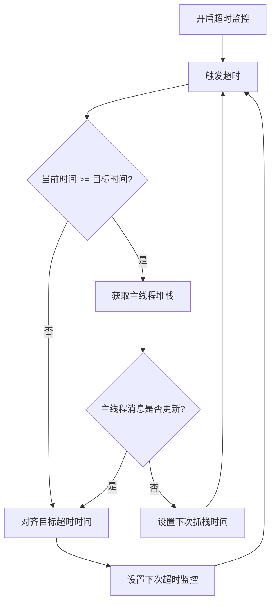
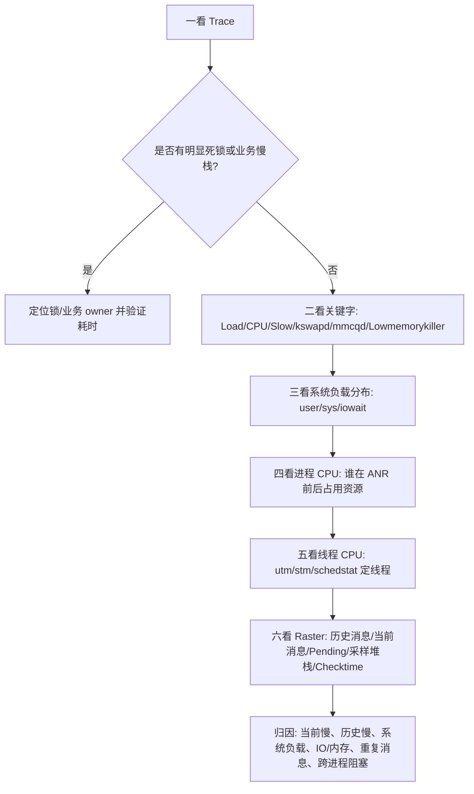

# 今日头条 ANR 优化实践第二篇总结：监控工具与分析思路

> 原文：`/Users/yanhao/Downloads/github-nots/notes/Clippings/Android ANR/第二篇：今日头条 ANR 优化实践系列 - 监控工具与分析思路.md`

## 读图情况

- 本文共 26 个图片引用，其中 1 张消息调度时序图重复出现。
- 图片均已下载并人工检查，可读取。
- 本机未安装 OCR 工具，因此图片中的表格、日志和流程信息是基于原图人工阅读后提炼。

## 一句话结论

第二篇的核心是：仅靠 ANR 发生时的 Trace 快照不足以归因，需要在应用侧补齐主线程消息调度历史、当前执行消息、待调度消息、耗时消息采样堆栈和线程调度延迟，再结合 Trace、AnrInfo、Logcat、Kernel、Meminfo 做系统化分析。

## 与第一篇的关系

第一篇说明了 ANR 是系统侧等待应用完成某类任务的超时结果，并强调 ANR Trace 不一定等于根因现场。第二篇承接这个问题，给出应用侧监控工具 Raster 和分析流程，用来回答几个第一篇无法靠系统快照直接回答的问题：

- ANR 前主线程到底调度过哪些消息？
- 当前 Trace 对应的消息执行了多久，是否真的是罪魁祸首？
- 消息队列中待调度消息是否已经被阻塞很久？
- 慢消息内部到底慢在哪些函数、锁、Binder 或 IO 上？
- 当前问题是应用自身慢，还是系统 CPU、内存、IO、调度能力恶化导致？

## Raster 监控工具

Raster 是应用侧主线程消息调度监控工具。文章用“由点到面，回放过去、现在和将来”概括它的能力：

- 过去：记录 ANR 发生前一段时间内主线程历史消息调度、耗时和聚合结果。
- 现在：记录 ANR 发生时当前正在调度的消息和已执行时长。
- 将来：记录消息队列中待调度消息、等待位置、阻塞时长和重复特征。
- 环境：用线程 Checktime 从侧面观察系统或进程线程调度是否及时。

### Raster 要解决的 Trace 陷阱

图片示例中，主线程 Trace 卡在 `nativePollOnce/epoll_wait`，或者卡在 `BinderProxy.transactNative` 到 WMS 的 IPC 调用。从 Trace 本身看，容易误判为“当前堆栈就是根因”。但 Raster 示例显示：

- 某次 IPC Trace 看似可疑，但当前调度消息 `Wall=44ms`，耗时并不严重。
- 真正影响后续调度的是前面两条历史消息，分别耗时 `2166ms` 和 `3277ms`。
- 另一例中，当前消息已执行 `1051ms`，但前一条历史消息耗时 `9828ms`，并且第一个 Pending 消息被阻塞约 `14s`，说明历史消息才是主要根因。

结论：技术方案不能只抓 ANR 当下主线程堆栈，必须把“当前 Trace 耗时”和“历史消息耗时”同时还原出来。

## Raster 采集能力拆解

| 能力 | 采集内容 | 解决的问题 | 评审关注点 |
| --- | --- | --- | --- |
| 历史消息调度 | 每轮消息 Wall/Cpu、Count、Type、消息标识 | ANR 前主线程做过什么 | 采样窗口、内存上限、聚合损失 |
| 当前调度消息 | ANR 时正在执行的消息和已执行时长 | 当前 Trace 是否真的慢 | 时间源准确性、并发读写一致性 |
| Pending 消息 | 队列中待调度消息、when、obj、Block 时长、位置 | 哪些 ANR 相关消息被卡住 | 反射兼容性、Android 版本差异 |
| 耗时消息堆栈采样 | 慢消息执行期间周期性抓主线程堆栈 | 慢消息内部慢在哪里 | 采样频率、性能扰动、堆栈聚合 |
| 关键组件消息 | Activity、Service、Receiver、Provider 等消息 | 四大组件相关 ANR 定位 | ActivityThread.H 消息识别兼容性 |
| Wall/Cpu 对照 | Wall Duration 与 Cpu Duration | 区分真实执行、等待、被抢占 | 线程 CPU 时间来源和单位 |
| 线程 Checktime | 预期调度间隔与实际响应间隔 | 侧面判断调度能力是否恶化 | 只能作为系统调度证据，不能直接当业务根因 |

## 主线程消息聚合策略

文章强调，如果每个短消息都单独记录，ANR 前 10s 甚至更长窗口可能产生上千条记录，既带来内存抖动，也不利于分析。因此 Raster 使用聚合策略压缩记录。

### 多消息聚合

适用于连续多个消息都很短的场景。

- 将多个短消息累加，直到累计耗时超过阈值。
- 示例中阈值可按 `300ms` 理解，若 16 个消息累计超过 300ms，则合并为一条记录。
- 记录中保留 `Count` 表示包含多少个消息，`Wall` 表示累计耗时。
- 如果保留 100 条记录，理论上可覆盖 ANR 前约 30s，但实际窗口会因拆分策略波动。

### 消息聚合拆分

适用于聚合过程中突然出现单条慢消息。

- 若前 N 条短消息累计 `200ms`，下一条消息后累计变为 `900ms`，则不能把这批消息合成一条。
- 应拆成两条记录：前 N 条短消息聚合记录，以及最后一条慢消息单独记录。
- 图片中慢消息会被单独标出，例如单条 `Wall=890ms`、`Wall=970ms`。
- 为降低性能影响，文章提到只在需要保存记录时更新线程 CPU 时间；拆分时前一条聚合记录的 CPU 可能为 `-1`，CPU 时间归到后一条重点消息。

### 关键消息聚合

适用于 Activity、Service、Receiver、Provider 等可能直接触发 ANR 的组件消息。

- 需要监控 `ActivityThread.H` 的消息调度。
- 当识别到组件相关消息，不管耗时多少，都单独记录。
- 这类消息不仅看耗时，也看它是否被历史消息挡住、是否位于 Pending 队列中、Block 时长是多少。

### IDLE 场景聚合

适用于主线程消息队列为空，或下一条消息未到调度时间时的空闲等待。

- 主线程消息调度后会进入 IDLE 或等待状态，Trace 容易命中 `nativePollOnce`。
- 这类堆栈出现频率高，不一定代表根因。
- Raster 在一次消息结束后记录时间，在下一次消息开始前再次记录时间。
- 若两次调度间隔较长，单独记录为 IDLE；若间隔很短，则可并入前面聚合记录。

## 耗时消息堆栈采样

文章比较了两种方案：

| 方案 | 优点 | 缺点 | 适用性 |
| --- | --- | --- | --- |
| 函数插桩 | 可精确知道每个函数真实耗时 | 包体积和运行时性能影响大，不利于多产品复用 | 精细专项治理 |
| 慢消息异步采样 | 对业务侵入小，可复用 | 采样粒度不如插桩精确 | 线上通用 ANR 监控 |

Raster 采用第二种思路：消息开始时设置目标超时时间，子线程到点后检查当前消息是否仍在执行，若仍执行则抓取主线程堆栈，并继续设置下一次采样。

图片流程可整理为：

技术方案评审时需要特别注意：

- 采样阈值不能太短，否则频繁抓栈会影响主线程性能。
- 采样阈值不能太长，否则慢消息内部定位置信度下降。
- 采样结果应按堆栈聚合展示，避免只上报离散堆栈。
- 抓栈本身也有成本，必须有限频、开关、采样率和降级策略。

## 当前消息与 Pending 消息

Raster 不只记录历史，还记录 ANR 当下的状态。

### 当前正在调度消息

需要记录：

- 消息类型或 tag。
- 当前已执行 Wall Duration。
- 当前已消耗 Cpu Duration。
- 是否为 ANR 相关组件消息。

价值是回答：当前 Trace 里的代码到底执行了多久？如果当前消息只执行几十毫秒，那么即使 Trace 看起来是 Binder、IO 或系统调用，也不能直接定为根因。

### Pending 消息

需要记录：

- 队列中待调度消息的顺序。
- `when` 或距离调度时间的偏移。
- `obj`、callback、target 等可识别信息。
- Block 时长。
- 是否包含 Service、Receiver、Input 等 ANR 相关消息。
- 是否存在大量重复消息。

Pending 消息的分析价值：

- 判断 ANR 相关消息是否已经在队列中被阻塞很久。
- 判断主线程繁忙程度。
- 识别大量重复消息，反推可能存在异常频繁 post、刷新、回调或业务循环。

## Wall Duration 与 Cpu Duration

文章反复强调一次消息耗时要同时看 Wall 和 Cpu。

| 现象 | 可能含义 | 后续分析方向 |
| --- | --- | --- |
| Wall 高、Cpu 高 | 线程真实执行了大量逻辑 | 看业务代码、算法、渲染、JSON、计算等 |
| Wall 高、Cpu 低 | 线程可能在等待、Binder、锁、IO 或被调度抢占 | 结合 Trace、系统负载、Checktime、AnrInfo |
| Wall 低、Cpu 低 | 当前消息不是主要根因 | 回看历史消息和 Pending 队列 |
| Cpu kernel 占比高 | 系统调用、文件读写、内核路径更可疑 | 看 `stm`、iowait、mmcqd、kswapd |

对技术方案而言，只有 Wall 没有 Cpu 会丢掉关键判断能力；只有 Trace 没有 Wall/Cpu 则容易误判。

## Checktime 机制

### 系统 Checktime

系统服务如 AMS、InputService 会在高频接口前后调用 `checkTime`。

图片中的代码逻辑是：

- 进入函数时记录 `startTime = SystemClock.elapsedRealtime()`。
- 在关键阶段调用 `checkTime(startTime, where)`。
- 若 `now - startTime > 50ms`，输出 `Slow operation` 警告。

系统服务优先级通常较高，如果系统服务都频繁出现 `Slow operation`，说明当时系统调度或资源状态可能已经异常。

### 应用侧线程 Checktime

应用侧线上通常拿不到系统日志，因此 Raster 迁移了类似思想：

- 创建周期性检测线程，例如预期每 `300ms` 执行一次。
- 每次实际执行时，比较实际响应间隔和预期间隔。
- 图片示例中，预期 `300ms` 的调度间隔被拉长到 `850ms`、`750ms`，表示严重 Delay。
- 连续严重 Delay 说明线程调度没有被及时响应，可作为系统负载或进程调度能力变差的证据。

注意：Checktime 是环境证据，不是业务根因。它能说明“当时线程没有及时获得调度”，但仍需结合主线程消息、Trace、CPU、IO、内存进一步定位。

## ANR 分析所需信息

文章列出的常用信息包括：

- Trace 日志
- AnrInfo
- Kernel 日志
- Logcat 日志
- Meminfo 日志
- Raster 监控工具

不同环境的信息可用性不同：

| 环境 | 可获取信息 | 局限 |
| --- | --- | --- |
| 应用侧线上 | 当前进程内部线程堆栈、AnrInfo、Raster、部分业务日志 | 通常拿不到完整系统 Trace、Kernel、系统 Logcat |
| 线下复现 | adb、Logcat、Trace、部分系统状态 | 复现成本高，场景可能不等价 |
| 系统侧或厂商侧 | 完整 Trace、Kernel、Logcat、硬件状态、频率、低电、温度等 | 普通三方应用难以依赖 |

因此技术方案应分层设计：线上应用侧先保证稳定可用的自采集闭环，线下和系统侧信息作为增强分析证据。

## 关键信息解读

### Trace 信息

图片中 Trace 重点标注了以下字段：

- `state`：线程状态，例如 Running、Runnable、Native、Waiting、Sleep、Blocked。
- `utm`：用户态 CPU 时间，包含 Java 层和非 Kernel 层 Native 逻辑。
- `stm`：系统态 CPU 时间，常见于 Kernel API、文件读写、系统调用。
- `core`：最后执行该线程的 CPU 核。
- `nice`：线程优先级，值越低优先级越高。
- `schedstat`：线程调度统计，通常包含 CPU 执行时长、等待时长、切换次数，单位为 ns。
- `HZ=100` 时，1 个 jiffies 约等于 10ms。

Trace 的正确用法：

- 先看是否有明显死锁、业务慢栈、锁等待、Binder、IO。
- 再结合 `utm/stm/schedstat/state` 判断线程是在执行、等待还是被调度影响。
- 不要把当前堆栈直接等同于根因。

### AnrInfo 信息

图片中 AnrInfo 重点标注：

- `longMsg`：ANR 类型，如 Input、Receiver、Service 等。
- `Reason`：示例为 Input dispatching timeout，并包含 wait queue length、wait queue head age。
- `Load`：例如 `45.53 / 27.94 / 19.57`，代表 1 分钟、5 分钟、15 分钟系统负载。
- `CPU usage from ... ago/later`：注意统计窗口是在 ANR 前还是 ANR 后。
- 进程 CPU：包含 user、kernel、minor faults、major faults。
- 关键进程：`kswapd`、`mmcqd`、`system_server` 等。
- 系统 CPU 分布：示例中 `89% TOTAL: 16% user + 20% kernel + 53% iowait + 0% softirq`，说明 IO wait 极高。

关键判断：

- Load 很高说明 CPU 或 IO 等待队列拥塞。
- 如果进程刚启动 1 分钟，但 5 分钟、15 分钟 Load 已经很高，说明系统环境问题早于本进程。
- `major faults` 代价远高于 `minor faults`，大量 major faults 可能与内存压力或文件加载有关。
- `kswapd` 高说明内存回收、文件缓存回写或内存交换压力大。
- `mmcqd` 高说明大量 IO 请求或回写压力。
- `iowait` 高时，应继续看进程 kernel CPU、线程 `stm` 和 IO 相关日志。

### Logcat 日志

图片中关键字包括：

- `Slow operation: 122ms/125ms ...`
- `Slow delivery took 3469ms/3470ms/3020ms/2599ms/2111ms ...`
- `binder thread pool ... starved ...`
- 业务异常日志、IO error、频繁 GC 等也应纳入分析。

含义：

- `Slow operation` 表示系统服务内部关键接口超过阈值。
- `Slow delivery` 表示 Looper 消息投递延迟，可能说明主线程或系统调度已被拖慢。
- 系统进程出现慢日志，往往比普通应用慢日志更能说明全局环境异常。

### Kernel 日志

图片示例是 Lowmemorykiller：

- `lowmemorykiller: Killing ...`
- `to free ...KB`
- `cache ...KB is below limit ...KB`
- `oom_score_adj`

含义：

- Lowmemorykiller 表示系统内存压力已经触发强制回收低优先级进程。
- `oom_score_adj` 由 AMS 根据进程状态、组件类型、前后台等计算，厂商通常有定制。
- 应用侧线上一般拿不到 Kernel 日志，因此只能作为线下或系统侧增强证据。

## 推荐分析流程

文章将分析思路拆成六步，可整理为以下评审用流程：

### 一看 Trace

- 死锁堆栈：主线程是否与其他线程互相等待。
- 业务堆栈：是否明显执行复杂业务逻辑。
- IPC Block：是否卡在 Binder，但不能立即下结论。
- 系统堆栈：如 `nativePollOnce`，需要结合 Raster 判断是否是历史消息导致。

### 二看关键字

重点搜索：

- `Load`
- `CPU`
- `Slow operation`
- `Slow delivery`
- `kswapd`
- `mmcqd`
- `kwork`
- `Lowmemorykiller`
- `iowait`
- `binder thread pool starved`
- 频繁 GC、业务异常、IO error

### 三看系统负载分布

- user 高：用户态逻辑更可疑，继续找高 CPU 进程和线程。
- sys 高：系统调用、内核路径、文件读写、内存回收更可疑。
- iowait 高：IO 阻塞、文件读写、内存回写、低存储性能更可疑。

### 四看进程 CPU

- 看 ANR 前还是 ANR 后的 CPU 统计窗口。
- 找 Top 进程及 user/kernel 占比。
- 判断是当前应用拖慢自己，还是其他进程或系统服务拖慢全局。

### 五看线程 CPU

- 在目标进程内比较线程 `utm/stm`。
- `utm` 高偏业务执行，`stm` 高偏系统调用或内核路径。
- 结合 `schedstat` 判断等待时间和切换次数。

### 六看消息调度

- 当前消息是否真的执行很久。
- 历史消息是否已经吃掉超时预算。
- Pending 队列中 ANR 相关消息被 Block 多久。
- 是否存在大量重复消息。
- 慢消息采样堆栈是否指向稳定热点。
- Checktime 是否证明调度能力下降。

## 对技术方案的启发

### 1. ANR 方案应以主线程消息时间线为核心

上报数据不能只有 ANR Trace。最小闭环应包含：

- ANR 类型和原因。
- 当前主线程堆栈。
- 当前正在调度消息及已执行时长。
- ANR 前 N 条历史调度记录。
- Pending 队列摘要。
- 慢消息采样堆栈。
- Wall/Cpu 对照。
- 系统负载证据或 Checktime 证据。

### 2. 需要用聚合降低常驻成本

可借鉴 Raster：

- 短消息按累计阈值聚合。
- 单条慢消息拆分单独记录。
- 关键组件消息强制单独记录。
- 长 IDLE 单独记录，短 IDLE 可并入聚合。
- 固定环形缓冲区保存最近记录，避免无限增长。

### 3. 需要把“根因判定”和“证据强度”分开

例如：

- 当前 Trace 是 Binder，但当前消息只有 `44ms`，证据弱。
- 历史消息 `9828ms`，Pending 消息 Block `14s`，证据强。
- Checktime 连续 Delay，只能证明调度异常，不能单独判定业务根因。
- `iowait=53%`、`kswapd/mmcqd` 高，可强烈提示 IO/内存压力。

### 4. 线上与线下能力要分层

线上应用侧优先做：

- 主线程调度时间线。
- 慢消息采样。
- Pending 队列摘要。
- Checktime。
- ANR Info 和当前进程线程堆栈。

线下增强再接：

- 完整 Trace。
- Logcat。
- Kernel。
- Meminfo。
- Perfetto/Systrace。
- 设备温度、低电、CPU/IO/GPU 频率。

### 5. 指标应能支撑自动归类

可考虑归类维度：

- 当前消息慢
- 历史消息慢
- Pending 队列被阻塞
- 重复消息风暴
- 主线程 Binder 等待
- 锁等待或死锁
- IO/内存压力
- 系统负载高
- 调度延迟高
- Trace 无明显业务栈但 Raster 有历史慢消息

## 评审检查清单

- 是否记录 ANR 发生前主线程历史消息调度，而不只是当前 Trace？
- 是否记录当前消息已执行 Wall/Cpu？
- 是否能获取 Pending 队列并计算 Block 时长？
- 是否识别 Activity、Service、Receiver、Provider 等关键组件消息？
- 是否有短消息聚合和慢消息拆分，避免上报爆炸？
- 是否有固定缓冲区、采样率、限频和降级策略？
- 是否区分 Wall Duration 和 Cpu Duration？
- 是否有慢消息堆栈采样，并能按堆栈聚合？
- 是否把 Checktime 定义为调度能力证据，而不是直接根因？
- 是否明确 Android 版本、厂商 ROM、反射访问 MessageQueue 的兼容风险？
- 是否明确线上拿不到 Kernel/系统 Logcat 时的替代证据？
- 是否在归因报告中区分 ANR 前 CPU 和 ANR 后 CPU？
- 是否能识别 `kswapd/mmcqd/iowait/major faults/Slow delivery/Slow operation` 等环境证据？
- 是否能给出“当前消息、历史消息、Pending 消息、系统环境”的联合结论？

## 举一反三提问

> 使用方式：这些问题不是为了背答案，而是为了在输出 ANR 监控技术方案前，主动暴露方案边界、证据链缺口和评审风险。

### 方案设计类

1. 如果只能上报 20 条历史消息，聚合阈值应该如何设计，才能兼顾窗口长度和慢消息精度？
2. 如果某个产品主线程消息特别密集，是否应该动态调整聚合阈值，而不是固定使用 300ms？
3. 历史消息记录应该按“条数上限”保留，还是按“时间窗口上限”保留？两者在高频短消息场景下有什么差异？
4. 慢消息采样间隔是固定值更好，还是按消息类型、设备性能、前后台状态动态变化更好？
5. 慢消息采样抓到的堆栈如果每次都不同，服务端应该如何聚合，才能避免噪声掩盖真实热点？
6. Pending 队列通过反射获取失败时，方案如何降级？是否需要在报告中明确“Pending 缺失”而不是静默忽略？
7. 当前消息 `Wall` 高但 `Cpu` 低，报告应该默认归为等待、抢占，还是需要继续结合 Trace、Checktime、Load 做二次判定？
8. 是否需要为 Service、Receiver、Provider、Input 分别设计不同的采集字段和根因模板？
9. Raster 常驻监控应该全量开启、按采样率开启，还是只在疑似卡顿/ANR 前置条件出现后开启？
10. 如果端侧只保存聚合后的消息，是否会丢失对某个关键短消息的识别能力？如何补偿？

### 数据结构类

1. 一条历史消息记录最少应包含哪些字段，才能支持后续归因：`type`、`tag`、`count`、`wall`、`cpu`、`start/end`、`sampleStacks` 是否都必须？
2. 当前正在调度消息和历史消息是否应该使用同一套数据结构，方便服务端统一展示？
3. Pending 消息中的 `obj`、callback、target 是否可能包含业务敏感信息，端侧是否需要脱敏或只保留类名？
4. `Cpu Duration` 的来源是什么？不同 Android 版本、不同内核 HZ、不同线程 CPU API 下是否需要统一单位？
5. 采样堆栈是端侧聚合后上传，还是原始堆栈上传后由服务端聚合？两种方式的成本和可解释性如何权衡？
6. Checktime 数据应该保存原始 delay 序列，还是保存最大值、均值、P95、连续严重 delay 次数？

### 归因分析类

1. 当前 Trace 卡在 Binder，但当前消息只执行 `44ms`，该如何避免误判 IPC？
2. 历史消息有多条 300ms 到 900ms 的记录，但没有单条超过 5s，是否可能累计导致 ANR？
3. `Load` 很高，但当前进程 CPU 不高，是否还能判定应用自身问题？
4. `iowait` 很高且 `mmcqd` 高，应该优先查业务文件 IO，还是系统内存回写？
5. `kswapd` 高、major faults 高、Lowmemorykiller 出现，这三个证据之间如何串起来？
6. Pending 队列中大量重复消息，如何反推业务异常入口？
7. 当前消息 `Wall` 高、`Cpu` 也高，但 Trace 看起来是普通业务函数，如何判断是单次大任务还是重复小任务累计？
8. 当前消息 `Wall` 高、`Cpu` 低，且 Checktime 连续 Delay，如何区分锁等待、Binder 等待、IO wait 和 CPU 抢占？
9. ANR Info 的 CPU 统计窗口如果发生在 ANR 之后，是否还能用于解释 ANR 前的根因？
10. 系统 Load 很高，但 Raster 显示历史消息也有明显慢消息，报告应该如何表达“应用问题”和“系统问题”的主次关系？
11. Trace 中 `nativePollOnce` 是否一定代表主线程空闲？在哪些情况下它只是历史慢消息后的“被命中现场”？
12. 如果 Pending 队列中有 ANR 组件消息，但它前面没有明显慢消息，是否应该怀疑同步屏障、消息优先级或队列异常？

### 评审攻防类

1. 采集主线程消息会不会改变 Looper 行为或引入额外 ANR？
2. 抓主线程堆栈是否会带来性能抖动，如何量化？
3. 监控工具自身内存占用如何证明可控？
4. 线上隐私与合规如何处理堆栈、消息 obj、业务参数？
5. 对不同 Android 版本、厂商定制 ROM 是否有兼容性矩阵？
6. 如果 Raster 证据和 Trace 结论冲突，报告应该如何排序和解释？
7. 如何证明聚合策略不会把真正的慢消息吞掉？
8. 如何证明 Checktime 不会被误用为根因，而只是调度能力证据？
9. 如果端侧抓栈、读取 Pending、读取线程 CPU 任一能力失败，最终报告是否还能给出有价值结论？
10. 如何衡量方案上线后真的提升了 ANR 定位效率，而不是只增加了上报字段？
11. 是否需要灰度和回滚策略？一旦监控工具自身引起性能问题，如何快速关闭？
12. 对业务团队输出时，如何避免“证据很多但结论不清”的报告体验？

### 治理闭环类

1. Raster 发现历史慢消息后，如何把消息 tag 或采样堆栈稳定映射到业务 owner？
2. 对重复消息风暴，应该输出“消息数量异常”还是进一步输出触发源、post 调用栈或业务模块？
3. 对系统负载型 ANR，是否应该进入应用治理看板，还是单独归为环境问题？
4. 同一个 ANR 类型在不同设备、系统版本、前后台状态下是否应该拆开治理？
5. 服务端聚类时应该按 Trace 聚类、Raster 时间线聚类，还是按慢消息采样堆栈聚类？
6. 修复后如何验证收益：ANR 率下降、慢消息耗时下降、Pending Block 时长下降，还是采样堆栈热点消失？

## 三轮审核

### 第一轮：事实一致性审核

审核结论：通过，但需要在后续技术方案中避免把 Raster 描述成“替代 Trace 的根因工具”。更准确的表达是：Raster 补齐 Trace 缺失的主线程调度过程，用于和 Trace、AnrInfo、系统负载证据共同归因。

已确认事实：

- ANR 不等于当前 Trace 根因，当前 Trace 只是系统 Dump 命中的现场。
- Raster 采集范围覆盖历史消息、当前消息、Pending 消息、耗时消息采样堆栈和 Checktime。
- 短消息聚合、慢消息拆分、关键组件消息单独记录、IDLE 单独记录是本文的核心聚合策略。
- 慢消息采样采用目标超时时间对齐，目的是减少频繁设置和取消超时监控带来的性能扰动。
- `Wall Duration` 和 `Cpu Duration` 必须共同使用，不能只靠 Wall 判断真实执行耗时。
- `Load`、进程 CPU、`kswapd`、`mmcqd`、`iowait`、`Slow operation`、`Slow delivery` 是系统环境证据，不应直接替代业务根因分析。

需要修正的表达风险：

- “将来”指 Pending 队列中的待调度消息，不是预测未来根因。
- Checktime 只能说明线程调度响应不及时，不能单独说明是 CPU、IO、锁还是 Binder。
- `nativePollOnce` 不能简单等价于主线程空闲无问题，需要结合历史消息和 Pending Block 判断。
- ANR Info 中 CPU usage 的时间窗口必须区分 `ago` 和 `later`，否则可能把 ANR 后的资源消耗误用为 ANR 前根因。

### 第二轮：方案落地性审核

审核结论：当前总结已具备方案骨架，但落地方案还必须补齐数据结构、成本预算、异常降级和服务端消费链路。

必须补齐的落地项：

- 数据结构：定义历史消息、当前消息、Pending 消息、采样堆栈、Checktime 的字段、单位、时间基准和缺省值。
- 成本预算：明确环形缓冲区大小、最大记录数、抓栈间隔、单次上报大小、端侧 CPU/内存开销目标。
- 阈值配置：聚合阈值、慢消息阈值、采样间隔、Checktime 周期、Pending 截断数量都应可动态配置。
- 兼容降级：反射 Pending 失败、ActivityThread.H 消息识别失败、线程 CPU 获取失败、抓栈失败时要保留部分报告能力。
- 隐私合规：消息 `obj`、堆栈、业务类名、线程名、日志字段需要脱敏策略，避免上传业务参数和用户数据。
- 服务端聚合：需要定义聚类维度，至少支持按 ANR 类型、当前 Trace、历史慢消息、采样堆栈、设备环境聚合。
- 工具自监控：上报监控工具错误率、数据完整率、采样命中率、超时监控触发次数和关闭降级次数。

评审高风险点：

- 常驻 Looper 监控如果实现不当，可能引入额外调度成本。
- 慢消息抓栈过频会干扰主线程，抓栈过稀会降低定位置信度。
- Pending 队列读取高度依赖系统实现和反射访问，Android 版本与厂商 ROM 风险较高。
- 只做端侧采集、不做服务端聚合展示，会导致信息很多但定位效率不升反降。

### 第三轮：评审表达审核

审核结论：表达主线成立，建议后续技术方案按“问题、能力、证据链、成本、边界、收益”组织，而不是按工具模块堆叠。

推荐表达顺序：

1. 先讲痛点：Trace 是快照，复杂 ANR 缺少调度过程，容易误判当前堆栈。
2. 再讲核心模型：用主线程消息时间线还原过去、现在和 Pending。
3. 再讲采集能力：历史消息、当前消息、Pending、慢消息采样、Wall/Cpu、Checktime。
4. 再讲分析链路：Trace -> 关键字 -> 系统负载 -> 进程 CPU -> 线程 CPU -> Raster 时间线。
5. 再讲工程控制：聚合、采样、限频、降级、兼容、脱敏、动态配置。
6. 最后讲收益：提升归因成功率，减少 Trace 误判，支持服务端聚类和业务治理。

表达中必须强调的例子：

- 当前 Binder Trace 只执行 `44ms`，历史消息 `2166ms/3277ms` 才更可疑。
- 当前消息 `1051ms` 虽需优化，但历史消息 `9828ms` 和 Pending Block `14s` 更能解释 ANR。
- Checktime 出现严重 Delay 时，只能说明调度响应异常，还需要结合 Load、Cpu、Trace 和 Raster 继续判断。

不建议的表达：

- 不说“Raster 可以直接定位所有 ANR 根因”。
- 不说“当前 Trace 没问题就不是应用问题”。
- 不说“系统 Load 高就一定不是业务问题”。
- 不说“Checktime Delay 就等于系统问题”。
- 不把 Kernel、系统 Logcat 当作线上应用侧必然可获取的信息。

最终评审口径：

- Raster 的价值不是替代系统 ANR 机制，而是让应用侧具备过程化证据。
- 根因报告应输出证据链和置信度，而不是只输出单一堆栈。
- 方案成败取决于端侧低成本采集、服务端有效聚合、业务侧可行动治理三者是否闭环。

## 后续五篇综合汇总时应抽取的共性能力

- 主线程消息时间线是 ANR 归因的核心数据模型。
- Trace 是现场快照，Raster 是调度过程回放。
- Wall/Cpu 是判断执行、等待、抢占的基础指标。
- 系统负载证据要和业务消息证据一起看。
- 应用侧线上方案必须承认权限边界，用 Checktime、AnrInfo 和自采集数据补足系统日志缺口。
- 最终技术方案应从“采集、压缩、还原、归因、评审、治理”六个环节展开。
