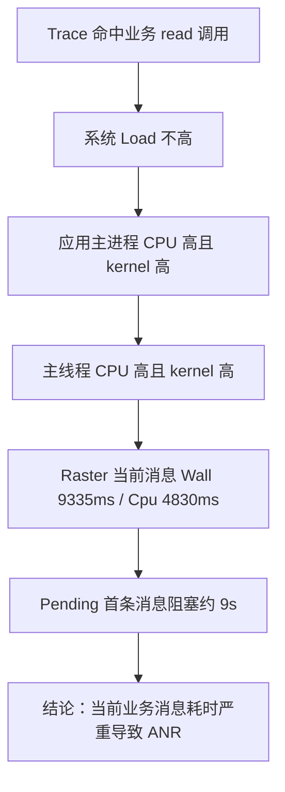
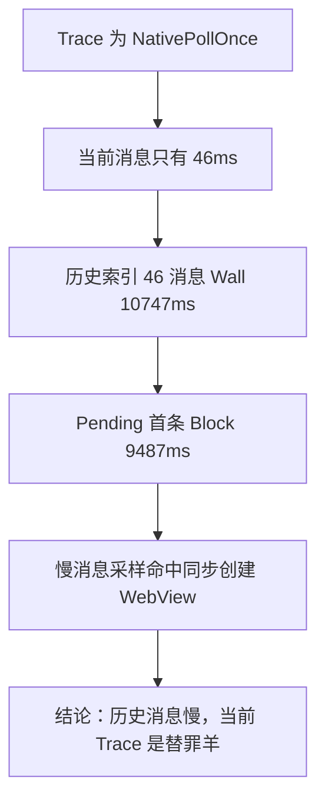
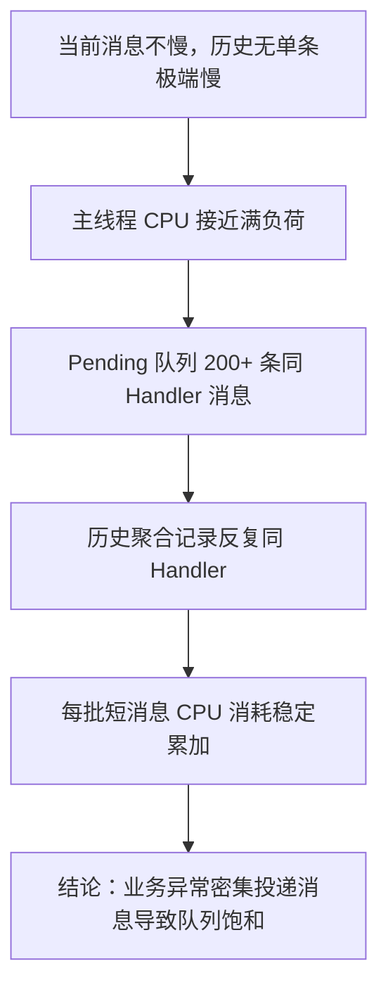
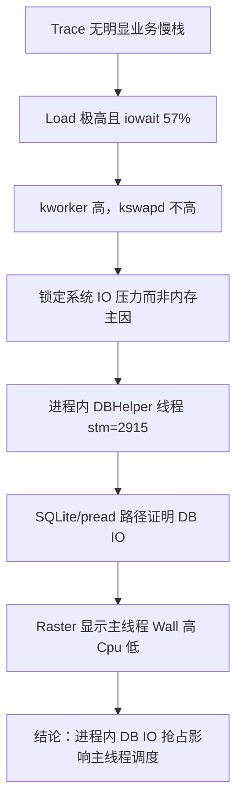
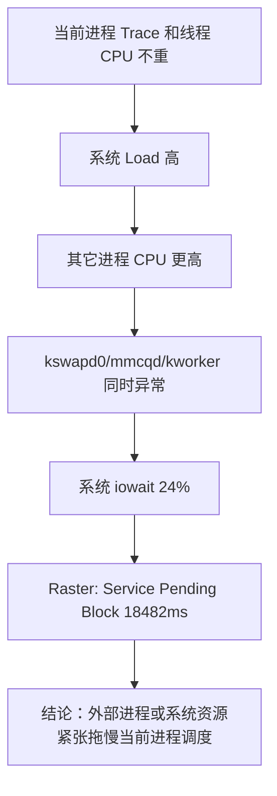
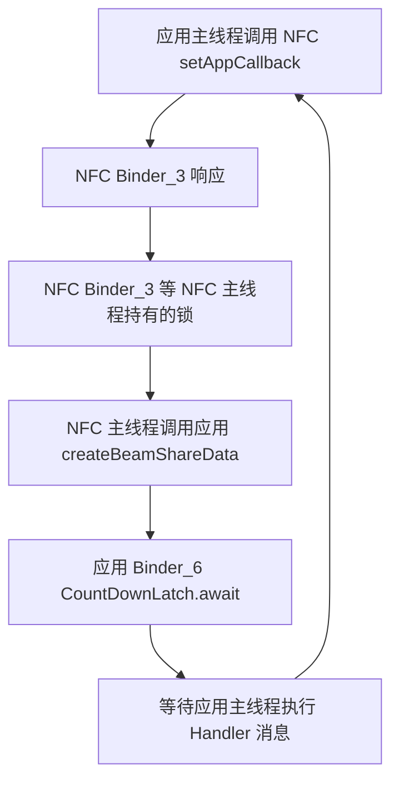

# 今日头条 ANR 优化实践第三篇总结：实例剖析集锦

> 原文：`/Users/yanhao/Downloads/github-nots/notes/Clippings/Android ANR/第三篇：今日头条 ANR 优化实践系列分享 - 实例剖析集锦.md`

## 读图情况

- 本文共 32 个图片引用，均已下载并人工检查，可读取。
- 图片内容覆盖主线程 Trace、ANR Info、CPU/Load、线程 utm/stm、Raster 消息时序、Pending 消息原始数据、跨进程 Binder 等待链。
- 本机未安装 OCR 工具，因此图片中的日志、数值和流程是基于原图人工阅读后提炼。

## 一句话结论

第三篇用 6 个真实案例证明：ANR 归因不能只看当前 Trace，而要把 Trace、ANR Info、进程/线程 CPU、系统 Load、Raster 历史消息、当前消息、Pending 队列、Checktime 和跨进程 Trace 串成证据链，才能区分当前消息慢、历史消息慢、消息风暴、进程内 IO 抢占、外部系统负载和跨进程死锁。

## 六类案例总览

| 案例 | Trace 表象 | 关键证据 | 最终归因 | 技术方案启发 |
| --- | --- | --- | --- | --- |
| 当前业务耗时严重 | 主线程业务逻辑中有 `read` 系统调用 | 当前消息 `Wall=9335ms/Cpu=4830ms`，Pending 首条约 9s | 当前正在执行消息耗时严重 | 当前消息 Wall/Cpu 是判断 Trace 是否真实慢的核心 |
| 历史消息耗时严重 | 当前 Trace 落在 `NativePollOnce` | 当前消息 `46ms`，历史索引 46 `Wall=10747ms`，Pending 首条 `9487ms` | 历史 UI 绘制同步创建 WebView | Trace 可能命中“替罪羊”，必须回看历史消息 |
| 业务异常密集执行 | 当前业务 Trace 看似简单 | 200+ Pending 消息来自同一 Handler `{1173da0}`，历史记录反复同一 Handler | 业务异常持续向主线程投递消息 | 需要识别重复消息风暴，而不只看单条慢消息 |
| 进程内 IO 负载异常 | 当前主线程 `epoll_wait/nativePollOnce` | Load `71.26/51.48/41.25`，iowait `57%`，DBHelper 线程 `utm=1259/stm=2915` | 进程内 DBHelper 线程长期 SQLite IO 抢占调度 | 子线程 IO 会拖慢主线程，必须采集线程 CPU 和系统 iowait |
| 其它进程及系统负载异常 | 当前主线程 `epoll_wait/nativePollOnce` | Load `49.44/39.37/37.09`，`kswapd0=20%`、`mmcqd=16%`，目标进程 CPU 低 | 外部进程/系统资源紧张影响当前进程调度 | 报告要能区分应用自身问题和环境问题 |
| 跨进程死锁 | 主线程 Binder 调用 NFC 被 Block | 应用主线程 -> NFC Binder_3 -> NFC 主线程 -> 应用 Binder_6 -> 等待应用主线程 | 应用与系统 NFC 形成跨进程环形等待 | 线上应用侧可能误归为 IPC 慢，线下完整 Trace 要能追 Binder 链 |

## 案例一：当前业务耗时严重

### 关键图片内容

- 主线程 Trace 显示当前在 `read` 系统调用路径。
- ANR Info 中 Load 为 `7.45 / 6.92 / 6.84`，系统整体负载不高。
- `CPU usage from 0ms to 8745ms later` 中，应用主进程 CPU `161%`，其中 `58% user + 103% kernel`。
- 进程内主线程 CPU `93%`，其中 `23% user + 69% kernel`，说明主线程在 ANR 后仍有大量系统调用。
- Raster 显示当前正在调度消息 `Wall=9335ms`、`Cpu=4830ms`。
- Pending 队列首条消息 `when` 约 `-9s`，说明后续消息被当前消息长期阻塞。

### 归因链路

### 评审要点

- 该案例是“当前 Trace 就是强根因”的正例。
- 但即使 Trace 看起来可疑，也仍需通过当前消息 Wall/Cpu 和 Pending Block 验证。
- `kernel` 占比高时，要优先关注文件 IO、系统调用、Native IO 或数据库读写。

## 案例二：历史消息耗时严重

### 关键图片内容

- 主线程 Trace 落在 `NativePollOnce`，表面看像线程空闲或等待。
- Load 为 `11.81 / 9.91 / 9.16`，最近 1 分钟略高但整体不算失控。
- 应用主进程 CPU `155%`，其中 `124% user + 31% kernel`。
- 系统 CPU 分布为 `26% TOTAL: 17% user + 7.5% kernel + 0.7% iowait`，系统 IO 不繁忙。
- Raster 显示当前消息 `Wall=46ms/Cpu=23ms`，当前 Trace 并不耗时。
- 历史索引 46 消息 `Wall=10747ms/Cpu=913ms`。
- Pending 首条消息 Block 约 `9487ms`。
- 采样堆栈多次命中 UI 绘制过程中同步创建 WebView。

### 归因链路

### 评审要点

- `NativePollOnce` 不能简单等价于“主线程空闲无问题”。
- 系统 ANR Dump 命中的是超时后的当前现场，不一定是消耗超时预算的历史现场。
- 慢消息采样是把“历史慢消息”继续定位到业务函数的关键能力。

## 案例三：业务异常密集执行

### 关键图片内容

- 主线程状态为 `Runnable`，`utm=1751/stm=128`。
- 进程启动约 22s，而主线程 CPU 时间约 `(1751+128)*10ms=18.8s`，说明启动后主线程几乎满负荷执行。
- Load 为 `13.54 / 12.07 / 11.4`，整体不算系统失控。
- 应用主进程 CPU `153%`，其中 `127% user + 25% kernel`。
- 系统 CPU 为 `39% TOTAL: 21% user + 8.5% kernel + 7.5% iowait`。
- 另一个窗口显示主线程 CPU `95%`。
- Raster 当前消息只有 `Wall=300ms/Cpu=0`，历史消息也没有单条极端慢。
- Pending 消息原始数据中，除第一个消息外，其余 200+ 条消息都来自同一个 `Handler (android.os.Handler) {1173da0}`。
- 当前正在调度消息也来自同一个 Handler。
- 历史聚合记录反复出现同一个 Handler，每条聚合记录约 4-6 个消息，`cpuDuration` 多在 `290ms` 左右。

### 归因链路

### 评审要点

- ANR 不一定由单条 5s/10s 慢消息触发，也可能由大量短消息累计触发。
- Pending 队列的重复消息识别非常关键，能发现“消息风暴”。
- 技术方案应记录 Handler、callback、target、message what、count 等特征，但要做脱敏。
- 服务端聚类不能只按 Trace 聚类，还要按重复消息特征聚类。

## 案例四：进程内 IO 负载异常

### 关键图片内容

- 主线程 Trace 落在 `epoll_wait/nativePollOnce`，本身无明显业务慢栈。
- Load 为 `71.26 / 51.48 / 41.25`，系统负载极高且最近 1 分钟继续加重。
- 多个 kworker 线程 CPU 高，说明系统侧 IO 压力明显。
- `kswapd0` 仅约 `2%`，侧面说明内存压力不是主因。
- 系统 CPU 为 `75% TOTAL: 5.4% user + 11% kernel + 57% iowait`，IO wait 极高。
- 线程 CPU 表中，`DBHelper-AsyncOp-New` 线程 `utm=1259/stm=2915`，`utm+stm=4174`，明显高于其他线程。
- DBHelper 线程堆栈包含 `pread64`、`libsqlite.so`、`sqlite3_step`、`SQLiteConnection.nativeExecute`。
- DBHelper 线程 `nice=0`，优先级较高。
- Raster 显示多个历史消息 Wall 很高但 Cpu 很低，例如 Cpu 接近 0 或小于 1ms，说明真实执行不多，等待/调度受影响更大。
- Checktime 也出现严重 delay。

### 归因链路

### 评审要点

- 子线程 IO 也可能导致主线程 ANR，因为 IO 压力会影响系统整体调度。
- `Wall 高、Cpu 低` 是调度受阻或等待较多的重要信号。
- 技术方案必须采集进程内线程 CPU 排名，不能只看主线程。
- IO 型问题与设备差异强相关，治理目标应是降低频率、降优先级、错峰、拆分、避免主线程 IO，而不是承诺彻底消灭。

## 案例五：其它进程及系统负载异常

### 关键图片内容

- 主线程 Trace 是 `epoll_wait/nativePollOnce`，`utm=376/stm=340`，当前进程主线程 CPU 不高。
- Load 为 `49.44 / 39.37 / 37.09`，系统负载较高。
- CPU 统计窗口为 ANR 前，目标进程 `com.ss.android.article.news` 只有 `17%`。
- `com.youku.phone` 为 `31%`，`com.android.contacts` 为 `23%`，更可疑。
- `kswapd0=20%`，`mmcqd=16%`，同时出现说明内存回收和 IO 压力都存在。
- 系统 CPU 为 `54% TOTAL: 13% user + 15% kernel + 24% iowait`。
- 当前进程线程 CPU 表中，主线程 `utm=495/stm=205`，`utm+stm=700`，结合进程已启动 108s，不算异常。
- Raster 显示当前消息 `Wall=3467ms/Cpu=234ms`。
- 历史消息中多个 `Type 1/Type 8` Wall 高，Cpu 相对低。
- Pending 队列中超时 Service 消息排在第 8，`when=-18482ms`，Block 约 18.5s。
- 由于 Service 常见超时阈值 20s，剩余 1s 多可能消耗在 AMS 发送到客户端 Binder 接收及调度过程中。

### 归因链路

### 评审要点

- 线上应用侧不一定能拿到其它进程完整信息，因此只能输出“高置信环境归因”而非绝对根因。
- 报告应明确目标进程 CPU 低、系统负载高、外部进程更可疑，避免误分配给本应用业务。
- Pending 中具体 ANR 组件消息位置和 Block 时长，是解释 Service 超时的关键证据。

## 案例六：跨进程死锁

### 关键图片内容

- 应用主线程 Trace 显示 Binder 调用 `android.nfc.INfcAdapter$Stub$Proxy.setAppCallback` 被 Block。
- 在完整 Trace 中搜索 `setAppCallback`，发现 NFC 进程 `Binder_3` 线程响应请求。
- NFC `Binder_3` 线程状态为 Blocked，等待锁 `com.android.nfc.P2pLinkManager`，该锁由 NFC 主线程持有。
- NFC 主线程持锁后又进行 Binder 通信，请求应用进程 `createBeamShareData`。
- 应用进程 `Binder_6` 线程响应 `createBeamShareData`，但处于 `CountDownLatch.await`。
- 业务逻辑需要通过 Handler 发到应用主线程执行后唤醒 `Binder_6`，但应用主线程已经在等待 NFC Binder 返回。
- 图片最终链路：应用主线程 Block NFC `Binder_3`；NFC `Binder_3` Block NFC 主线程；NFC 主线程 Block 应用 `Binder_6`；应用 `Binder_6` Block 应用主线程。

### 归因链路

### 评审要点

- 这是跨进程环形等待，不是简单 IPC 慢。
- 线上应用侧若只能看到本进程 Trace，容易误归为 Binder 超时。
- 线下或系统侧完整 Trace 应支持按 Binder 接口名追踪请求链。
- 技术方案应保留 Binder 接口名、服务端进程、Binder 线程状态、锁等待对象等信息，至少在线下诊断链路中支持。

## 六类归因模式提炼

| 模式 | 典型信号 | 容易误判 | 需要补充的证据 |
| --- | --- | --- | --- |
| 当前消息慢 | 当前消息 Wall/Cpu 都高，Pending 首条 Block 接近当前 Wall | 只靠 Trace 定责 | 当前消息耗时、Pending Block、线程 CPU |
| 历史消息慢 | 当前消息短，历史消息超长，Pending Block 对齐历史消息 | 当前 Trace 替罪羊 | 历史消息、采样堆栈 |
| 消息风暴 | 单条不慢，但同 Handler 大量重复消息，主线程 CPU 高 | 业务 Trace 看似简单 | Pending 重复特征、历史聚合 count |
| 进程内资源抢占 | 子线程 utm/stm 高，系统 iowait 高，主线程 Wall 高 Cpu 低 | 当前主线程无慢栈就无问题 | 线程 CPU 排名、子线程堆栈、Checktime |
| 外部系统负载 | 目标进程 CPU 低，Load/iowait/kswapd/mmcqd 高，外部进程高 | 错分给当前业务 | ANR 前 CPU 窗口、系统进程、Pending Block |
| 跨进程死锁 | Binder 调用阻塞，多进程锁/等待环 | IPC 慢或服务端慢 | 完整跨进程 Trace、Binder 接口名、锁等待链 |

## 对技术方案的启发

### 1. 报告要输出证据链，而不是单个根因标签

每个案例都不是只靠一条日志定位，而是至少经过：

- Trace 表象
- 系统 Load/CPU
- 进程 CPU
- 线程 CPU
- Raster 当前消息
- Raster 历史消息
- Pending 队列
- 慢消息采样或跨进程 Trace

技术方案输出时应将这些证据按时间线组织，避免“结论对但不可解释”。

### 2. 主线程消息时间线是服务端展示核心

Raster 时间线至少要支持：

- 当前消息 Wall/Cpu。
- 历史消息 Wall/Cpu/Count/Type。
- Pending 消息位置、when、Block。
- 关键组件消息标识，如 Service、Receiver、Input。
- 重复 Handler/Callback 聚合。
- 慢消息采样堆栈跳转。

### 3. 自动归因需要多维规则

可沉淀为规则雏形：

| 规则 | 初步判定 |
| --- | --- |
| 当前消息 Wall 高且 Pending Block 接近当前 Wall | 当前消息慢 |
| 当前消息短，历史某消息 Wall 高，Pending Block 接近历史慢消息 | 历史消息慢 |
| 主线程 CPU 高，单条消息不慢，Pending 同 Handler 大量重复 | 消息风暴 |
| 系统 iowait 高，子线程 stm 高，主线程 Wall 高 Cpu 低 | 进程内 IO 抢占 |
| 目标进程 CPU 低，外部进程/kswapd/mmcqd 高，Load 高 | 外部系统负载 |
| Binder 调用链形成环形等待 | 跨进程死锁 |

### 4. 报告要区分“可治理”和“不可完全治理”

- 当前业务慢、历史业务慢、消息风暴：通常可由业务修复。
- 进程内 IO：可通过降低 IO 频率、降优先级、错峰、批处理、减少主线程 IO 缓解。
- 外部系统负载：应用无法根治，只能识别、规避误归因，并做降级策略。
- 跨进程死锁：需要完整 Trace 或专项复现，线上应用侧难以独立闭环。

### 5. 线上和线下能力要分层

线上应用侧优先保证：

- Raster 时间线。
- 当前进程 Trace。
- 线程 CPU。
- ANR Info。
- Pending 队列。
- Checktime。
- 慢消息采样。

线下增强能力：

- 完整多进程 Trace。
- Binder 调用链追踪。
- Kernel/Logcat/Meminfo。
- Perfetto/Systrace。
- 设备 IO、频率、温度和低电状态。

## 评审检查清单

- 是否能区分当前消息慢、历史消息慢和消息风暴？
- 是否能用 Pending Block 时长解释 ANR 组件超时？
- 是否记录当前消息 Wall/Cpu，并能证明当前 Trace 是否真的耗时？
- 是否保存历史消息 Count 和最后一条 msg string，用于识别重复 Handler？
- 是否能按 Handler/callback/target 聚合 Pending 重复消息？
- 是否采集进程内线程 `utm/stm` 排名，识别子线程 IO 或 CPU 抢占？
- 是否能读取系统 Load、进程 CPU、`kswapd/mmcqd/kworker/iowait` 等环境证据？
- 是否区分 ANR 前 `ago` 和 ANR 后 `later` 的 CPU 统计窗口？
- 是否把 `Wall 高、Cpu 低` 作为调度受阻或等待证据？
- 是否支持慢消息采样堆栈与历史消息关联？
- 是否对线上拿不到完整跨进程 Trace 的场景给出降级归因？
- 是否能输出证据强弱和治理建议，而不是只输出一个 Trace 栈？

## 举一反三提问

> 使用方式：第三篇是案例集，提问重点不只是“这个案例怎么分析”，而是“换一个相似但证据不完整的线上问题时，方案还能不能给出可信结论”。

### 案例迁移类

1. 如果当前消息 `Wall=8s` 但 `Cpu=50ms`，它更像案例一还是案例四？
2. 如果 Trace 是 `NativePollOnce`，但 Pending 首条 Block 12s，应该优先查当前消息还是历史消息？
3. 如果主线程 CPU 高、单条消息不慢、Pending 有大量同 Handler 消息，如何证明是业务消息风暴？
4. 如果系统 Load 高、目标进程 CPU 低、外部进程 CPU 高，报告如何避免误伤当前业务？
5. 如果只拿到应用侧 Trace，看见 Binder 阻塞，如何判断是否需要线下完整 Trace 复现跨进程死锁？
6. 如果当前消息 `Wall` 高、`Cpu` 高，但系统 Load 也高，如何判断是业务自身慢还是系统负载放大了业务耗时？
7. 如果历史消息 `Wall=10s`，但 Pending 首条只 Block `2s`，能否判定历史消息是本次 ANR 根因？
8. 如果 Pending 中重复 Handler 很多，但主线程 CPU 不高，这更像消息风暴还是消息堆积等待？
9. 如果 `iowait` 高，但进程内没有明显 `stm` 高的线程，如何判断是外部 IO 还是采集窗口错过了本进程 IO？
10. 如果 Service 消息 Block 18s，但系统 Service 超时是 20s，剩余时间应该从哪些链路解释？

### 反事实推理类

1. 如果案例一没有 Raster 当前消息时长，仅凭 Trace 和 CPU，结论的置信度会降低在哪里？
2. 如果案例二没有慢消息采样堆栈，只知道历史消息 `10747ms`，能否把问题派给 WebView 创建逻辑？
3. 如果案例三没有 Pending 原始数据，只看当前消息 `300ms`，会不会被误判为无明显业务问题？
4. 如果案例四没有线程 CPU 排名，只看到系统 `iowait=57%`，能否证明是当前进程 DBHelper 导致？
5. 如果案例五没有其它进程 CPU 列表，只看到目标进程低 CPU 和系统高 Load，报告应如何保守表述？
6. 如果案例六没有完整多进程 Trace，只看到应用主线程 Binder Block，线上报告应该输出什么降级结论？

### 方案设计类

1. Pending 队列最多只保留 300 条时，如何避免截断导致漏掉真正的 ANR 组件消息？
2. 历史消息聚合时保留“最后一个 msg string”是否足够识别消息风暴？
3. 是否需要额外采集 post 调用栈，帮助从 Handler 反推业务入口？
4. 线程 CPU 排名应该在 ANR 时采集一次，还是周期性采集最近窗口？
5. 对 IO 型 ANR，是否需要记录磁盘剩余空间、设备型号、存储类型和低电/温度？
6. 对外部系统负载型 ANR，服务端是否应该单独打环境标签，不纳入业务 owner KPI？
7. 历史消息、当前消息、Pending 消息是否应该统一使用同一个时间基准，避免跨字段无法对齐？
8. `Wall/Cpu` 比例规则应该端侧计算，还是服务端根据原始字段统一计算？
9. 对消息风暴，端侧是否要保存重复 Handler 的 top N 列表，而不是只保存前 N 条 Pending？
10. 对历史慢消息，是否要保存采样堆栈的命中次数和首次/末次采样时间？
11. 对外部负载型问题，是否需要单独记录设备温度、低电、CPU 频率和存储状态，提升环境归因置信度？
12. 对跨进程问题，应用侧是否应该记录 Binder 接口名和调用方向，方便线下完整 Trace 搜索？

### 自动归因类

1. 当前消息慢、历史消息慢、消息风暴、IO 抢占、外部负载、跨进程死锁这 6 类是否可以用规则自动初筛？
2. 每类归因至少需要哪些必要证据？哪些证据缺失时只能输出“疑似”？
3. `Wall 高、Cpu 低` 的阈值如何定？是固定比例，还是按设备性能和系统负载动态调整？
4. 消息风暴的阈值如何定：同 Handler 数量、同 callback 数量、单位时间消息数，哪个更稳？
5. 环境型 ANR 的置信度如何计算：Load、iowait、kswapd、mmcqd、外部进程 CPU 是否应加权？
6. 如果自动规则之间冲突，例如当前消息慢且外部 Load 高，报告应该输出多标签还是主次标签？

### 治理闭环类

1. 案例一、二、三这类业务可修复问题，如何从堆栈和消息特征映射到业务 owner？
2. 案例四这类进程内 IO 问题，治理目标应该是 ANR 率、IO 频率、DB 线程 `stm`，还是主线程 Wall/Cpu 比例？
3. 案例五这类外部负载问题，是否应该从业务治理中剔除，还是作为设备/系统环境风险单独看板？
4. 案例六这类跨进程问题，线上如何触发线下专项复现或系统 Trace 采集流程？
5. 修复后如何验证收益：同类 ANR 下降、历史慢消息减少、Pending Block 降低、重复 Handler 消失，还是线程 `stm` 下降？
6. 服务端聚类应按 Trace、历史慢消息、Pending Handler、线程 IO、系统环境哪个维度优先？

### 评审攻防类

1. 如何证明当前消息慢不是系统调度慢导致，而是业务自身执行慢？
2. 如何证明历史消息慢和 Pending Block 的时间关系足够一致？
3. 如何证明消息风暴不是 Raster 聚合策略造成的错觉？
4. 如何证明子线程 IO 是进程内导致，而不是被外部 IO 压力拖慢？
5. 如何向业务解释“当前 Trace 不是你的代码，但根因仍可能是你之前的历史消息”？
6. 如何向评审解释“这个 ANR 不是应用可修复问题，但仍然有监控价值”？
7. 如果业务质疑 Raster 数据可信度，如何用 Trace、CPU、Pending 三方证据交叉证明？
8. 如何证明端侧监控本身没有显著增加主线程负担？
9. 如果线上隐私要求不能上传完整 callback/obj，如何仍保留消息风暴识别能力？
10. 如果某类问题只能线下完整 Trace 才能确认，线上报告是否应该避免输出确定根因？
11. 如何避免服务端把所有高 Load 问题都归为环境问题，从而掩盖应用自身问题？
12. 技术方案如何证明它提升了定位效率，而不是只增加了日志字段？

## 三轮审核

### 第一轮：事实一致性审核

审核结论：通过。第三篇与前两篇的理论完全对齐，案例分别覆盖第一篇提出的影响因素分类，并使用第二篇 Raster 能力补齐证据链。需要注意的是，案例结论的强弱来自多证据对齐，而不是某一个单点指标。

已确认事实：

- 案例一是当前消息耗时严重，Raster 当前消息 `Wall=9335ms/Cpu=4830ms`。
- 案例二是历史消息耗时严重，当前消息仅 `46ms`，历史消息 `10747ms`。
- 案例三是业务异常密集投递消息，不是单条消息极慢。
- 案例四是进程内 DBHelper 线程 SQLite IO 导致系统 IO 压力和主线程调度受影响。
- 案例五是其它进程或系统负载异常影响目标进程调度。
- 案例六是跨进程环形等待，而不是普通 Binder 慢。
- `ago/later` 的 CPU 窗口会影响证据解释，不能混用。
- `Wall 高、Cpu 低` 更像等待、抢占或调度受影响；`Wall 高、Cpu 高` 更像真实执行较多。
- Pending 消息的 Block 时长可以用于解释组件消息为什么触发超时。

表达风险：

- 不要把 `NativePollOnce` 直接写成“主线程空闲”。
- 不要把 `iowait` 高直接写成“当前进程 IO 导致”，还要看进程内线程证据。
- 不要把外部系统负载型问题归给当前应用业务。
- 不要把跨进程死锁简化成 IPC timeout。
- 不要把案例四和案例五混为一类：前者有进程内 DBHelper 线程证据，后者目标进程 CPU 低且外部进程更可疑。
- 不要把消息风暴理解成单条消息慢，它的关键是短消息高频累计。

事实补强建议：

- 在后续综合汇总中，把 6 个案例统一映射到第一篇的影响因素分类。
- 为每个案例提炼“必要证据”和“增强证据”，方便后续自动归因规则设计。
- 对跨进程死锁明确线上应用侧能力边界，避免把线下完整 Trace 能力写成线上必备能力。

### 第二轮：方案落地性审核

审核结论：案例能直接转化为方案需求，但需要把“案例分析能力”产品化为端侧字段、服务端规则、展示模型和治理闭环。仅端侧采集字段不足以复现第三篇的分析效率。

必须补齐：

- 当前消息、历史消息、Pending 消息的数据结构。
- Handler/callback/target 重复聚合能力。
- 线程 CPU 排名和线程堆栈关联能力。
- Wall/Cpu 比例分析规则。
- ANR 前后 CPU 统计窗口标注。
- 环境型 ANR 标签，避免误派单。
- 跨进程 Trace 的线下诊断流程。
- 慢消息采样堆栈与历史消息 index 的关联关系。
- Pending 组件消息位置、Block 时长和 ANR 类型之间的关联关系。
- 同 Handler 重复消息的聚合摘要，如数量、最大 Block、首次/末次 when。
- IO 型问题的设备维度信息，如机型、存储状态、低电、温度、系统版本。
- 服务端证据链展示模板，至少按“Trace 表象 -> 系统环境 -> 线程/消息时间线 -> 结论”排序。

高风险点：

- Pending 读取和 Handler 识别涉及兼容、反射和隐私。
- 消息风暴类问题如果没有服务端聚合，会很难从单次报告中稳定识别。
- 外部系统负载类问题只能给出高置信推断，不应承诺端侧可完全修复。
- Wall/Cpu 阈值如果固定，可能在不同设备、不同前后台状态下误判。
- 子线程 IO 归因需要线程堆栈和 `stm` 同时支持，否则只能说明系统 IO 压力高。
- 跨进程死锁在线上无法完整确认时，报告必须有“疑似 IPC 链路问题，需线下完整 Trace”的降级口径。

落地优先级建议：

1. P0：当前消息、历史消息、Pending、Wall/Cpu、ANR 类型、Trace。
2. P1：慢消息采样、线程 CPU 排名、重复 Handler 聚合、Checktime。
3. P2：环境证据增强、设备状态、线下跨进程 Trace 辅助流程。

### 第三轮：评审表达审核

审核结论：后续技术方案可用第三篇作为“为什么需要完整证据链”的案例支撑。表达上应避免堆案例，而要把案例转化为归因模式、必要证据和治理动作。

推荐表达顺序：

1. 先用案例二说明 Trace 会误导。
2. 再用案例一说明当前消息 Wall/Cpu 可验证 Trace。
3. 再用案例三说明单条消息不慢也能 ANR。
4. 再用案例四、五说明调度环境和资源抢占会改变归因。
5. 最后用案例六说明线上应用侧能力有边界，需要线下完整 Trace。

推荐评审话术：

- “我们不是根据 Trace 派单，而是根据超时形成过程派单。”
- “当前消息、历史消息和 Pending 队列必须放在同一条时间线上解释。”
- “业务可修复、进程内资源抢占、外部环境和跨进程问题要分不同治理口径。”
- “环境型问题不是没有价值，它能减少误归因，并指导降级、设备分层和系统侧反馈。”

不建议的表达：

- 不说“六类案例覆盖所有 ANR”。
- 不说“有 Raster 就一定能定位根因”。
- 不说“系统负载高就不是应用问题”。
- 不说“消息风暴只需要看 Pending 数量”，还要看同 Handler/callback 特征和主线程 CPU。
- 不说“跨进程死锁线上可直接确认”，除非确实有完整多进程 Trace。

最终评审口径：

- ANR 监控不是“抓一份堆栈”，而是“还原一次超时形成过程”。
- Raster 的核心价值是把主线程过去、现在和 Pending 队列变成可解释时间线。
- 技术方案需要同时支持业务可修复问题、环境型问题和线下专项问题三类输出。
- 第三篇的 6 个案例可以作为验收集：方案至少要能解释这 6 类问题，并在证据缺失时给出合理降级结论。

## 后续五篇综合汇总时应抽取的共性能力

- 当前 Trace 只能作为入口，不能作为唯一结论。
- Pending 队列是解释组件超时和消息风暴的关键证据。
- Wall/Cpu 比例是判断业务执行、等待和调度受阻的基础。
- 线程 CPU 与系统 iowait 能把“主线程慢”扩展到“进程/系统资源抢占”。
- 跨进程问题需要完整 Trace 或专项链路追踪，线上应用侧要明确边界。
- 最终方案要输出证据链、置信度和治理建议，而不只是根因标签。
