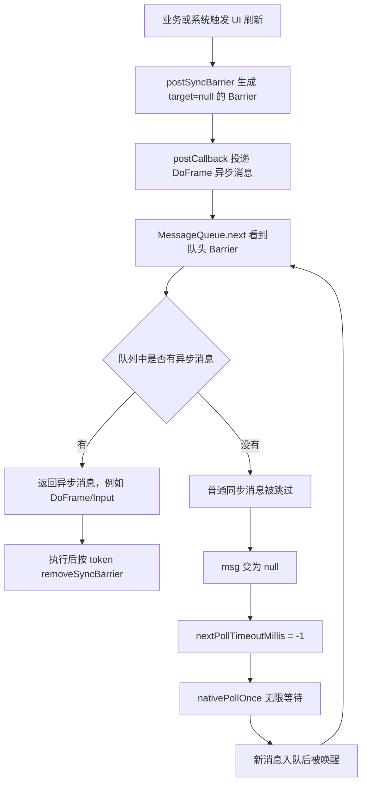
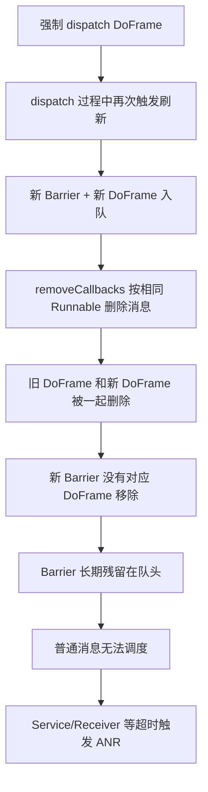

# 今日头条 ANR 优化实践第四篇总结：Barrier 导致主线程假死

> 原文：`/Users/yanhao/Downloads/github-nots/notes/Clippings/Android ANR/第四篇：今日头条 ANR 优化实践系列 - Barrier 导致主线程假死.md`

## 读图情况

- 本文共 24 个图片引用，其中 `NativePollOnce` 调度时序图有 1 张重复引用，实际关键图约 23 张，均已下载并人工检查，可读取。
- 图片内容覆盖主线程 Trace、系统 Load/CPU、Raster 消息调度时序、Native Hook 日志、`MessageQueue.next()` 源码、Sync Barrier 源码、连续 ANR Trace、`removeCallbacks`/`removeMessages` 源码、异步刷新触发路径。
- 本机未安装 OCR 工具，因此图片里的日志、数值和源码重点是基于原图人工阅读后提炼。

## 一句话结论

第四篇证明了一类真正发生在 `NativePollOnce` 内部的 ANR：队列头部残留 `target == null` 的 Sync Barrier 后，主线程虽然不断被唤醒，但 `MessageQueue.next()` 只能放行异步消息，普通业务消息、Service、Receiver 等同步消息长期被挡住，表现为主线程像“假死”一样停在 `NativePollOnce`，并可能连续触发 ANR。

## 核心判断

这类问题不能简单套用“`NativePollOnce` 多数是替罪羊”的经验。前三篇里，很多 `NativePollOnce` 是历史消息慢、系统负载、IO 或跨进程等待造成的现场偏移；第四篇的特殊点是：`NativePollOnce` 这一次真的是问题发生地，但根因仍然不在底层 `epoll_wait`，而在 Java 层 `MessageQueue.next()` 的 Barrier 调度规则。

典型证据组合如下：

| 证据维度 | 关键表现 | 说明 |
| --- | --- | --- |
| Trace | 主线程停在 `epoll_wait`、`nativePollOnce`、`MessageQueue.next()` | 表面像空闲等待 |
| 系统负载 | Load 不高或不足以解释问题 | 不能归因到系统整体负载 |
| 当前进程线程 CPU | 主线程 `utm/stm` 不高 | 不是主线程持续执行 CPU 任务 |
| Raster 当前消息 | 当前 `Wall` 很长，`Cpu` 很短 | 大量时间是等待，不是执行 |
| Pending 队列 | 第一条待调度消息被 Block 十几秒到几十秒 | 队列里明明有消息却不被调度 |
| 队头消息 | 第一条 Pending 的 `target` 为空 | 命中 Sync Barrier 特征 |
| Hook 日志 | `nativePollOnce(timeoutMillis=-1)` 多次进入退出 | 不是底层一次 wait 卡死，而是反复被唤醒又继续等待 |

## 关键图片内容提炼

### 1. Trace 表象：主线程停在 NativePollOnce

主线程 Trace 图显示：

```text
"main" prio=5 tid=1 Native
state=S
utm=187 stm=57
native: __epoll_pwait
native: epoll_wait
native: android::Looper::pollInner
native: android::Looper::pollOnce
at android.os.MessageQueue.nativePollOnce
at android.os.MessageQueue.next
at android.os.Looper.loop
at android.app.ActivityThread.main
```

这说明主线程处于睡眠等待状态，且用户态/内核态累计 CPU 不高。仅看 Trace 很容易误判为“当前没有业务执行，不是根因”。

### 2. 系统侧不能解释 ANR

系统负载图显示：

- Load：`5.64 / 5.43 / 5.42`，整体不算高。
- ANR 后 24 秒窗口内，`com.meizu.mstore` CPU 为 `92%`，其中 `71% user + 20% kernel`。
- 当前应用主进程 CPU 约 `15%`，其中 `11% user + 4.2% kernel`。
- 系统 CPU 汇总为 `69% TOTAL: 37% user + 24% kernel + 6.9% iowait + 0.1% softirq`。

这里外部进程和系统 CPU 确实有一定压力，但当前应用主线程 `utm=187/stm=57`，进程内线程也没有明显异常，不能把本次 ANR 直接归因到系统负载或其它进程抢占。

### 3. Raster 现场：队列里有消息，却长期不调度

Raster 图显示：

- 当前正在调度消息：`Wall=21744ms`、`Cpu=100ms`。
- 第一批 Pending 消息 `when` 约 `-22338ms`、`-22293ms`、`-22335ms`、`-22285ms`。
- 历史消息没有单条极端慢消息。

这形成了矛盾：如果主线程真的在 `NativePollOnce` 等待，通常意味着没有立刻可调度消息；但 Raster 明确显示队列里有大量待调度消息，并且已经被 Block 超过 20 秒。

因此关键问题变成：为什么消息队列里有消息，`MessageQueue.next()` 却不返回这些消息？

### 4. Hook nativePollOnce：不是底层一次性卡死

Native Hook 图显示：

```text
looper_poll_inner timeoutMillis:-1
end looper_poll_inner
looper_poll_inner timeoutMillis:-1
end looper_poll_inner
```

其中有区间标注“进入退出耗时 23S”“进入退出耗时 24S”，ANR 前还能看到多次 `timeoutMillis=-1` 的 `nativePollOnce` 调用。

这说明：

- 主线程不是在一次 `epoll_wait` 中永远不返回。
- 其它线程新增消息时，主线程会被唤醒。
- 唤醒后回到 Java 层 `MessageQueue.next()`，但仍然没有拿到普通消息，随后又以 `timeoutMillis=-1` 进入下一轮等待。

### 5. MessageQueue.next：Barrier 会跳过同步消息

源码图中的关键逻辑：

```java
Message msg = mMessages;
if (msg != null && msg.target == null) {
    do {
        prevMsg = msg;
        msg = msg.next;
    } while (msg != null && !msg.isAsynchronous());
}
```

含义是：

- 如果队头消息 `msg.target == null`，说明队头是 Sync Barrier。
- Barrier 会让 `MessageQueue.next()` 向后查找第一个异步消息。
- 如果找到异步消息，则返回该异步消息。
- 如果没有异步消息，`msg` 最终会变成 `null`。
- 当 `msg == null` 时，后续逻辑把 `nextPollTimeoutMillis` 设置为 `-1`，表示无限等待，直到新事件唤醒。

所以，队列里有大量同步消息并不代表它们能被调度。只要队头 Barrier 没有被移除，普通消息会被挡住。

### 6. Barrier 的典型特征：target 为空

Barrier 源码图显示：

```java
final Message msg = Message.obtain();
msg.markInUse();
msg.when = when;
msg.arg1 = token;
```

源码特征是：创建了一个 Message，但没有设置 `target`。因此 `msg.target == null` 是识别 Barrier 的核心特征。

对应 Raster 队首 Pending 图里，悬浮信息显示：

```text
arg1: 41
arg2: 0
id: 1
obj:
target:
what: 0
when: -22343
```

其中 `target:` 为空，`arg1` 存在 token 值，正好吻合 Barrier 消息。

### 7. 连续 ANR：Barrier 会造成后续普通消息持续无法执行

第二次 ANR Trace 图显示同一主线程对象继续停在 `NativePollOnce`，并且 `utm/stm` 从第一次的 `187/57` 变为第二次的 `202/77`。

两次 ANR 的 CPU 差值：

```text
(202 + 77) - (187 + 57) = 35 tick
35 * 10ms = 350ms
```

Raster 当前消息 CPU 从 `100ms` 变为 `450ms`，差值也是 `350ms`。

这说明两次 ANR 之间，主线程并非完全没有执行，而是在消息入队唤醒后反复遍历队列、找异步消息、找不到后继续等待。普通消息依然没有被真正调度。

### 8. 根因修复段：错误时序制造了无人认领的 Barrier

文章定位到一笔业务改动：

调整前：

```java
if (hasMsg) {
    handler.removeCallbacks(message.getCallback());
    handler.dispatchMessage(cloneMsg);
}
```

调整后：

```java
handler.dispatchMessage(newMessage);
handler.removeCallbacks(message.getCallback());
```

调整后的风险在于：

- 强制 dispatch DoFrame 消息期间，业务可能再次触发 UI 刷新。
- 新一轮 UI 刷新会 `postSyncBarrier()` 并请求下一次 vsync。
- 如果下一次 DoFrame 消息也进入队列，此时再调用 `removeCallbacks`，可能把旧 DoFrame 和新 DoFrame 一起删除。
- 新 DoFrame 被删除后，它对应的 Barrier 没有人执行后续移除逻辑。
- 结果就是消息队列头部残留一个“无人认领”的 Barrier。

`removeCallbacks` 源码图进一步说明：

```java
public final void removeCallbacks(@NonNull Runnable r) {
    mQueue.removeMessages(this, r, null);
}
```

`removeMessages` 会按 `Handler + Runnable + Object` 遍历删除匹配消息。这里 `object` 传入 `null`，等价于删除当前 Handler 下所有相同 Runnable 的消息。因此当队列里同时存在多个相同 runnable 的 DoFrame 消息时，会一起被删除。

### 9. 其它可能场景：异步 UI 刷新并发覆盖 Barrier token

文章还提到另一个风险：UI 异步刷新。

`scheduleTraversals()` 里会：

```java
mTraversalScheduled = true;
mTraversalBarrier = mHandler.getLooper().getQueue().postSyncBarrier();
mChoreographer.postCallback(...);
```

这段逻辑只保证线性时序，但如果异步线程绕过 UI 线程检查并并发触发刷新，可能出现前一次 `mTraversalBarrier` 被后一次覆盖的情况，导致前一次 Barrier token 丢失，后续无法正确 remove。

Android Q 源码图里，`onDescendantInvalidated()` 的 `checkThread()` 被注释：

```java
// TODO: Re-enable after camera is fixed or consider targetSdk checking this
// checkThread();
```

因此在某些硬件加速/系统版本场景下，异步刷新仍可能造成 Barrier 同步问题。

## 原理流程



异常路径：



## 与前三篇的关系

第四篇是对 `NativePollOnce` 经验的补充，而不是推翻。

| 场景 | `NativePollOnce` 是否根因现场 | 关键区分方式 |
| --- | --- | --- |
| 历史消息慢 | 不是，当前 Trace 是替罪羊 | 当前消息短、历史消息长、Pending Block 能对齐历史慢消息 |
| 系统/IO 负载 | 不是，主线程被环境拖慢 | Load、iowait、其它进程/线程 CPU 高 |
| 跨进程死锁 | 不是，主线程等待 Binder 链 | Trace 串联多个进程形成等待环 |
| Barrier 残留 | 是，问题发生在 `MessageQueue.next()` 内部 | 队头 `target=null`，普通消息堆积，`nativePollOnce(-1)` 反复出现 |

所以技术方案不能写成“看到 `NativePollOnce` 就排除当前问题”，更准确的口径是：看到 `NativePollOnce` 后，要先判断它是现场偏移还是队列调度异常。

## 对技术方案的启发

### 1. Raster 必须采集 Pending 队列头部消息的结构字段

仅有 Wall/Cpu 不够。Barrier 场景必须能看到：

- 队首消息 `target` 是否为空。
- 队首消息 `arg1` token。
- `what`、`callback`、`obj`、`when`。
- 队列中同步/异步消息分布。
- 首条普通消息被 Block 的时长。

如果无法读取 `target == null`，这类问题很容易被误判为系统底层 `epoll_wait` 异常。

### 2. 需要把 `nativePollOnce` 的 timeout 参数纳入监控

Hook 或代理 `nativePollOnce` 时，关键字段包括：

- 进入时间、退出时间。
- `timeoutMillis`。
- 调用次数。
- 与 Java 层 `Looper.next()` 周期的对齐关系。
- ANR 发生前是否反复出现 `timeoutMillis=-1`。

如果 `timeoutMillis=-1` 反复出现，并且 Pending 队列里有大量普通消息，应优先怀疑 Barrier 残留。

### 3. ANR 自动归因要增加 Barrier 特征分支

建议在归因树里增加：

```text
Trace == NativePollOnce
  -> 当前消息 Wall 很长且 Cpu 很短
  -> Pending 队列存在大量已超时同步消息
  -> 队首 target == null
  -> nativePollOnce timeoutMillis 多次为 -1
  -> 归因：疑似 Sync Barrier 残留导致主线程假死
```

输出结论时应与历史消息慢、系统负载、IO、跨进程死锁分开。

### 4. UI 刷新链路改造要显式评审 Barrier 生命周期

凡是涉及以下操作，都要评审 Barrier 风险：

- 强制调度 `doFrame`。
- 修改 Choreographer/ViewRootImpl 调度时序。
- 在 dispatch 过程中 remove callback。
- 使用 `removeCallbacks(runnable)` 删除 UI 刷新消息。
- 异步线程触发 View invalidate/requestLayout。
- Hook 或代理 `postSyncBarrier/removeSyncBarrier`。

评审问题不是“是否会卡主线程”，而是“是否可能让 Barrier 和它对应的异步消息失配”。

### 5. 修复策略要优先保证一一配对

可落地的治理方向：

- `postSyncBarrier` 与 `removeSyncBarrier` 建立 token 级监控。
- 对 Barrier 存活时长设置阈值，超过阈值上报。
- 对 `removeCallbacks` 的对象范围进行收窄，避免用 `object=null` 批量删除相同 runnable。
- 避免在强制 dispatch 过程中再触发不受控的 UI 刷新。
- 对异步 UI 刷新做线程检查和告警。
- 在开发期或灰度期加入 Barrier 泄漏检测，线上采样保留轻量指标。

## 评审检查清单

### 证据链检查

- 是否说明 Trace 为 `NativePollOnce`，但没有直接归因到系统底层。
- 是否给出系统 Load、系统 CPU、当前进程 CPU，证明外部负载不是主因。
- 是否给出主线程 `utm/stm`，证明当前不是 CPU 执行型卡顿。
- 是否给出 Raster 当前消息 `Wall/Cpu`，证明 Wall 高、Cpu 低。
- 是否给出 Pending 队列首条消息 Block 时长。
- 是否确认队首 Pending 的 `target` 为空。
- 是否解释 `timeoutMillis=-1` 的来源。
- 是否能说明为什么普通消息有队列积压却不被调度。

### 机制检查

- 是否明确 Barrier 是 `target == null` 的 Message。
- 是否明确 Barrier 只放行异步消息。
- 是否明确普通业务消息、Service、Receiver 通常不是异步消息。
- 是否明确 Barrier 不会自动移除，必须由对应业务/系统流程 remove。
- 是否说明 `removeCallbacks` 可能删除多个相同 runnable 消息。
- 是否说明 token 丢失或对应异步消息被删会造成 Barrier 残留。

### 方案检查

- 监控方案是否能采集 Pending 队头字段，而不是只统计队列长度。
- 是否有 Barrier 存活时长阈值。
- 是否有 `postSyncBarrier/removeSyncBarrier` 配对监控。
- 是否能把 Barrier 残留从历史消息慢、系统负载、IO、跨进程死锁中区分出来。
- 是否能对连续 ANR 做同一 Barrier/同一主线程现场关联。
- 是否有灰度期间的高风险 UI 调度改动观测。

## 举一反三提问

> 这一组问题用于后续技术方案评审。它不只检查“是否看懂第四篇”，更重要的是逼出方案在采集字段、归因边界、误判兜底、代码治理上的短板。

### 机制理解类

1. 为什么 `MessageQueue` 里明明有大量消息，主线程仍然会停在 `NativePollOnce`？
2. `msg.target == null` 为什么能作为 Sync Barrier 的识别特征？
3. `timeoutMillis=-1` 是底层卡死的证据，还是 Java 层没有可返回消息后的等待结果？
4. 为什么 Barrier 场景里用户点击或 UI 刷新可能仍可响应，但 Service/Receiver 仍会 ANR？
5. `Cpu` 很短、`Wall` 很长时，为什么不能直接归因到 IdleTask 或系统负载？
6. Barrier 为什么不应该被理解成“消息队列为空”，而应该理解成“同步消息被屏蔽”？
7. 如果队头 Barrier 后面一直有异步消息，主线程是否会完全假死？这种情况下会出现什么更隐蔽的表现？
8. 为什么 Barrier 泄漏会造成连续 ANR，而不是只触发一次 ANR 后自然恢复？

### 监控设计类

1. Pending 队列快照至少要采集哪些字段，才能识别 Barrier？
2. 是否需要记录同步消息和异步消息的数量比例？
3. Barrier 存活多久应该上报？阈值应该按 Input、Service、Broadcast 的 ANR 阈值分层吗？
4. `nativePollOnce` Hook 应该记录哪些字段，才能和 Raster 时序图对齐？
5. 如何避免 Barrier 监控本身引入主线程额外开销？
6. 是否需要采集 Barrier 的 `arg1` token、插入时间、插入调用栈、移除调用栈？
7. 如果只能周期性采样 Pending 队列，如何降低漏掉短生命周期 Barrier 的概率？
8. 是否要把队头 Barrier 后第一个同步消息的等待时长单独作为指标？
9. 如何记录“主线程被唤醒但未取出普通消息”的次数？
10. 采集 `isAsynchronous` 字段失败时，是否还能通过 callback 类型、Choreographer 消息、Input 消息做近似识别？

### 自动归因类

1. 如何区分“历史消息慢后 Trace 落在 NativePollOnce”和“Barrier 残留导致 NativePollOnce”？
2. 如何区分“系统负载导致调度慢”和“Barrier 导致普通消息不可调度”？
3. 如果队首 `target=null`，但队列里存在异步消息，是否一定会 ANR？
4. 如果不能读取 `target` 字段，还有哪些间接证据可以辅助判断 Barrier？
5. 连续 ANR 中，如何判断是否是同一个 Barrier 残留导致？
6. 如果当前消息 `Wall` 高、`Cpu` 低，但 Pending 队头不是 Barrier，应落到哪个候选归因？
7. 如果系统 CPU/iowait 同时偏高，又看到队头 Barrier，如何判断主因和次因？
8. 如果只看到 `NativePollOnce(-1)`，但没有 Pending 队列快照，能不能下 Barrier 结论？
9. 如何给 Barrier 归因打置信度？哪些证据是强证据，哪些只是弱证据？
10. 自动归因报告里应该如何表达“不排除 Barrier，但证据不足”？

### 反事实推理类

1. 如果这次不是 Barrier，Raster 图应该呈现什么差异？
2. 如果是底层 `epoll_wait` 没有被唤醒，Hook 日志和 CPU 差值应该是什么表现？
3. 如果是历史消息慢导致，历史消息、当前消息、Pending 队列三者的时间应该如何对齐？
4. 如果是其它进程抢占 CPU，当前进程主线程 `utm/stm` 和系统 Load 会如何变化？
5. 如果是 IdleTask 长时间执行，Trace 和 Raster 当前消息应出现哪些 IdleHandler 特征？
6. 如果 removeCallbacks 没有批量删掉新 DoFrame，Barrier 为什么不会泄漏？
7. 如果业务只删除指定 token 的消息，而不是按 runnable 批量删除，风险会如何变化？

### 代码评审类

1. 哪些 UI 调度改动可能破坏 Barrier 和 DoFrame 的配对关系？
2. `removeCallbacks(runnable)` 和 `removeCallbacksAndMessages(token)` 的删除范围有什么风险差异？
3. 为什么“先 dispatch 再 remove”比“先 remove 再 dispatch”更容易制造 Barrier 泄漏？
4. 是否允许业务代码强制 dispatch 系统/框架调度消息？如果允许，边界是什么？
5. 异步线程触发 View 刷新时，如何在开发期提前发现？
6. 涉及 Choreographer、ViewRootImpl、Handler、Looper 的 Hook 或代理时，必须加哪些回归用例？
7. 对相同 runnable 的去重、替换、删除逻辑，是否需要强制携带 token 或对象标识？
8. 代码评审中如何发现“只改变了执行顺序，但破坏了同步协议”的风险？
9. 如果必须强制调度 DoFrame，怎样保证后续 Barrier 一定被 remove？
10. 是否应该禁止业务直接调用隐藏 API `postSyncBarrier/removeSyncBarrier`？如果无法禁止，如何审计？

### 治理闭环类

1. 线上发现 Barrier 残留后，报告应该给业务方哪些可执行线索？
2. 如何把 Barrier 异常聚合到具体版本、具体需求、具体 UI 调度改动？
3. 是否要在灰度阶段对 Barrier 泄漏做强告警？
4. 修复后如何验证：只看 ANR 下降是否足够？
5. 是否需要把 Barrier 场景纳入 ANR 归因回归测试集？
6. Barrier 异常是否应该单独建大盘，而不是合并到 `NativePollOnce` 大盘？
7. 对连续 ANR 用户，是否要识别“同一进程未恢复”的长会话影响？
8. 如何把 Barrier 泄漏与版本改动、设备 ROM、Android 版本、targetSdk 关联分析？
9. 修复后应该观察哪些指标：Barrier 存活时长、连续 ANR、Pending 首条等待、Service/Receiver 超时？
10. 对无法采集完整字段的低版本或厂商 ROM，如何给出降级归因策略？

## 三轮审核

### 第一轮：事实完整性审核

结论：文档对第四篇的关键事实覆盖完整，能解释“为什么这次 `NativePollOnce` 不是替罪羊，而是 `MessageQueue.next()` 内部 Barrier 规则导致的问题现场”。

已覆盖事实：

- 主线程 Trace 位于 `epoll_wait/nativePollOnce/MessageQueue.next`。
- 主线程 `utm=187/stm=57`，CPU 不高。
- 系统 Load `5.64/5.43/5.42`，系统 CPU `69% TOTAL`，但不足以解释当前应用普通消息长期不调度。
- Raster 当前消息 `Wall=21744ms/Cpu=100ms`。
- Pending 首条消息 block 约 `22s`。
- 队首 Pending 的 `target` 为空，吻合 Barrier。
- Hook 日志出现多次 `timeoutMillis=-1`。
- 连续 ANR 中 CPU 差值与 Raster 差值能对齐。
- 根因是 DoFrame/Barrier 配对被破坏，残留无人认领的 Barrier。

需要注意的表达风险：

- 不应写成“所有 `NativePollOnce` 都是 Barrier”。
- 不应写成“系统负载完全无影响”，更准确是“系统负载不是本案主因”。
- 不应写成“Barrier 是 bug”，Barrier 本身是 Android 的正常机制，异常在于 Barrier 未被移除。
- 不应只说“队列卡住”，要说明“同步消息被 Barrier 挡住，异步消息仍可能被放行”。

事实链应按如下顺序表达：

```text
NativePollOnce Trace
  -> 系统负载和主线程 CPU 不足以解释
  -> Raster 当前 Wall 高/Cpu 低
  -> Pending 有大量超时同步消息
  -> 队头 target 为空，疑似 Barrier
  -> nativePollOnce(-1) 反复进入退出
  -> Barrier 未移除导致普通消息无法调度
```

强证据与弱证据分层：

| 证据 | 证据强度 | 说明 |
| --- | --- | --- |
| Pending 队头 `target == null` | 强 | 直接命中 Barrier 结构特征 |
| `arg1` token 存在且长期不变 | 强 | 可用于关联 Barrier 生命周期 |
| `nativePollOnce(timeoutMillis=-1)` 反复出现 | 中强 | 证明进入无限等待，但仍需队列证据解释原因 |
| 当前消息 `Wall` 高、`Cpu` 低 | 中 | 说明等待型问题，不独占 Barrier |
| Pending 首条消息等待超过 ANR 阈值 | 中 | 说明影响严重，但不说明根因 |
| 系统 Load 不高 | 辅助 | 用于排除系统负载主因 |

第一轮审核结论：

- 作为单篇总结，事实已足够支撑 Barrier 归因。
- 作为技术方案输入，还需要在综合汇总时补上采集可行性、性能成本和低版本兼容策略。
- 写评审材料时要避免从单个 `NativePollOnce` Trace 直接跳到 Barrier，必须保留中间证据链。

### 第二轮：技术方案落地审核

结论：后续方案必须把 Barrier 作为独立归因分支，而不是混在 `NativePollOnce` 或 Pending 堆积里。

方案必须包含：

- Pending 队头结构采集：`target`、`arg1`、`callback`、`what`、`when`、`isAsynchronous`。
- Barrier 生命周期监控：`postSyncBarrier` token、时间、线程、调用栈；`removeSyncBarrier` token、时间、调用栈。
- `nativePollOnce` 监控：`timeoutMillis`、进入/退出时间、调用耗时。
- 连续 ANR 关联：同一主线程、同一队头 Barrier、同一批 Pending 消息。
- UI 调度改动治理：强制 dispatch、remove callback、异步刷新、Choreographer 代理都要有评审规则。

优先级建议：

| 优先级 | 能力 | 原因 |
| --- | --- | --- |
| P0 | Pending 队头 `target == null` 识别 | 没有它就无法准确识别 Barrier |
| P0 | Barrier 存活时长和 token 配对 | 可直接定位泄漏 |
| P1 | `nativePollOnce(timeoutMillis)` 采集 | 用于证明不是底层一次 wait 卡死 |
| P1 | 连续 ANR 关联 | Barrier 残留常导致连续 ANR |
| P2 | 异步 UI 刷新检测 | 覆盖低频但高隐蔽风险 |

落地能力分层：

| 能力层 | 必须回答的问题 | 最小实现 |
| --- | --- | --- |
| 现场还原 | 当时队头是什么消息？ | Pending 队头字段快照 |
| 生命周期 | Barrier 是谁发的、谁没删？ | token 级 post/remove 配对 |
| 调度循环 | 主线程是否反复被唤醒又等待？ | `nativePollOnce` 进入/退出和 timeout |
| 影响评估 | 哪些消息被挡了多久？ | 首个同步消息等待时长、队列长度、连续 ANR |
| 责任定位 | 能否关联到代码改动？ | Barrier 调用栈、版本、灰度批次、UI 调度变更 |

自动归因建议输出结构：

```text
归因：疑似 Sync Barrier 残留导致主线程假死
置信度：高/中/低
关键证据：
1. 主线程 Trace 位于 MessageQueue.nativePollOnce
2. 当前消息 Wall 高、Cpu 低
3. Pending 队头 target 为空，arg1=xxx
4. 普通同步消息等待 xx ms
5. nativePollOnce timeoutMillis=-1 出现 xx 次
影响：
Service/Receiver/业务 Handler 同步消息无法调度，存在连续 ANR 风险
建议：
检查 postSyncBarrier/removeSyncBarrier 配对、DoFrame removeCallbacks、异步 UI 刷新
```

落地风险：

- 隐藏 API 和反射访问 `MessageQueue` 字段可能受 Android 版本、厂商 ROM、灰度策略影响。
- 主线程队列遍历本身有性能风险，必须控制采样频率和遍历深度。
- Hook `nativePollOnce` 或框架方法可能带来兼容性风险，应优先灰度、小流量和开关控制。
- 只有 `target == null` 而没有 token/时长/影响消息时，报告容易误报，应降低置信度。
- 业务方最需要的是“谁发了 Barrier、谁删错了消息”，仅输出机制解释不够闭环。

第二轮审核结论：

- P0 不是“画出更漂亮的 Raster 图”，而是让报告能识别队头 Barrier 并证明它长期残留。
- P1 是把 Barrier 生命周期和 `nativePollOnce(-1)` 调度循环串起来，避免被质疑只是普通等待。
- P2 是治理高风险 UI 调度代码，防止同类问题再次由时序改动引入。

### 第三轮：评审表达审核

推荐评审口径：

> 这类 ANR 的表象是主线程停在 `NativePollOnce`，但它不同于前三篇里“历史消息慢后 Trace 偏移”的场景。Raster 显示队列中有大量 Pending 消息，当前消息 Wall 高而 Cpu 低，队首 Pending 的 `target` 为空，说明队头是 Sync Barrier。由于 Barrier 只放行异步消息，普通业务消息、Service、Receiver 等同步消息无法调度，最终触发连续 ANR。方案上需要把 Barrier 残留作为独立归因分支，采集队头消息字段、Barrier token 配对和 `nativePollOnce` timeout 参数。

评审时可以直接追问：

- “我们现在能不能看到 Pending 队头 `target == null`？”
- “Barrier token 能不能证明 post 和 remove 是配对的？”
- “如果只能看到 `NativePollOnce`，我们怎么区分历史消息慢和 Barrier 残留？”
- “连续 ANR 是否能关联到同一个 Barrier？”
- “UI 调度相关改动有没有规则避免 `removeCallbacks` 批量删除 DoFrame？”

不推荐表达：

- “Trace 在 `NativePollOnce`，所以就是系统卡住。”
- “队列里有消息但不执行，说明 Looper 异常。”
- “Barrier 是 Android bug。”
- “只要看到 `target == null` 就一定是 ANR 根因。”
- “这个问题靠降低主线程耗时就能解决。”

推荐补充表达：

- “Barrier 是正常机制，异常是 Barrier 与异步消息的生命周期失配。”
- “这类问题要看队头字段，而不是只看队列长度。”
- “`nativePollOnce(-1)` 说明本轮没有可返回消息，不等于底层没有被唤醒。”
- “普通同步消息被挡住时，Input/Vsync 等异步消息仍可能执行，所以现象可能不是完全黑屏或完全无响应。”
- “连续 ANR 是重要特征，因为 Barrier 残留不会随一次超时自动恢复。”

评审攻防表：

| 评审追问 | 推荐回答 |
| --- | --- |
| 为什么不是历史消息慢？ | 历史消息没有单条极端慢，当前 Wall 高/Cpu 低，Pending 队头是 Barrier，普通消息持续等待。 |
| 为什么不是系统负载？ | 系统有一定负载但当前进程和主线程 CPU 不足以解释 20s+ 普通消息不调度，且队头 Barrier 是更直接证据。 |
| 为什么不是底层 epoll 卡死？ | Hook 看到 `nativePollOnce(-1)` 多次进入退出，说明主线程被唤醒过，问题在回到 Java 层后没有可返回同步消息。 |
| 为什么 target 为空就能说明 Barrier？ | `postSyncBarrier` 创建 Message 时不设置 target，并用 `arg1` 保存 token，这是 Barrier 的结构特征。 |
| 方案如何定位责任代码？ | 需要记录 Barrier post/remove token、调用栈、存活时长，并关联版本和 UI 调度改动。 |

最终审核结论：

- 该文档可作为第四篇后续技术方案和评审材料的输入。
- 后续五篇综合汇总时，应把第四篇归为“消息队列调度机制异常”类别。
- 它对方案的最大价值是补齐 `NativePollOnce` 的例外场景：不是所有 `NativePollOnce` 都是替罪羊，队头 Sync Barrier 残留时，`NativePollOnce` 本身就是异常调度循环的一部分。
- 后续综合方案中，Barrier 场景应单独进入 ANR 自动归因树，并作为 `NativePollOnce` 分支下的高优先级特征检查项。
