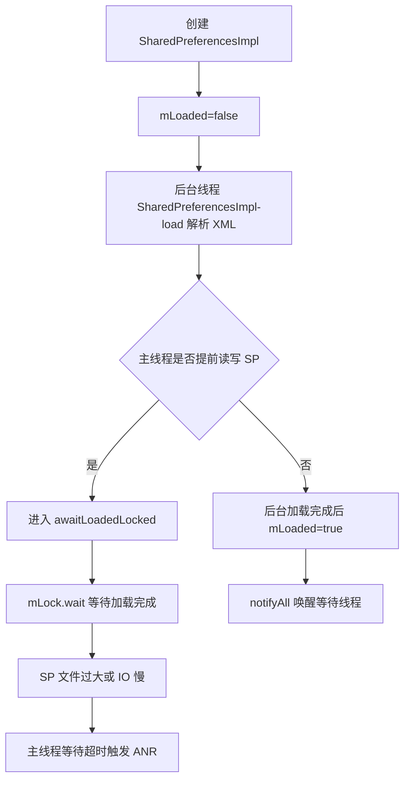
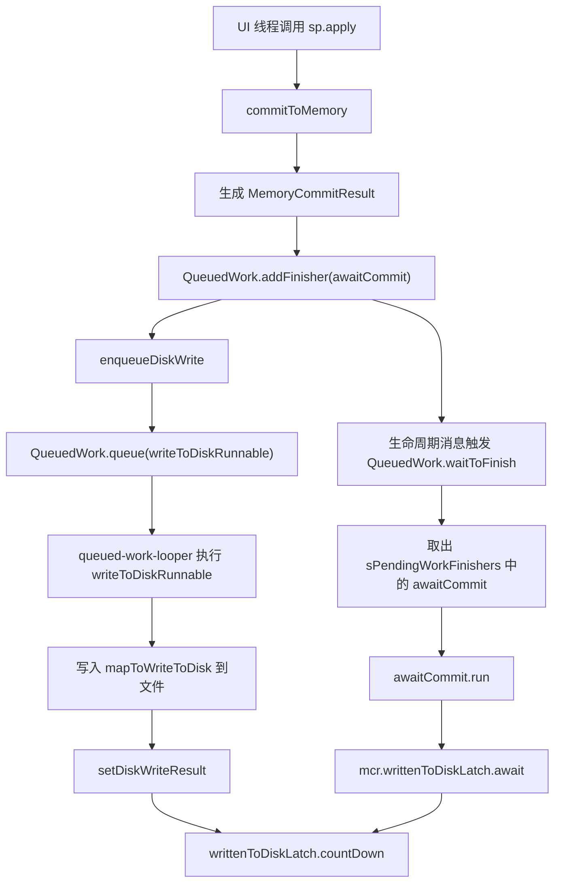

# 今日头条 ANR 优化实践第五篇总结：告别 SharedPreference 等待

> 原文：`/Users/yanhao/Downloads/github-nots/notes/Clippings/Android ANR/第五篇：今日头条 ANR 优化实践系列 - 告别 SharedPreference 等待.md`

## 读图情况

- 本文共 13 个图片引用，均已下载并人工检查，可读取。
- 图片内容覆盖 SharedPreferences 首次加载等待 Trace、`SharedPreferencesImpl` 加载源码、`awaitLoadedLocked()` 等待逻辑、`loadFromDisk()` 唤醒逻辑、Activity/Service 生命周期中的 `QueuedWork.waitToFinish()`、`apply()` 写盘流程、`MemoryCommitResult`、`CountDownLatch`、`sPendingWorkFinishers` 代理方案。
- 本机未安装 OCR 工具，因此图片中的源码、堆栈和流程图内容是基于原图人工阅读后提炼。

## 一句话结论

第五篇指出 SharedPreferences 引发 ANR 的核心不是 API 本身复杂，而是两个“主线程等待”机制：首次加载时，主线程读写会等待 SP 文件解析完成；`apply()` 写入时，系统会在 Activity/Service/Broadcast 等生命周期节点通过 `QueuedWork.waitToFinish()` 等待异步写盘完成。SP 被滥用、文件过大、pending apply 过多时，这些等待会被放大成 ANR。

## 两类 SP ANR 总览

| 问题 | Trace 表象 | 等待点 | 根因 | 常规治理 | 文章方案 |
| --- | --- | --- | --- | --- | --- |
| 首次加载等待 | 主线程 Waiting 在 `SharedPreferencesImpl.awaitLoadedLocked` | `mLock.wait()` | SP 文件尚未解析完成，`mLoaded=false` | 预加载、减小文件、核心路径避免首次同步读写 | 以使用规范为主，不建议硬绕 |
| apply 写入等待 | 主线程在 `QueuedWork.waitToFinish` 或写盘链路 | `writtenToDiskLatch.await()` | pending apply 太多，生命周期节点等待写盘完成 | 减少 SP 写入、合并写入、迁移存储 | 代理 `sPendingWorkFinishers`，让主线程跳过无意义等待 |

## 问题一：SP 加载未完成导致主线程等待

### 关键图片内容

首张 Trace 图显示主线程状态：

```text
"main" prio=5 tid=1 Waiting
state=S
utm=158 stm=30
at java.lang.Object.wait
- waiting on a android.app.SharedPreferencesImpl
at android.app.SharedPreferencesImpl.awaitLoadedLocked(SharedPreferencesImpl.java:225)
at android.app.SharedPreferencesImpl.edit(SharedPreferencesImpl.java:302)
```

源码图显示 `SharedPreferencesImpl` 构造时：

```java
mLoaded = false;
mMap = null;
startLoadFromDisk();
```

`startLoadFromDisk()` 中继续标记：

```java
synchronized (mLock) {
    mLoaded = false;
}
new Thread("SharedPreferencesImpl-load") {
    public void run() {
        loadFromDisk();
    }
}.start();
```

读写接口都会调用 `awaitLoadedLocked()`：

```java
private void awaitLoadedLocked() {
    while (!mLoaded) {
        mLock.wait();
    }
}
```

`getAll()`、`getString()` 等读接口，以及 `edit()` 写入口，都可能在 `mLoaded=false` 时被卡住。

`loadFromDisk()` 完成后：

```java
synchronized (mLock) {
    mLoaded = true;
    mMap = map != null ? map : new HashMap<>();
    mLock.notifyAll();
}
```

### 归因链路



### 评审要点

- 这类问题本质是“首次访问时机”与“文件加载耗时”的冲突。
- SP 不是不能用，而是不能在主线程关键路径首次访问大文件。
- 预加载只能降低命中概率，不能解决 SP 文件过大和核心路径同步读写的问题。
- 如果预加载发生得太晚，或预加载本身与首屏抢资源，仍可能产生收益不稳定。

## 问题二：apply 写入等待导致生命周期 ANR

### 关键图片内容

`handlePauseActivity()` 源码图显示：

```java
// Make sure any pending writes are now committed.
if (r.isPreHoneycomb()) {
    QueuedWork.waitToFinish();
}
```

正文还列出会等待文件写入的消息类型：

```java
public static final int SERVICE_ARGS = 115;
public static final int STOP_SERVICE = 116;
public static final int PAUSE_ACTIVITY = 101;
public static final int STOP_ACTIVITY_SHOW = 103;
public static final int SLEEPING = 137;
```

ANR Trace 图显示调用链：

```text
at java.io.FileDescriptor.sync
at android.os.FileUtils.sync
at android.app.SharedPreferencesImpl.writeToFile
at android.app.SharedPreferencesImpl$2.run
- locked java.lang.Object
at android.app.QueuedWork.processPendingWork
at android.app.QueuedWork.waitToFinish
at android.app.ActivityThread.handleServiceArgs
at android.app.ActivityThread$H.handleMessage
```

这说明主线程或生命周期处理链路正在等 SP 写盘相关任务完成。虽然 `apply()` 对业务调用方看起来是异步，但系统在某些生命周期边界会把未完成写入重新拉回到主线程等待语义里。

### apply 流程拆解

图片中的 Android 8.0 及以下流程可整理为：



`MemoryCommitResult` 图显示关键字段：

```java
final Map<String, Object> mapToWriteToDisk;
final CountDownLatch writtenToDiskLatch = new CountDownLatch(1);
volatile boolean writeToDiskResult = false;
boolean wasWritten = false;

void setDiskWriteResult(boolean wasWritten, boolean result) {
    this.wasWritten = wasWritten;
    writeToDiskResult = result;
    writtenToDiskLatch.countDown();
}
```

`QueuedWork.waitToFinish()` 图显示：

```java
public static void waitToFinish() {
    Runnable toFinish;
    while ((toFinish = sPendingWorkFinishers.poll()) != null) {
        toFinish.run();
    }
}
```

`awaitCommit` 图显示：

```java
final Runnable awaitCommit = new Runnable() {
    public void run() {
        mcr.writtenToDiskLatch.await();
    }
};
QueuedWork.addFinisher(awaitCommit);
```

因此，ANR 的根因不是“apply 一定同步写盘”，而是：`apply` 注册了一个等待写盘完成的 finisher；生命周期边界会执行这些 finisher；当 pending 写盘任务过多或单次写盘很慢时，主线程就会等待。

## 文章给出的解决方案

### 1. 加载等待的治理

文章建议：

- 对高频 SP 做预加载，尽量让真正使用时文件已经解析完成。
- 核心场景使用的 SP 文件不能太大。
- 遵守轻量级存储定位，不要把大量业务数据塞进 SP。

补充评审口径：

- 预加载是概率优化，不是根治。
- 根治方向是拆分大文件、减少主线程首次访问、迁移重数据。
- 预加载需要避开首屏强竞争阶段，否则可能把 IO 压力前移。

### 2. apply 写入等待的治理

文章认为生命周期里等待 SP 子线程写盘“收益很小、代价很高”，因此从 `QueuedWork.waitToFinish()` 入手。

`waitToFinish()` 的核心是：

```java
while ((toFinish = sPendingWorkFinishers.poll()) != null) {
    toFinish.run();
}
```

如果让 `sPendingWorkFinishers.poll()` 返回 `null`，主线程就不会执行 `awaitCommit.run()`，也就不会卡在 `writtenToDiskLatch.await()`。

方案图显示：自定义 `ConcurrentLinkedQueueProxy` 包装原始集合：

```java
public class ConcurrentLinkedQueueProxy<E> extends ConcurrentLinkedQueue<E> {
    public ConcurrentLinkedQueue<Runnable> workFinishers;

    public boolean add(E e) {
        return workFinishers.add((Runnable) e);
    }

    public boolean remove(Object e) {
        return workFinishers.remove(e);
    }

    public E poll() {
        return null;
    }

    public boolean isEmpty() {
        return true;
    }
}
```

效果是：

- SP 写盘任务仍然可以进入后台队列执行。
- finisher 仍然可以被 add/remove 到原集合。
- 主线程执行 `waitToFinish()` 时拿不到 finisher，因此不会等待写盘完成。

## 方案风险与边界

这篇文章的方案很有工程收益，但评审时必须把风险说清楚。

| 风险 | 说明 | 评审关注 |
| --- | --- | --- |
| 数据落盘时机变化 | 主线程不再等待写盘完成，进程被杀时可能丢失最近 apply | 哪些 SP 可以接受最终一致性 |
| 跨进程可见性变化 | 原设计希望生命周期边界尽量完成写盘，跳过等待会降低实时性 | 是否仍有跨进程读取 SP |
| 崩溃恢复风险 | pending apply 未写完时崩溃，文件可能保持旧值 | 关键配置是否必须 commit 或迁移 |
| 版本兼容风险 | 反射/代理 `QueuedWork.sPendingWorkFinishers` 依赖系统实现 | Android 版本和厂商 ROM 兼容矩阵 |
| 监控盲区 | ANR 降了，但写盘积压可能仍然存在 | 需要监控 pending 写盘队列和失败率 |
| 业务误用扩大 | 跳过等待后业务可能继续滥用 SP | 仍需治理大文件和高频写入 |

技术方案不能只写“代理 poll 返回 null”，还要配套：

- SP 文件大小监控。
- SP 首次加载耗时监控。
- apply 次数、写盘耗时、pending 写入数量监控。
- 关键 SP 白名单或黑名单策略。
- `commit` 与 `apply` 使用规范。
- DataStore/MMKV/数据库等迁移策略。

## 对技术方案的启发

### 1. SP ANR 要拆成加载等待和写入等待两套归因

自动归因不能只输出“SharedPreferences 导致 ANR”。更有用的分类是：

```text
SP_LOAD_WAIT:
  Trace 命中 awaitLoadedLocked / Object.wait
  SP 文件尚未 mLoaded
  关注文件大小、首次访问时机、加载耗时

SP_APPLY_WAIT:
  Trace 命中 QueuedWork.waitToFinish / writtenToDiskLatch.await / writeToFile
  pending apply 未完成
  关注 apply 频率、写盘耗时、生命周期消息
```

### 2. 监控字段要能回到具体文件和调用点

建议采集：

- SP 文件名、文件大小、key 数量。
- 首次加载开始/结束时间、是否主线程等待。
- 主线程等待 `awaitLoadedLocked` 的耗时。
- `apply/commit` 调用次数、调用栈、线程、批次。
- `MemoryCommitResult` 写盘耗时。
- `QueuedWork.sPendingWorkFinishers` 队列长度。
- 生命周期消息类型：`PAUSE_ACTIVITY`、`STOP_SERVICE`、`SERVICE_ARGS` 等。
- 是否发生主线程 `waitToFinish` 等待。

### 3. 治理优先级要按数据重要性分层

| 数据类型 | 推荐策略 |
| --- | --- |
| 非关键埋点、UI 状态、缓存开关 | 可接受最终一致性，可跳过生命周期等待 |
| 关键业务配置、登录态、支付相关状态 | 不建议简单跳过等待，应迁移或使用同步可靠写入 |
| 高频小写入 | 合并、批量、延迟写 |
| 大文件、多 key、复杂对象 | 拆分或迁移 DataStore/MMKV/数据库 |
| 跨进程依赖数据 | 不应依赖 SP apply 实时可见，需改为明确 IPC 或可靠存储 |

### 4. 优化方案要有灰度和回滚

绕过系统等待属于高收益但有语义变化的优化，应具备：

- 版本和 ROM 白名单。
- 线上开关。
- 崩溃、丢配置、回滚监控。
- 关键 SP 排除策略。
- 灰度前后 ANR、流畅性、写盘失败率对比。

## 评审检查清单

### 证据链检查

- 是否区分了 `awaitLoadedLocked` 加载等待和 `QueuedWork.waitToFinish` 写入等待。
- 是否有主线程 Trace 证明等待点。
- 是否能定位到具体 SP 文件名和调用栈。
- 是否能说明 SP 文件大小、key 数量、加载耗时。
- 是否能说明 pending apply 数量和写盘耗时。
- 是否能关联生命周期消息类型。
- 是否能排除系统负载、普通 IO 抢占、历史消息慢等其它 ANR 类别。

### 方案检查

- 是否明确哪些 SP 可以跳过等待，哪些不能跳过。
- 是否有数据一致性风险说明。
- 是否有跨进程读取 SP 的排查。
- 是否有版本/ROM 兼容验证。
- 是否有灰度开关和回滚方案。
- 是否有优化后的写盘积压监控。
- 是否规划长期迁移方案，而不是只依赖 Hook/代理。

## 举一反三提问

> 这一组问题用于后续技术方案输出和评审。第五篇的关键不只是“怎么消灭 SP 等待 ANR”，还要回答“哪些等待可以跳过、哪些数据不能冒险、如何证明优化没有引入一致性事故”。

### 机制理解类

1. 为什么 `apply()` 被称为异步，但仍可能在主线程生命周期里触发等待？
2. `awaitLoadedLocked()` 和 `writtenToDiskLatch.await()` 分别代表哪两类 SP 等待？
3. 为什么 SP 文件越大，首次访问主线程等待风险越高？
4. `QueuedWork.waitToFinish()` 为什么会出现在 Activity/Service/Broadcast 生命周期里？
5. Android 8.0 以后主线程“帮助写入”为什么仍不能完全解决 ANR？
6. `commit()` 与 `apply()` 在内存更新、磁盘写入、返回时机和主线程风险上分别有什么差异？
7. 为什么 `apply()` 的内存可见性不等同于磁盘持久化完成？
8. `QueuedWork.addFinisher(awaitCommit)` 的设计初衷是什么？它在重度 SP 使用场景下为什么会变成 ANR 风险？
9. 为什么生命周期节点等待 pending writes 不能简单理解为“系统 bug”，而是“设计假设与业务使用规模冲突”？
10. 为什么 SP 适合轻量 key-value，而不适合承载大文件、多 key、高频写入、跨进程实时通信？

### 方案设计类

1. 哪些 SP 文件可以接受跳过生命周期等待？
2. 哪些数据必须禁止使用这种绕过方案？
3. 是否需要按文件、按业务、按 key 做白名单/黑名单？
4. 如何记录 pending apply 的数量和最长等待时间？
5. 如果代理 `sPendingWorkFinishers` 失败，是否能自动降级？
6. 是否应该按数据重要性分成强一致、最终一致、可丢弃三类？
7. 对强一致数据，是继续使用 `commit()`，还是迁移到更可靠的存储？
8. 对最终一致数据，是否允许跳过 `waitToFinish()`，以及允许多长的落盘延迟？
9. 对可丢弃数据，是否应该从 SP 迁移到内存缓存或普通文件缓存？
10. 绕过 `sPendingWorkFinishers.poll()` 是全局生效还是按文件生效？如果只能全局生效，如何控制风险？
11. 是否需要在启动、退出、低内存回调等时机主动 flush 关键 SP？
12. 是否需要对 SP 写入做合并、防抖、批处理，减少 pending finisher 数量？
13. 如果同一个 SP 文件既有关键 key 又有非关键 key，是否应该先拆文件再做绕过？
14. 对多进程应用，是否要禁止跨进程依赖 SP 的实时落盘？
15. DataStore/MMKV/数据库迁移优先级如何排序？

### 风险评审类

1. 跳过 `waitToFinish()` 后，进程立刻被杀会丢哪些数据？
2. 是否存在其它进程依赖 SP 文件实时落盘？
3. 崩溃恢复时，哪些业务会因为最后一次 apply 未落盘产生异常？
4. 如何证明 ANR 收益不是以数据一致性事故换来的？
5. 如果线上出现配置丢失，如何快速定位是否与该优化有关？
6. 如果用户完成关键操作后立刻杀进程，哪些状态必须保证已持久化？
7. 如果系统低内存杀进程发生在 apply 后、写盘前，业务能否接受回滚到旧值？
8. 如果 `QueuedWork` 代理在某些 ROM 上失败，会退化成什么表现？
9. 如果代理集合行为与系统期望不一致，是否可能影响其它使用 `QueuedWork` 的框架任务？
10. 跳过等待后，后台写盘任务如果长期堆积，会不会造成后续 IO 抖动或数据延迟？
11. 如果 SP 文件损坏或恢复 backup 文件，绕过等待是否会扩大异常影响？
12. 是否有监控能区分“数据未写入”和“业务后来覆盖了旧值”？
13. 是否有关键业务回归用例验证登录态、实验配置、开关配置、草稿数据等场景？
14. 是否需要在 crash 报告里带上 pending SP 写入数量和最近写入文件？
15. 是否有线上开关能按 ROM、Android 版本、业务模块关闭该优化？

### 反事实推理类

1. 如果这次 ANR 不是 SP 加载等待，Trace 中应该不会出现哪些特征？
2. 如果是普通文件 IO 慢，而不是 `QueuedWork.waitToFinish()`，调用链会有什么差异？
3. 如果是历史消息慢导致当前 Trace 命中 SP，Raster 历史消息和当前消息应如何对齐？
4. 如果是系统 iowait 高导致 SP 写盘慢，系统 CPU/Load 应该补充哪些证据？
5. 如果 `apply()` pending 很少但仍 ANR，应该怀疑单个 SP 文件过大还是磁盘环境异常？
6. 如果跳过 `waitToFinish()` 后 ANR 下降但写盘耗时没有下降，说明优化解决了什么、没解决什么？
7. 如果 ANR 没下降，是否说明根因不是 SP，还是说明只跳过了一部分生命周期等待？
8. 如果配置丢失上升但 ANR 下降，方案应该如何重新分层和收敛？

### 自动归因类

1. 如何把 SP 加载等待和 SP 写入等待拆成两个不同的归因码？
2. `awaitLoadedLocked`、`Object.wait`、`SharedPreferencesImpl.edit/getString` 这些栈如何组成加载等待规则？
3. `QueuedWork.waitToFinish`、`MemoryCommitResult`、`writtenToDiskLatch.await`、`writeToFile` 如何组成写入等待规则？
4. 如果 Trace 只看到 `FileDescriptor.sync`，如何判断是否属于 SP 写盘？
5. 是否需要把 SP 文件名、文件大小、调用栈、生命周期消息类型放进归因报告？
6. 置信度如何分级：Trace 命中、文件名可定位、pending 数量可见、写盘耗时可见分别算几分？
7. 如果不能读取 SP 文件名，报告应该如何表达“疑似 SP 等待但证据不足”？
8. 如何把 SP 等待与第二篇/第三篇中的系统 IO 负载、进程内 IO 负载区分开？

### 治理闭环类

1. SP 文件大小超过多少需要告警？
2. 高频 apply 的阈值如何定义？
3. 是否要在 CI 或静态扫描里限制主线程关键路径读写 SP？
4. 是否要推动核心业务迁移到 DataStore/MMKV/数据库？
5. 优化后还需要保留哪些 SP 健康度大盘？
6. 是否需要建立 SP 文件排行榜：文件大小、key 数量、读写次数、加载耗时、写盘耗时？
7. 是否需要对新增 SP 文件进行准入评审？
8. 是否要在代码扫描中识别循环内 `apply()`、生命周期内频繁 `apply()`、主线程首次读取大 SP？
9. 如何推动业务把“临时缓存、埋点状态、关键配置、用户状态”拆到不同存储？
10. 迁移 DataStore/MMKV/数据库时，如何处理旧 SP 数据兼容和回滚？
11. 灰度验收标准是什么：ANR 下降、卡顿下降、配置丢失不上升、crash 不上升、写盘积压不上升？
12. 如果优化后业务仍继续滥用 SP，是否需要加硬性阈值和报警升级？

## 三轮审核

### 第一轮：事实完整性审核

结论：文档已覆盖第五篇的两个核心事实：SP 首次加载会让主线程等待 `mLoaded=true`，SP `apply()` 会在生命周期边界通过 `QueuedWork.waitToFinish()` 等待异步写盘完成。

已覆盖事实：

- `SharedPreferencesImpl` 构造时 `mLoaded=false`，随后启动 `SharedPreferencesImpl-load` 线程。
- 读写接口会进入 `awaitLoadedLocked()`，在 `mLoaded=false` 时 `mLock.wait()`。
- `loadFromDisk()` 完成后设置 `mLoaded=true` 并 `notifyAll()`。
- `apply()` 生成 `MemoryCommitResult`，包含 `writtenToDiskLatch`。
- `QueuedWork.addFinisher(awaitCommit)` 注册等待任务。
- 生命周期节点调用 `QueuedWork.waitToFinish()`，轮询 `sPendingWorkFinishers` 并执行 finisher。
- finisher 内部等待 `mcr.writtenToDiskLatch.await()`。
- 子线程写盘完成后 `setDiskWriteResult()` 调用 `countDown()`。

表达风险：

- 不应说 `apply()` 完全同步；准确说法是“调用处异步，但生命周期边界可能同步等待其写盘完成”。
- 不应说跳过 `waitToFinish()` 没有副作用；它改变了系统原本的等待语义。
- 不应把所有 SP ANR 都归为写入等待；首次加载等待是另一类问题。
- 不应只强调 Hook 收益，必须同时写数据一致性和跨进程风险。

事实链应拆成两条表达：

```text
SP_LOAD_WAIT
  -> SharedPreferencesImpl 构造后 mLoaded=false
  -> 后台线程 loadFromDisk
  -> 主线程提前 get/edit
  -> awaitLoadedLocked / mLock.wait
  -> 文件大或 IO 慢导致等待超时

SP_APPLY_WAIT
  -> apply 更新内存并生成 MemoryCommitResult
  -> addFinisher(awaitCommit)
  -> 后台 queued-work 写盘
  -> 生命周期触发 waitToFinish
  -> finisher 等待 writtenToDiskLatch
  -> pending 写盘过多或写盘慢导致 ANR
```

强证据与弱证据分层：

| 证据 | 对应场景 | 证据强度 | 说明 |
| --- | --- | --- | --- |
| Trace 命中 `awaitLoadedLocked` | 加载等待 | 强 | 直接证明主线程等待 SP 加载 |
| Trace 命中 `QueuedWork.waitToFinish` | 写入等待 | 强 | 直接证明生命周期边界等待 pending work |
| Trace 命中 `writtenToDiskLatch.await` | 写入等待 | 强 | 直接证明等待 apply 写盘完成 |
| Trace 命中 `FileDescriptor.sync/writeToFile` | 写入等待 | 中强 | 需确认来自 SP 写盘而非普通文件 IO |
| SP 文件大小/key 数量异常 | 加载/写入 | 中 | 可解释耗时，但不是单独根因 |
| pending apply 数量高 | 写入等待 | 中强 | 可解释 `waitToFinish` 等待变长 |
| 系统 iowait 高 | 加载/写入 | 辅助 | 说明环境放大 IO 等待 |
| 生命周期消息类型命中 | 写入等待 | 辅助 | 用于解释为什么此时触发等待 |

第一轮审核结论：

- 文档事实已覆盖第五篇的核心机制。
- 后续综合方案中必须明确：SP 等待是“系统组件默认语义被业务规模放大”的问题，不是单纯某个业务慢函数。
- 对外评审时要把“短期绕过等待”和“长期治理 SP 滥用”分开，不要让 Hook 方案承担全部治理目标。

### 第二轮：技术方案落地审核

结论：第五篇可以转化为一套 SP ANR 专项治理方案，但必须同时包含“短期绕过等待”和“长期治理 SP 滥用”。

落地优先级：

| 优先级 | 能力 | 原因 |
| --- | --- | --- |
| P0 | 区分加载等待与写入等待 | 两类问题的修复手段不同 |
| P0 | 采集 SP 文件名、大小、调用栈、等待耗时 | 没有这些信息无法推动业务整改 |
| P0 | `waitToFinish` 绕过方案灰度开关 | 高收益方案必须可回滚 |
| P1 | pending apply 队列和写盘耗时监控 | 防止 ANR 消失但写盘积压继续恶化 |
| P1 | 关键 SP 白名单/黑名单 | 控制数据一致性风险 |
| P2 | DataStore/MMKV/数据库迁移 | 长期解决重数据滥用 |

必须补齐的方案问题：

- 代理 `sPendingWorkFinishers` 的 Android 版本兼容矩阵。
- 关键数据和非关键数据的策略差异。
- 进程被杀、崩溃、跨进程读取时的数据一致性评估。
- 灰度前后 ANR、卡顿、配置丢失、写盘失败率对比。
- 如果 Hook 失败或 ROM 行为不一致，如何自动关闭优化。

落地能力分层：

| 能力层 | 必须回答的问题 | 最小实现 |
| --- | --- | --- |
| 归因识别 | 是加载等待还是写入等待？ | Trace 规则区分 `awaitLoadedLocked` 与 `waitToFinish` |
| 现场定位 | 是哪个 SP 文件、哪个调用点？ | 文件名、文件大小、调用栈、线程 |
| 等待量化 | 主线程等了多久，pending 有多少？ | 等待耗时、pending finisher 数、写盘耗时 |
| 风险控制 | 哪些数据不能跳过等待？ | 文件/key 分级，关键数据排除 |
| 兼容回滚 | 某 ROM/版本异常怎么办？ | 灰度开关、版本白名单、失败自动降级 |
| 长期治理 | 如何减少 SP 滥用？ | 文件拆分、写入合并、存储迁移、静态扫描 |

数据分级建议：

| 分级 | 示例 | 推荐策略 |
| --- | --- | --- |
| 强一致 | 登录态、支付状态、关键协议确认、不可丢业务进度 | 不直接跳过等待，优先迁移可靠存储或显式同步写 |
| 最终一致 | UI 状态、非关键开关、普通用户偏好 | 可跳过生命周期等待，但需监控落盘延迟 |
| 可丢弃 | 埋点临时状态、缓存标记、曝光去重临时位 | 可从 SP 迁出，使用内存/缓存存储 |
| 跨进程共享 | 多进程配置、进程间通信状态 | 不建议依赖 SP apply 实时性，改为明确 IPC 或可靠存储 |

自动归因输出模板：

```text
归因：SharedPreferences 写入等待导致 ANR
归因码：SP_APPLY_WAIT
置信度：高
关键证据：
1. 主线程 Trace 命中 QueuedWork.waitToFinish
2. finisher 等待 writtenToDiskLatch.await
3. pending apply 数量 xx，最长写盘 xx ms
4. 生命周期消息：PAUSE_ACTIVITY / SERVICE_ARGS / STOP_SERVICE
5. SP 文件：xxx.xml，大小 xx KB，最近调用栈 xxx
风险提示：
该优化可跳过主线程等待，但需要确认该 SP 是否允许最终一致。
建议：
短期灰度绕过 waitToFinish；中期治理高频 apply；长期迁移重数据。
```

灰度验收指标：

- SP 等待类 ANR 下降。
- 生命周期切换卡顿下降。
- crash 率不升高。
- 配置丢失、登录态异常、状态回滚等业务指标不升高。
- pending apply 数量和最长写盘耗时不继续恶化。
- Hook/代理失败率可见，失败后能自动降级。

第二轮审核结论：

- P0 是把 SP 等待识别清楚，并给出可回滚的短期优化。
- P1 是把写盘积压和关键数据风险监控起来，防止“ANR 消失但隐患还在”。
- P2 是推动存储迁移和 SP 使用规范，否则同类问题会反复出现。

### 第三轮：评审表达审核

推荐评审口径：

> SharedPreferences 导致 ANR 主要分两类。第一类是首次加载等待：SP 构造后后台解析文件，主线程提前读写会卡在 `awaitLoadedLocked()`。第二类是 `apply()` 写入等待：虽然 `apply()` 对调用方是异步，但它会注册 `QueuedWork` finisher，Activity/Service/Broadcast 生命周期边界执行 `waitToFinish()` 时可能等待 `writtenToDiskLatch`，pending 写盘过多就会 ANR。短期可以通过代理 `sPendingWorkFinishers` 跳过主线程无意义等待，但必须配套灰度、回滚、关键数据排除和写盘健康度监控；长期仍要治理 SP 大文件和高频写入。

评审时可以直接追问：

- “这次 Trace 是 `awaitLoadedLocked` 还是 `QueuedWork.waitToFinish`？”
- “能不能定位到具体 SP 文件和调用栈？”
- “跳过等待后，哪些数据允许最终一致，哪些必须强一致？”
- “是否还有跨进程依赖 SP 实时落盘？”
- “优化后 pending apply 是否继续积压？”
- “是否有 DataStore/MMKV/数据库迁移计划？”

不推荐表达：

- “`apply()` 是异步的，所以不会造成 ANR。”
- “把 `poll()` 改成返回 `null` 就没有副作用。”
- “SP ANR 都可以通过 Hook 一把梭解决。”
- “ANR 降了就说明方案完全成功。”
- “Google 设计有缺陷，所以业务不用再治理 SP。”

推荐补充表达：

- “这不是取消写盘，而是取消生命周期主线程等待；后台写盘仍应继续执行。”
- “该方案改变的是等待语义，不改变内存更新语义，但会影响磁盘持久化时机。”
- “SP 等待治理分短期止血和长期治理：短期绕过无意义等待，长期减少大文件和高频写入。”
- “关键数据必须单独分级，不能和普通 UI 状态、埋点缓存采用同一策略。”
- “优化收益必须和数据一致性指标一起看。”

评审攻防表：

| 评审追问 | 推荐回答 |
| --- | --- |
| 跳过 `waitToFinish` 会不会丢数据？ | 可能改变最近一次 apply 的落盘时机，所以必须按数据分级；强一致数据不走该策略，最终一致数据可接受延迟。 |
| 为什么不直接要求业务少用 SP？ | 长期必须治理，但线上 ANR 需要短期止血；两条线并行，不能互相替代。 |
| Android 8.0 以后不是优化过了吗？ | 8.0 后主线程可能协助处理 pending work，但 pending 多或 IO 慢时仍可能卡主线程，不能根治重度使用问题。 |
| 怎么证明不是普通 IO ANR？ | Trace 要命中 `QueuedWork.waitToFinish`/`writtenToDiskLatch.await` 或 `SharedPreferencesImpl.writeToFile`，并结合 SP 文件和 pending apply 证据。 |
| 如果线上出现配置丢失怎么办？ | 通过开关按 ROM/版本/业务关闭优化，查看最近 pending SP 写入、文件名、调用栈，并将相关 SP 加入强一致排除列表。 |
| 为什么不直接全量迁移 DataStore？ | 迁移成本和兼容风险高，适合作为长期治理；短期仍需要控制现有 SP 等待 ANR。 |

最终审核结论：

- 第五篇应归入“系统组件使用方式与系统等待语义冲突”类别。
- 这篇对后续方案的最大价值，是提醒 ANR 优化不能只做 Trace 归因，还要改造高频系统组件的危险默认行为。
- 技术方案中可以把 SP 等待作为独立专项：短期绕过主线程等待，中期监控和规范，长期迁移重数据。
- 后续五篇综合汇总时，应把第五篇作为“专项治理型 ANR”的代表案例：先用监控证明系统等待语义，再用工程手段止血，最后用规范和迁移降低复发。
