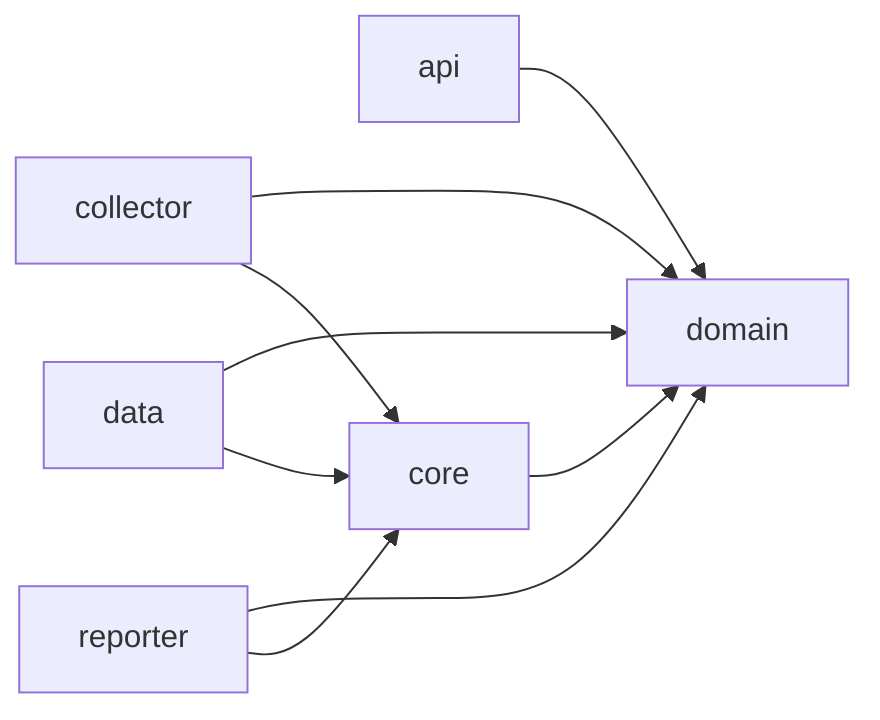
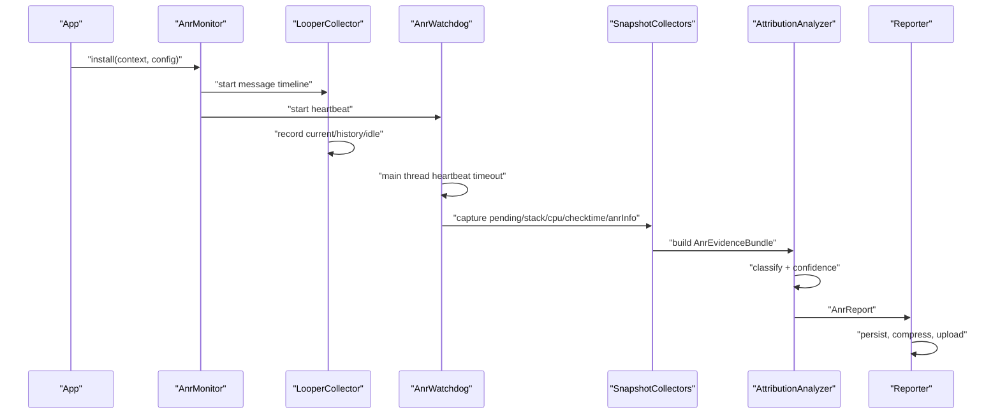

# ANR 监控 SDK 设计开发文档

> 输入资料：`01-第一篇-设计原理及影响因素.md`、`02-第二篇-监控工具与分析思路.md`、`03-第三篇-实例剖析集锦.md`、`04-第四篇-Barrier导致主线程假死.md`、`05-第五篇-告别SharedPreference等待.md`

## 1. 文档目标

本文用于指导当前项目开发一个 Android ANR 监控 SDK。文档目标不是复述 ANR 文章，而是把 5 篇文章中的原理、工具、案例和专项治理方案转化为可开发、可评审、可验收的 SDK 方案。

本 SDK 的核心目标：

- 在线上应用侧低成本记录 ANR 形成过程，而不是只记录 ANR 发生时的 Trace 快照。
- 用主线程消息时间线串联过去、现在和 Pending 队列，解释系统超时为什么发生。
- 通过规则化归因输出证据链、置信度和治理建议，减少 Trace 误判。
- 支持当前消息慢、历史消息慢、累计慢、消息风暴、进程内资源抢占、外部系统负载、跨进程阻塞疑似、Sync Barrier 残留、SharedPreferences 等待等核心类型。
- 在兼容、性能、隐私、稳定性可控的前提下，为后续服务端聚类和业务治理提供标准数据协议。

一句话设计原则：

> ANR 监控 SDK 不是“抓一份堆栈”，而是“还原一次超时形成过程”。

## 2. 关键输入结论

### 2.1 来自第一篇：ANR 是系统侧等待超时

ANR 的本质是系统服务端对组件或输入事件设置异步超时，等待应用在阈值内完成回调。ANR Info 中的组件名、Reason 和 Trace 当前栈只能说明“哪个系统事件没有按时完成”，不能直接说明“哪个业务代码就是根因”。

SDK 必须覆盖：

- ANR 类型：Input、Service、Broadcast、Provider、Activity、Finalizer 等。
- 超时阈值：不同组件、Android 版本、厂商 ROM 可能不同，必须可配置。
- 主线程当前状态、历史状态、Pending 队列、系统和进程资源环境。
- Trace 不完整、Dump 超时、系统正在 dump 造成 `system_server` CPU 高等容错解释。

### 2.2 来自第二篇：Raster 的核心是主线程消息时间线

仅靠系统 Trace 会错过 ANR 前的调度过程。SDK 应借鉴 Raster 的“过去、现在、将来”模型：

- 过去：ANR 前一段时间的历史消息调度记录。
- 现在：ANR 发生或疑似发生时当前正在调度的消息。
- 将来：Pending 队列中已经等待很久但尚未调度的消息。
- 环境：Wall/Cpu、慢消息采样、线程 Checktime、系统/进程资源状态。

### 2.3 来自第三篇：归因必须输出证据链

第三篇 6 类案例说明，单点证据不足以归因：

| 归因类型 | 核心证据 |
| --- | --- |
| 当前消息慢 | 当前消息 Wall/Cpu 高，Pending 首条 Block 与当前消息耗时对齐 |
| 历史消息慢 | 当前消息短，历史消息长，Pending Block 与历史慢消息对齐 |
| 消息风暴 | 单条不慢，但同 Handler/callback 大量重复，主线程 CPU 高 |
| 进程内 IO 抢占 | 子线程 `stm` 高、系统 iowait 高、主线程 Wall 高 Cpu 低 |
| 外部系统负载 | 目标进程 CPU 不高，Load/iowait/kswapd/mmcqd/外部进程异常 |
| 跨进程死锁 | Binder 调用链、锁等待链形成环形等待，线上通常只能疑似 |

SDK 报告必须按证据链展示，而不是只输出一个根因标签。

### 2.4 来自第四篇：`NativePollOnce` 也可能是队列机制异常

`NativePollOnce` 不能简单等价于“主线程空闲”。当队头残留 `target == null` 的 Sync Barrier 时，普通同步消息会长期被挡住，主线程反复 `nativePollOnce(timeoutMillis=-1)`，表现为队列中有消息但不调度。

SDK 必须增加独立归因分支：

- Pending 队头 `target == null`。
- `arg1` token 可见且长期残留。
- 普通同步消息等待超过阈值。
- 当前消息 Wall 高 Cpu 低。
- `nativePollOnce(-1)` 多次出现时可增强置信度。

### 2.5 来自第五篇：SP 等待是专项治理型 ANR

SharedPreferences 相关 ANR 至少拆成两类：

- `SP_LOAD_WAIT`：主线程卡在 `SharedPreferencesImpl.awaitLoadedLocked`，等待首次加载完成。
- `SP_APPLY_WAIT`：生命周期边界触发 `QueuedWork.waitToFinish`，等待 `apply()` 写盘完成。

SDK 必须能区分两类等待，并输出具体文件、大小、key 数量、调用点、pending apply、写盘耗时和数据一致性风险。

## 3. 总体设计

### 3.1 建议模块形态

当前仓库是 Android 项目，建议新增独立 SDK 模块：

```text
Vibe-ANR-Monitoring
├── app
└── anr-monitor-sdk
    └── src/main/java/com/valiantyan/anrmonitor
```

`app` 只作为示例接入和验证入口，SDK 不反向依赖 `app`。

### 3.2 分层结构

SDK 采用“对外 API + 纯领域模型 + 采集实现 + 归因分析 + 上报存储”的结构。领域模型尽量保持纯 Kotlin，Android 框架访问集中在 collector 和 integration 层。

```text
com.valiantyan.anrmonitor
├── api
│   ├── AnrMonitor
│   ├── AnrMonitorConfig
│   ├── AnrReportUploader
│   └── AnrEventListener
├── domain
│   ├── model
│   ├── analyzer
│   └── repository
├── data
│   ├── local
│   ├── mapper
│   └── repository
├── core
│   ├── clock
│   ├── config
│   ├── privacy
│   ├── sampling
│   └── thread
├── collector
│   ├── looper
│   ├── pending
│   ├── stack
│   ├── threadcpu
│   ├── checktime
│   ├── anrinfo
│   ├── barrier
│   └── sharedprefs
├── reporter
│   ├── encoder
│   ├── uploader
│   └── retry
└── internal
    ├── reflection
    ├── compat
    └── diagnostics
```

依赖方向：



约束：

- `domain` 不直接依赖 Android 框架类，只放模型、归因规则接口和纯计算逻辑。
- `collector` 负责 Android 运行时采集，所有反射、隐藏 API、兼容处理集中在这里。
- `data` 负责本地缓存和队列持久化，不包含归因业务逻辑。
- `api` 只暴露稳定配置和生命周期入口，不泄漏内部反射实现。

### 3.3 运行流程



## 4. 对外 API 设计

### 4.1 初始化 API

```kotlin
AnrMonitor.install(
    context = application,
    config = AnrMonitorConfig(
        appId = "demo",
        environment = "debug",
        enabled = true,
        uploadEnabled = true,
        sampleRate = 1.0f,
    ),
    uploader = object : AnrReportUploader {
        override fun upload(report: AnrReport): UploadResult {
            return UploadResult.Skip
        }
    },
)
```

设计要求：

- `install` 幂等，多次调用只生效一次。
- 支持 Application 初始化，也支持按进程启用。
- 默认只在主进程开启完整能力，多进程能力通过配置显式开启。
- 支持远程配置动态更新采样率、阈值、开关和禁用列表。

### 4.2 配置模型

核心配置建议：

| 字段 | 默认值 | 说明 |
| --- | --- | --- |
| `enabled` | `true` | SDK 总开关 |
| `sampleRate` | `1.0` debug / 线上按需 | 事件采样率 |
| `historyBufferSize` | `120` | 历史消息环形缓冲区条数 |
| `shortMessageAggregateMs` | `300` | 短消息聚合阈值 |
| `slowMessageMs` | `1000` | 慢消息阈值 |
| `stackSampleIntervalMs` | `500` | 慢消息采样间隔 |
| `maxStackSamplesPerMessage` | `10` | 单条消息最大采样次数 |
| `watchdogIntervalMs` | `1000` | Watchdog 心跳间隔 |
| `suspectAnrMs` | `5000` | 疑似 ANR 阈值，Input 场景优先 |
| `pendingSnapshotMaxDepth` | `200` | Pending 队列最大遍历深度 |
| `checktimeIntervalMs` | `300` | Checktime 检测周期 |
| `checktimeSevereDelayMs` | `800` | 严重调度延迟阈值 |
| `captureThreadCpu` | `true` | 是否采集进程内线程 CPU |
| `capturePendingQueue` | `true` | 是否读取 Pending 队列 |
| `captureSpHealth` | `true` | 是否采集 SP 健康度 |
| `enableQueuedWorkBypass` | `false` | 是否启用 SP waitToFinish 绕过，默认关闭 |
| `privacyMode` | `Safe` | 默认不上传对象内容和参数 |

### 4.3 事件监听

```kotlin
interface AnrEventListener {
    fun onSuspectAnr(snapshot: AnrSnapshot)
    fun onConfirmedAnr(report: AnrReport)
    fun onMonitorError(error: AnrMonitorError)
}
```

用途：

- Debug 环境展示本地诊断面板。
- 自动化测试中校验采集结果。
- 业务方接入自定义日志、埋点或降级策略。

## 5. 核心采集能力

### 5.1 主线程消息时间线

实现目标：

- 记录当前消息、历史消息、IDLE、关键组件消息。
- 支持短消息聚合、慢消息拆分、关键组件消息强制单独记录。
- 每条记录有统一时间基准，可和 Pending、Checktime、Trace 对齐。

推荐采集方式：

- P0 使用 `Looper.setMessageLogging(Printer)` 识别 dispatch start/end。
- 若业务已有 Printer，SDK 需要做代理转发，避免覆盖。
- 记录 start/end 时使用 `SystemClock.uptimeMillis()` 和 `Debug.threadCpuTimeNanos()`。
- 消息字符串需要脱敏，只保留类名、what、target/callback 类名哈希或简名。

`MessageRecord` 建议字段：

| 字段 | 说明 |
| --- | --- |
| `seq` | SDK 内部递增序号 |
| `kind` | `CURRENT`、`HISTORY`、`IDLE`、`AGGREGATED`、`COMPONENT` |
| `messageType` | ActivityThread.H 类型、Handler、Callback、Idle 等 |
| `what` | Message.what，无法获取时为空 |
| `targetClass` | Handler 类名或脱敏 hash |
| `callbackClass` | callback 类名或脱敏 hash |
| `isCriticalComponent` | 是否为 Activity/Service/Receiver/Provider/Input 相关消息 |
| `startUptimeMs` | 开始时间 |
| `endUptimeMs` | 结束时间，当前消息可为空 |
| `wallMs` | Wall Duration |
| `cpuMs` | Cpu Duration |
| `count` | 聚合消息数量 |
| `sampleStackIds` | 慢消息采样堆栈 ID 列表 |

聚合策略：

- 连续短消息累计到 `shortMessageAggregateMs` 后合并。
- 单条消息超过慢消息阈值时强制拆分。
- 组件消息、疑似 ANR 相关消息不参与普通聚合。
- 长 IDLE 单独记录，短 IDLE 可并入前后记录。
- 环形缓冲区固定大小，避免内存无限增长。

### 5.2 当前消息采集

当前消息用于判断 Trace 是否是强根因。

采集字段：

- 当前消息标识。
- 已执行 Wall。
- 已消耗 CPU。
- 当前主线程 Java 栈。
- 当前消息是否为关键组件消息。
- 当前消息开始前的最近历史消息。

判断口径：

- 当前消息 Wall/Cpu 都高：更像当前业务执行慢。
- 当前消息 Wall 高、Cpu 低：更像等待、锁、Binder、IO 或调度受阻。
- 当前消息 Wall/Cpu 都低：当前 Trace 很可能是替罪羊，应回看历史消息和 Pending。

### 5.3 Pending 队列快照

Pending 是解释组件超时、消息风暴和 Barrier 的关键能力。

采集方式：

- 在疑似 ANR、慢消息阈值触发、用户主动 dump 时读取。
- 通过反射读取 `MessageQueue#mMessages` 及 `Message#next` 链。
- 遍历时控制深度和耗时，建议只在非高频路径触发。
- 读取失败必须在报告中记录 `pendingAvailable=false`，不能静默忽略。

`PendingMessage` 建议字段：

| 字段 | 说明 |
| --- | --- |
| `index` | 队列位置 |
| `whenUptimeMs` | Message.when |
| `delayMs` | `when - now`，负数代表已到期 |
| `blockedMs` | `max(0, now - when)` |
| `what` | Message.what |
| `arg1` / `arg2` | 用于 Barrier token 等判断 |
| `targetClass` | Handler 类名或空 |
| `callbackClass` | callback 类名 |
| `objClass` | obj 类型，不上传 obj 内容 |
| `isAsynchronous` | 可获取时记录 |
| `isBarrierLike` | `target == null` |
| `isCriticalComponent` | 是否关键组件消息 |

隐私约束：

- 禁止上传 `obj.toString()`。
- 默认只上传类名、hash、what、when、arg。
- callback、target 可以按包名策略脱敏。

### 5.4 慢消息堆栈采样

目标：

- 对慢消息内部的热点函数、锁等待、Binder、IO 做低侵入定位。
- 避免函数插桩的大成本，使用异步周期采样。

策略：

- 消息开始时记录 `seq` 和目标采样时间。
- 后台线程到点后检查当前消息 `seq` 是否仍一致。
- 一致则抓取主线程栈，并继续下一轮采样。
- 不一致说明消息已结束，取消本轮采样。
- 单条消息最大采样次数受限。

采样结果：

- 端侧可按栈 hash 聚合，记录出现次数。
- 上传时保留栈顶关键帧和业务包内帧。
- 对混淆包可依赖服务端 mapping 还原。

### 5.5 Watchdog 与 ANR 确认

SDK 需要区分“疑似主线程卡住”和“系统确认 ANR”。

Watchdog 设计：

- 后台线程按固定间隔向主线程投递心跳。
- 超过 `suspectAnrMs` 未响应时触发疑似 ANR 快照。
- 快照包含当前栈、当前消息、历史消息、Pending、线程 CPU、Checktime、SP/Barrier 现场。

系统确认增强：

- 通过 `ActivityManager.getProcessesInErrorState()` 尝试读取 `ProcessErrorStateInfo`。
- 如果当前进程状态为 `NOT_RESPONDING`，补充 `shortMsg`、`longMsg`、`condition`。
- 无法确认时仍可上传 `SUSPECT_ANR`，但归因置信度降低。

不建议 P0 依赖：

- 完整系统 Trace 文件：三方应用线上权限和路径不稳定。
- Kernel/系统 Logcat：普通应用线上通常不可得。
- 自定义 SIGQUIT 监听：兼容和稳定风险较高，可作为 P2 实验能力。

### 5.6 线程 CPU 与栈快照

目标：

- 区分主线程自身执行慢、进程内子线程抢占、IO/系统调用压力。

采集内容：

- 主线程 `utm/stm` 或近似 CPU 时间。
- 进程内 Top N 线程 CPU 增量。
- 可疑线程 Java 栈。
- 线程名、tid、优先级、状态。

实现建议：

- P0 使用 `Thread.getAllStackTraces()` 获取当前进程线程栈。
- P1 读取 `/proc/self/task/<tid>/stat` 计算线程 utime/stime 增量。
- 若读取失败，降级为仅线程栈和线程名。

### 5.7 Checktime 调度能力检测

Checktime 是环境证据，不是根因。

设计：

- 创建一个低成本检测线程，理论周期如 300ms。
- 每次执行记录实际间隔。
- 输出最大 delay、P95、连续严重 delay 次数、最近 delay 序列摘要。

归因使用：

- Checktime delay 高 + 主线程 Wall 高 Cpu 低：提示调度受阻。
- Checktime delay 高 + Load/iowait 高：提示系统或 IO 环境异常。
- Checktime 不能单独判定业务根因。

### 5.8 系统和设备环境

线上应用侧可采集：

- App 前后台状态、页面、进程启动时长。
- Android 版本、厂商、机型、CPU 核数、内存等级。
- `/proc/loadavg`，可获取时记录 1/5/15 分钟 Load。
- `/proc/stat` 计算 CPU user/system/iowait 近似值。
- 进程内内存、GC 概览、存储剩余空间。
- 低电、充电状态、温度等可选字段。

注意：

- Android 高版本对读取其他进程信息限制较多，不能把外部进程 CPU 当作 P0 必备。
- 如果缺失外部进程信息，报告应使用“疑似外部系统负载”而不是确定归因。

## 6. 专项能力设计

### 6.1 Sync Barrier 监控

P0 目标：

- 通过 Pending 队头识别疑似 Barrier 残留。
- 输出同步消息被挡住的证据。

P0 字段：

- 队头 `target == null`。
- 队头 `arg1` token。
- 队头 `when` 和存活时长。
- 队头后第一个同步消息等待时长。
- 队列同步/异步消息数量。
- 当前消息 Wall/Cpu。

P1/P2 增强：

- 记录 `nativePollOnce(timeoutMillis)` 进入/退出日志。
- Debug 或灰度环境 Hook `postSyncBarrier/removeSyncBarrier`，记录 token 配对、调用栈和存活时长。
- 连续 ANR 中关联同一 token 和同一队头 Barrier。

归因规则：

```text
Trace 位于 MessageQueue.nativePollOnce 或当前消息 Wall 高 Cpu 低
  + Pending 队头 target == null
  + 普通同步消息 blockedMs 超过阈值
  + 历史消息无明显极慢
  -> SYNC_BARRIER_STUCK
```

置信度：

- 高：队头 `target == null` + token 长期不变 + 同步消息等待超过 ANR 阈值。
- 中：队头疑似 Barrier + 当前 Wall 高 Cpu 低，但缺少 token 或同步/异步分布。
- 低：只有 `NativePollOnce`，无 Pending 证据，不应直接下 Barrier 结论。

### 6.2 SharedPreferences 监控与治理

SP 能力拆成“归因监控”和“优化治理”两条线。

#### 归因监控

归因码：

- `SP_LOAD_WAIT`
- `SP_APPLY_WAIT`

采集字段：

- SP 文件名。
- 文件大小、key 数量。
- 首次加载耗时。
- 主线程等待 `awaitLoadedLocked` 耗时。
- `apply/commit` 调用次数。
- 最近写入调用栈。
- pending apply 数量。
- 单次写盘耗时。
- 生命周期消息类型：`PAUSE_ACTIVITY`、`STOP_SERVICE`、`SERVICE_ARGS` 等。

实现分层：

- P0：通过 Trace 规则识别 `awaitLoadedLocked`、`QueuedWork.waitToFinish`、`writtenToDiskLatch.await`、`writeToFile`。
- P1：扫描 `shared_prefs` 目录，建立文件大小和 key 数量排行榜。
- P1：提供 `MonitoredSharedPreferences` 包装入口，让新代码可记录文件名、调用栈和写入耗时。
- P2：对历史代码做 Gradle 插桩或静态扫描，识别主线程关键路径 SP 使用。

#### 优化治理

`QueuedWork.sPendingWorkFinishers` 绕过方案默认关闭，只能远程灰度打开。

启用条件：

- 仅对可接受最终一致的数据开放。
- 强一致数据、跨进程实时读取数据、登录态和支付相关数据必须排除。
- 具备 ROM/Android 版本白名单。
- 具备快速回滚开关。
- 具备写盘积压、配置丢失、crash、业务状态回滚监控。

治理策略：

| 数据类型 | 策略 |
| --- | --- |
| 强一致数据 | 迁移可靠存储或显式同步写，不跳过等待 |
| 最终一致数据 | 可灰度跳过生命周期等待，监控落盘延迟 |
| 可丢弃数据 | 迁移内存缓存或普通缓存文件 |
| 大文件/多 key | 拆分文件或迁移 DataStore/MMKV/数据库 |
| 高频 apply | 合并、防抖、批量写入 |

### 6.3 跨进程阻塞疑似识别

线上应用侧通常拿不到完整多进程 Trace，因此只能做疑似识别。

采集字段：

- 主线程是否卡在 Binder 调用。
- Binder 接口名、Proxy 类名、方法名。
- 当前消息 Wall/Cpu。
- 当前进程 Binder 线程栈。
- 是否出现 Binder 线程等待主线程的链路迹象。

输出口径：

- 不能轻易输出“跨进程死锁已确认”。
- 应输出“疑似 Binder/跨进程等待，需要线下完整 Trace 或 Perfetto 复核”。

## 7. 数据模型与上报协议

### 7.1 核心模型

```text
AnrReport
├── event
├── app
├── device
├── runtime
├── mainThread
├── pendingQueue
├── threadCpu
├── stacks
├── checktime
├── sharedPreferences
├── barrier
├── attribution
└── sdkDiagnostics
```

### 7.2 JSON 示例

```json
{
  "schemaVersion": 1,
  "event": {
    "eventId": "uuid",
    "eventType": "CONFIRMED_ANR",
    "anrType": "SERVICE",
    "reason": "executing service",
    "timeUptimeMs": 123456789,
    "foreground": true
  },
  "mainThread": {
    "current": {
      "seq": 1024,
      "targetClass": "android.app.ActivityThread$H",
      "what": 115,
      "wallMs": 6200,
      "cpuMs": 120
    },
    "history": [],
    "currentStackId": "stack-main-1"
  },
  "pendingQueue": {
    "available": true,
    "truncated": false,
    "maxDepth": 200,
    "messages": [
      {
        "index": 0,
        "blockedMs": 12000,
        "targetClass": "",
        "arg1": 41,
        "isBarrierLike": true
      }
    ]
  },
  "checktime": {
    "maxDelayMs": 850,
    "p95DelayMs": 620,
    "severeDelayCount": 3
  },
  "attribution": {
    "primary": "SYNC_BARRIER_STUCK",
    "confidence": "HIGH",
    "evidence": [
      "Pending queue head target is null",
      "First synchronous message blocked 12000ms",
      "Current message wall high and cpu low"
    ],
    "suggestion": "检查 postSyncBarrier/removeSyncBarrier 配对和 UI 调度 removeCallbacks 风险"
  }
}
```

### 7.3 上报大小控制

建议预算：

- 单次原始报告小于 500KB。
- gzip 后目标小于 150KB。
- 历史消息最多 120 条。
- Pending 最多 200 条，超过截断并保留 Top 重复摘要。
- 采样堆栈最多 10 组，每组最多 80 帧。
- 线程栈只保留主线程、Top CPU 线程、Binder/IO/锁等待可疑线程。

## 8. 自动归因设计

### 8.1 归因结果结构

```text
AttributionResult
├── primaryCode
├── secondaryCodes
├── confidence
├── evidenceItems
├── missingEvidence
├── ownerHints
├── actionSuggestions
└── reportTemplate
```

置信度：

- `HIGH`：多个强证据互相对齐，可直接进入业务治理。
- `MEDIUM`：核心证据存在，但缺少一类增强证据。
- `LOW`：只有弱证据，只能提示方向。
- `UNKNOWN`：证据不足或采集失败。

### 8.2 归因码

| 归因码 | 说明 |
| --- | --- |
| `CURRENT_MESSAGE_SLOW` | 当前消息执行慢 |
| `HISTORY_MESSAGE_SLOW` | 历史单条消息慢 |
| `HISTORY_MESSAGES_CUMULATIVE` | 历史多条消息累计慢 |
| `MESSAGE_STORM` | 高频重复消息导致队列堆积 |
| `PROCESS_THREAD_CPU_BUSY` | 进程内线程 CPU 抢占 |
| `PROCESS_IO_PRESSURE` | 进程内 IO 压力 |
| `EXTERNAL_SYSTEM_LOAD` | 外部系统或其他进程负载 |
| `BINDER_BLOCK_SUSPECTED` | Binder 或跨进程等待疑似 |
| `CROSS_PROCESS_DEADLOCK_SUSPECTED` | 跨进程死锁疑似，需线下 Trace |
| `SYNC_BARRIER_STUCK` | Sync Barrier 残留导致同步消息不调度 |
| `SP_LOAD_WAIT` | SharedPreferences 首次加载等待 |
| `SP_APPLY_WAIT` | SharedPreferences apply 写入等待 |
| `UNKNOWN_INSUFFICIENT_EVIDENCE` | 证据不足 |

### 8.3 规则优先级

归因不是简单 if/else，而是候选评分。建议规则顺序：

1. 强机制类优先：`SP_LOAD_WAIT`、`SP_APPLY_WAIT`、`SYNC_BARRIER_STUCK`、明显死锁。
2. 当前消息强证据：当前 Wall/Cpu 高且 Pending Block 对齐。
3. 历史消息强证据：当前短，历史慢，Pending Block 对齐。
4. 消息风暴：重复 Handler/callback 高、主线程 CPU 高、单条不极慢。
5. 进程内资源：子线程 CPU/IO 高、主线程 Wall 高 Cpu 低。
6. 外部环境：目标进程证据弱、系统 Load/iowait/Checktime 强。
7. 证据不足时输出未知，不强行定责。

### 8.4 关键规则示例

#### 当前消息慢

```text
current.wallMs >= threshold
+ current.cpuMs / current.wallMs >= cpuRatio
+ firstPending.blockedMs 接近 current.wallMs
-> CURRENT_MESSAGE_SLOW
```

#### 历史消息慢

```text
current.wallMs 较低
+ history 中存在 slowMessage.wallMs >= threshold
+ firstPending.blockedMs 与 slowMessage.wallMs 或其时间段对齐
-> HISTORY_MESSAGE_SLOW
```

#### 消息风暴

```text
history 无单条极慢
+ pending 同 target/callback 数量超过阈值
+ history 聚合 count 高
+ 主线程 CPU 高或消息吞吐异常
-> MESSAGE_STORM
```

#### 进程内 IO 压力

```text
main.wallMs 高且 cpuMs 低
+ 系统 iowait 高或 checktime delay 高
+ 进程内某子线程 stm 高
+ 子线程栈命中 SQLite/File/IO
-> PROCESS_IO_PRESSURE
```

#### SP 写入等待

```text
main stack 命中 QueuedWork.waitToFinish
+ stack 命中 writtenToDiskLatch.await 或 SharedPreferencesImpl.writeToFile
+ pending apply 或 SP 写盘耗时可见
-> SP_APPLY_WAIT
```

## 9. 性能与稳定性预算

### 9.1 端侧成本目标

| 项目 | 目标 |
| --- | --- |
| 常驻 CPU | 平均小于 0.3% |
| 主线程单消息额外耗时 | P95 小于 50us |
| 常驻内存 | P0 小于 1MB，P1 全开小于 2MB |
| 单次快照耗时 | P95 小于 200ms，且不在主线程做重操作 |
| 单次上报大小 | gzip 后小于 150KB |
| 抓栈频率 | 单消息最多 10 次，全局限频 |

### 9.2 降级策略

必须支持以下降级：

- Pending 反射失败：保留当前/历史消息和栈，标记缺失原因。
- 线程 CPU 读取失败：降级为线程栈。
- 慢消息采样过多：自动拉长采样间隔。
- 上报队列积压：丢弃低置信疑似事件，保留确认 ANR。
- SDK 异常：只关闭故障 collector，不关闭整个 App。
- 远程配置禁用：按 ROM、Android 版本、App 版本、进程名精准关闭。

### 9.3 自监控指标

SDK 自身要上报：

- 初始化成功率。
- Looper Printer 代理成功率。
- Pending 读取成功率和耗时。
- 线程 CPU 读取成功率。
- 抓栈次数、耗时、失败率。
- 报告生成耗时和大小。
- 归因 UNKNOWN 比例。
- 各 collector 自动降级次数。

## 10. 隐私与合规

默认策略：

- 不上传 Message `obj` 内容。
- 不上传业务参数、Intent extras、Bundle 内容、SP key/value 内容。
- 类名可配置为明文、hash、包名前缀裁剪三种模式。
- 堆栈只保留方法签名，不保留局部变量。
- 线程名可能含业务信息，支持 hash。
- 文件名默认可上传，但支持按正则脱敏。

服务端还原：

- 混淆 mapping 由内部平台管理。
- SDK 只上传栈 hash 和必要明文帧。
- 对用户数据敏感行业，开启 `StrictPrivacyMode`，只上传 hash 和系统类特征。

## 11. 兼容性设计

目标范围：

- `minSdk = 23`。
- `targetSdk = 35`。
- 主进程 P0 全量可用，多进程按配置开启。

兼容风险：

| 能力 | 风险 | 策略 |
| --- | --- | --- |
| Looper Printer | 业务已有 Printer 或三方库覆盖 | 代理转发，检测冲突 |
| Pending 反射 | Android 版本和厂商字段差异 | 兼容表、失败降级、远程关闭 |
| Message 字段 | `isAsynchronous` 访问限制 | 可选字段，缺失不阻断报告 |
| `/proc` 读取 | 高版本权限和厂商限制 | 只依赖 self，可失败 |
| SIGQUIT | 影响 ART 原信号处理 | P2 实验能力，默认不启用 |
| `QueuedWork` 代理 | 改变系统等待语义 | 默认关闭，白名单灰度 |
| Barrier hook | 隐藏 API 和 Hook 风险 | P0 只做快照识别，Hook 放 P2 |

## 12. 开发里程碑

### P0：最小可用 SDK

目标：能低成本发现疑似 ANR，并输出基础证据链。

范围：

- 新增 `anr-monitor-sdk` 模块。
- `AnrMonitor.install`、配置、监听、上传接口。
- Looper 消息时间线：当前、历史、短消息聚合、慢消息拆分。
- Watchdog 疑似 ANR 检测。
- 当前主线程栈、当前消息 Wall/Cpu。
- Pending 队列快照，最多 200 条。
- 基础归因：当前慢、历史慢、消息风暴、Barrier 疑似、SP Trace 命中、未知。
- 本地 JSON 报告落盘。
- 示例 app 接入。

验收：

- 手动制造主线程 sleep，可得到 `CURRENT_MESSAGE_SLOW`。
- 手动制造历史慢消息后再触发组件消息，可得到 `HISTORY_MESSAGE_SLOW` 或中置信提示。
- 手动大量 post 同 Handler，可得到 `MESSAGE_STORM`。
- Pending 读取失败时报告仍完整，并明确缺失。

### P1：完整线上诊断能力

目标：提升归因置信度，覆盖文章中的主要案例。

范围：

- 慢消息堆栈采样。
- 线程 CPU 排名和可疑线程栈。
- Checktime。
- ActivityThread.H 关键组件消息识别。
- SP 文件健康度扫描和包装 API。
- 归因规则评分和置信度。
- 报告压缩、重试、限频、采样。
- SDK 自监控。

验收：

- 可解释当前慢、历史慢、消息风暴、进程内 IO、环境调度异常。
- SP 加载等待与 apply 写入等待能拆分归因。
- 报告能输出缺失证据和下一步建议。

### P2：专项增强与治理闭环

目标：覆盖低频复杂场景和治理提效。

范围：

- `nativePollOnce(timeoutMillis)` 监控。
- Barrier token 配对监控。
- `QueuedWork.waitToFinish` 绕过方案灰度能力。
- Binder/跨进程等待线下辅助分析。
- 静态扫描或 Gradle 插桩辅助 SP 治理。
- 服务端聚类协议、看板字段和 owner 映射。

验收：

- Barrier 残留能高置信识别并关联连续 ANR。
- SP 绕过方案可按 ROM/版本/文件分级灰度和回滚。
- 能把同类问题聚合到业务 owner、版本和设备维度。

## 13. 测试方案

### 13.1 单元测试

- 历史消息聚合。
- 慢消息拆分。
- IDLE 记录。
- Pending 重复摘要。
- Wall/Cpu 比例规则。
- 归因规则评分。
- 隐私脱敏。
- JSON schema 编码。

### 13.2 Instrumentation 测试

用示例 app 构造以下场景：

- 当前消息 sleep 或 busy loop。
- 历史消息慢，当前 Trace 命中 `NativePollOnce`。
- 高频 Handler 消息风暴。
- 主线程等待锁。
- 主线程 Binder-like 等待。
- SP 大文件首次读取。
- SP 高频 apply 后生命周期切换。
- Debug 环境通过反射制造 Sync Barrier 残留。

### 13.3 性能测试

- 每秒 1000 条短消息压力下主线程额外耗时。
- 慢消息采样开启/关闭对帧率和 CPU 的影响。
- Pending 队列 1000 条时快照截断耗时。
- 低端设备内存占用。
- 上报压缩耗时和大小。

### 13.4 兼容矩阵

至少覆盖：

- API 23、26、28、29、30、31、33、35。
- AOSP/Pixel、MIUI、ColorOS、OneUI、HarmonyOS/EMUI、vivo、魅族等常见 ROM。
- 前台、后台、多进程、冷启动、热启动、低内存。

## 14. 服务端消费建议

即使当前只开发端侧 SDK，数据结构也要为服务端预留消费方式。

服务端报告页面建议结构：

1. 结论卡片：归因码、置信度、是否业务可治理。
2. 证据链：Trace 表象 -> 当前消息 -> 历史消息 -> Pending -> 环境 -> 结论。
3. 主线程时间线：过去、当前、Pending 三段联动。
4. 慢消息采样堆栈聚合。
5. Pending 重复消息 Top N。
6. 线程 CPU Top N。
7. SP/Barrier 专项卡片。
8. 缺失证据和降级原因。
9. 治理建议和 owner hint。

聚类维度：

- 归因码。
- ANR 类型。
- 当前 Trace 栈 hash。
- 历史慢消息栈 hash。
- Pending target/callback hash。
- SP 文件名。
- Barrier token/队头特征。
- 设备/ROM/Android 版本。
- App 版本、灰度批次、页面。

## 15. 风险清单

| 风险 | 影响 | 应对 |
| --- | --- | --- |
| Looper Printer 冲突 | 其他库消息日志失效 | 代理转发、冲突检测 |
| 反射读取 Pending 不稳定 | 关键字段缺失 | 降级、兼容表、远程开关 |
| 抓栈过频 | 性能扰动 | 限频、采样、动态降级 |
| 上报字段太多 | 网络和存储压力 | 截断、压缩、hash、分层采集 |
| 隐私泄漏 | 合规风险 | 默认不上传对象内容，严格脱敏 |
| 误归因 | 业务信任下降 | 输出置信度和缺失证据，不强行定责 |
| SP 绕过等待改变语义 | 数据一致性事故 | 默认关闭、分级、白名单、回滚 |
| Barrier hook 风险 | ROM 崩溃或兼容问题 | P0 不 Hook，只快照识别 |
| 外部系统负载不可完全证明 | 线上证据不足 | 输出疑似环境标签，保留线下复核入口 |

## 16. 评审检查清单

### 16.1 方案完整性

- 是否说明 ANR 是系统等待超时，不把当前 Trace 直接当根因？
- 是否有主线程当前、历史、Pending 三段时间线？
- 是否记录 Wall/Cpu，而不是只有 Wall？
- 是否有慢消息采样和采样限频？
- 是否能识别关键组件消息？
- 是否能在 Pending 读取失败时降级？
- 是否输出归因码、证据链、置信度和治理建议？

### 16.2 专项场景

- 是否能区分当前消息慢、历史消息慢、消息风暴？
- 是否能识别主线程 Wall 高 Cpu 低的等待/抢占型问题？
- 是否能区分进程内 IO 和外部系统负载？
- 是否把跨进程死锁作为线上疑似、线下确认能力？
- 是否把 Sync Barrier 残留作为独立归因分支？
- 是否把 SP 加载等待和 apply 写入等待拆成两个归因码？

### 16.3 工程安全

- 是否有性能预算和实测计划？
- 是否有远程开关、采样率、降级策略？
- 是否有 SDK 自监控？
- 是否有隐私脱敏策略？
- 是否有 Android/ROM 兼容矩阵？
- 是否明确哪些能力 P0 可做、哪些只能 P1/P2 灰度？

## 17. 未决问题

后续进入编码前建议确认：

1. SDK 是否只服务当前 app，还是按可发布 AAR 标准建设？
2. 是否已有服务端接收 ANR 报告？若没有，P0 是否先落本地 JSON 和 Debug UI？
3. 线上是否允许上传业务包名和方法名，还是必须 hash？
4. 是否需要支持多进程全量监控？
5. `QueuedWork.waitToFinish` 绕过方案是否进入当前版本，还是仅先做监控？
6. 是否接受反射读取 Pending 队列作为 P0 能力？
7. 是否需要配套 Gradle 插件做 SP 静态扫描和后续插桩？

## 18. 推荐下一步任务拆分

1. 新建 `anr-monitor-sdk` Android Library 模块。
2. 实现 `AnrMonitor` API、配置、远程开关占位和示例 app 接入。
3. 实现 Looper 消息时间线和环形缓冲区。
4. 实现 Watchdog 疑似 ANR 快照。
5. 实现 Pending 队列快照和脱敏。
6. 实现基础归因规则和本地 JSON 报告。
7. 补充慢消息采样、Checktime、线程 CPU。
8. 加入 SP 和 Barrier 专项归因。
9. 建立测试场景和性能基准。
10. 评估服务端协议和聚类字段。

## 19. 最终评审口径

本 SDK 的设计不是替代系统 ANR 机制，也不是承诺端侧能确认所有复杂根因。它的价值是让应用侧具备过程化证据：

- 用消息时间线解释超时预算被谁消耗。
- 用 Pending 队列解释组件消息为什么迟迟没执行。
- 用 Wall/Cpu 和线程 CPU 区分执行、等待和资源抢占。
- 用 Checktime 和环境字段降低系统负载场景的误归因。
- 用 Barrier 和 SP 专项规则覆盖隐藏但高价值的系统机制问题。
- 用证据链、置信度和缺失证据让报告可以被业务和评审信任。

第一版 SDK 应优先把 P0 做稳：低成本采集、可降级、可解释、可本地验证。P1/P2 再逐步补齐慢消息采样、资源环境、Barrier 生命周期、SP 治理和服务端闭环。

## 20. 举一反三提问

> 使用方式：这一组问题用于方案评审、任务拆分、编码前自检和后续复盘。它们不是为了追求标准答案，而是为了暴露 SDK 在证据链、性能、兼容、隐私和治理闭环上的薄弱点。

### 20.1 ANR 原理与边界

1. 为什么系统 ANR Reason 只能说明“哪个系统事件超时”，不能直接说明业务根因？
2. 如果 `executing service` 的 Service 逻辑本身很简单，SDK 如何证明它是被历史消息或 Pending 队列挡住？
3. Input、Service、Broadcast、Provider 的超时阈值不同，SDK 是否需要按类型生成不同归因模板？
4. 厂商 ROM 修改 ANR 阈值后，SDK 的 `suspectAnrMs` 是否仍然可信？
5. 后台无感知 ANR、前台可感知 ANR 和疑似 ANR 是否应该走同一套上报优先级？
6. 系统 Trace 发生在 ANR 超时之后，SDK 如何避免把超时后的现场误当成超时前根因？
7. `system_server` CPU 高时，如何区分它是在执行 ANR dump，还是系统服务本身就是慢源头？
8. 端侧拿不到完整 Kernel/Logcat 时，哪些证据可以作为替代，哪些结论必须降级为“疑似”？

### 20.2 SDK 架构与 API

1. SDK 应该按可发布 AAR 设计，还是只按当前项目内部模块设计？
2. `AnrMonitor.install()` 幂等失败、重复初始化、多进程初始化时应该如何表现？
3. 如果宿主 App 已经使用 `Looper.setMessageLogging()`，SDK 是覆盖、拒绝启动，还是代理转发？
4. 远程配置更新时，哪些参数可以热更新，哪些必须下次进程启动才生效？
5. SDK 关闭某个 collector 后，报告是否要明确标注该能力缺失？
6. `AnrReportUploader` 上传失败时，SDK 是立即重试、延迟重试，还是只落本地文件？
7. Debug、本地测试、灰度、正式线上是否应该使用同一套默认配置？
8. 如果宿主 App 有多个进程，哪些进程必须启用，哪些进程只做轻量 Watchdog？

### 20.3 主线程消息时间线

1. 历史消息缓冲区按条数保存还是按时间窗口保存？消息风暴场景下两者有什么差异？
2. 短消息聚合阈值固定为 300ms 是否适合所有设备和所有业务场景？
3. 关键组件消息即使很短也单独记录，会不会导致高频场景下缓冲区过快被挤占？
4. IDLE 记录如何避免把真正的 Barrier 或 Pending 堆积误判成主线程空闲？
5. 当前消息、历史消息、Pending 消息如果时间基准不一致，服务端如何对齐？
6. 当前消息 Wall 高但 Cpu 低时，SDK 应该先看 Trace、Checktime、Pending 还是线程 CPU？
7. 如果当前消息 Wall/Cpu 都高，但系统 Load 也高，报告如何表达主因和放大因素？
8. 消息字符串脱敏后，服务端是否仍能稳定聚类到业务 owner？

### 20.4 Pending 队列与反射兼容

1. Pending 队列最多遍历 200 条时，如果目标 ANR 组件消息在第 300 条，报告如何避免误判？
2. `Message.target`、`callback`、`obj`、`isAsynchronous` 任一字段读取失败时，归因规则如何降级？
3. Pending 队列读取是否可能持有内部锁或放大主线程风险？
4. Pending 快照应该在疑似 ANR 时采集一次，还是在慢消息期间周期性采样？
5. 同 Handler 消息很多但 callback 不同，是否可以判定消息风暴？
6. 同 callback 消息很多但主线程 CPU 不高，更像消息风暴还是消息等待堆积？
7. `objClass` 是否足以定位问题？是否需要额外采集 hash、业务包名前缀或 post 调用栈？
8. Pending 缺失时，SDK 最低还能输出哪些有价值证据？

### 20.5 慢消息采样与堆栈

1. 慢消息采样间隔固定为 500ms 时，能否捕获 1s 左右的短慢消息热点？
2. 采样堆栈每次都不同，服务端如何判断是噪声还是真实热点扩散？
3. 抓取主线程栈本身是否会造成停顿？如何量化和限频？
4. 采样堆栈应该端侧聚合后上传，还是上传原始样本让服务端聚合？
5. 混淆后没有 mapping 时，堆栈是否仍可用于归因？
6. 如果某条历史慢消息没有采样堆栈，是否还能定为 `HISTORY_MESSAGE_SLOW`？
7. 采样线程自身调度延迟时，采样时间戳如何校正？
8. 慢消息采样是否需要按前后台、设备性能、低电状态动态调整？

### 20.6 自动归因与置信度

1. 当前消息慢和历史消息慢同时命中时，主因如何选择？
2. 当前消息慢和系统 Load 高同时出现时，报告应该输出单标签还是多标签？
3. `Wall 高、Cpu 低` 是否一定代表被抢占？如何区分锁等待、Binder 等待、IO wait 和 Barrier？
4. 消息风暴的阈值按 Pending 数量、单位时间投递数、同 Handler 占比还是主线程 CPU 更稳定？
5. 外部系统负载类问题是否应该计入业务团队 KPI？
6. 证据缺失时，SDK 应该输出低置信归因还是 `UNKNOWN_INSUFFICIENT_EVIDENCE`？
7. 自动归因规则在不同设备性能等级上是否需要不同阈值？
8. 如何用后续人工复盘结果反向校准规则权重？

### 20.7 Sync Barrier 专项

1. 为什么 `target == null` 是 Barrier 强特征，但不能单独作为高置信根因？
2. 如果队头是 Barrier，但队列里持续有异步消息，是否一定会触发 ANR？
3. 普通同步消息被 Barrier 挡住时，为什么用户仍可能看到部分 UI 响应？
4. 没有 `nativePollOnce(timeoutMillis)` Hook 时，SDK 如何给出中置信 Barrier 归因？
5. 连续 ANR 中如何判断是否是同一个 Barrier token 残留？
6. 如何区分历史消息慢后 Trace 命中 `NativePollOnce`，和 Barrier 残留导致的 `NativePollOnce`？
7. Hook `postSyncBarrier/removeSyncBarrier` 的收益是否值得承担隐藏 API 和 ROM 风险？
8. Barrier 归因报告应给业务方哪些可执行线索，而不是只解释 Android 机制？

### 20.8 SharedPreferences 专项

1. `SP_LOAD_WAIT` 和 `SP_APPLY_WAIT` 的修复策略为什么不能混用？
2. 如果 Trace 只看到 `FileDescriptor.sync`，如何判断是否属于 SP 写盘，而不是普通文件 IO？
3. SDK 如何定位到具体 SP 文件名、文件大小和最近调用栈？
4. 高频 `apply()` 的阈值按次数、队列长度、写盘耗时还是生命周期等待次数定义？
5. `QueuedWork.waitToFinish` 绕过方案如果只能全局生效，如何按业务数据分级控制风险？
6. 哪些 SP key 必须排除在最终一致策略之外？
7. 跳过等待后，如何监控配置丢失、状态回滚、跨进程可见性变化？
8. 长期治理中，哪些数据迁移到 DataStore、MMKV、数据库或内存缓存更合适？

### 20.9 性能、稳定性与自监控

1. 如何证明 SDK 常驻成本没有显著增加主线程 dispatch 耗时？
2. Pending 队列快照、线程 CPU 读取、堆栈采样三者同时触发时，是否需要全局快照预算？
3. SDK 自身异常是否可能触发新的 ANR？如何保证 collector 失败只影响自身？
4. 报告落盘发生在低存储空间时，是否会放大 IO 压力？
5. 上报队列积压时，保留确认 ANR、疑似 ANR、低置信事件的优先级如何排序？
6. 远程配置服务异常时，SDK 应使用上次配置、默认配置还是直接关闭？
7. 如何定义 SDK 自身的健康指标，例如 Pending 读取成功率、UNKNOWN 比例、报告大小 P95？
8. 如果 SDK 上线后 ANR 率上升，如何快速判定是监控引入还是原本问题暴露？

### 20.10 隐私、合规与数据安全

1. Message `obj`、Intent、Bundle、SP key/value 中哪些内容绝对不能上传？
2. 类名和方法名是否属于可上传数据？不同业务线和地区是否有不同标准？
3. hash 后的 target/callback 是否仍可能被反推敏感业务含义？
4. 堆栈中包含用户 ID、文件路径、URL 参数时如何过滤？
5. 本地落盘报告是否需要加密、过期清理和大小限制？
6. 用户关闭数据收集或隐私授权未通过时，SDK 应完全关闭还是只保留本地诊断？
7. 服务端 mapping 还原和权限控制如何配合 SDK 脱敏策略？
8. Debug 模式和线上模式是否允许不同隐私级别？

### 20.11 服务端聚类与治理闭环

1. 服务端应优先按 Trace 栈聚类，还是按归因码、历史慢消息、Pending 特征聚类？
2. 同一个 ANR 同时有业务慢和系统负载时，看板如何避免重复计数？
3. SP 文件名、Barrier token、Handler hash、线程名分别适合映射到什么 owner？
4. 外部系统负载类 ANR 应该进入业务治理看板，还是进入设备/ROM 风险看板？
5. 业务修复后，验证指标应该看 ANR 率、慢消息耗时、Pending Block、消息风暴次数还是线程 IO？
6. 服务端报告如何展示缺失证据，避免业务误以为 SDK 没有采集就是没有问题？
7. 如何把人工复盘结论回写到归因规则，形成规则迭代闭环？
8. 没有服务端时，P0 本地 JSON 如何仍然支持开发者快速定位？

### 20.12 测试与验收

1. 如何稳定制造“历史消息慢但当前 Trace 是 NativePollOnce”的测试场景？
2. 如何构造消息风暴，并证明 SDK 没把普通消息堆积误判成风暴？
3. 如何在 Debug 环境安全制造 Barrier 残留，不污染正式代码路径？
4. 如何制造 SP 加载等待和 apply 写入等待两个可重复场景？
5. 单元测试如何覆盖归因规则冲突和证据缺失？
6. 性能测试是否覆盖低端机、低电、后台、多进程和高消息吞吐？
7. 兼容测试失败时，是否能自动把某能力加入 ROM 黑名单？
8. P0 验收是否要求“归因准确”，还是先要求“证据完整且不误导”？

### 20.13 评审攻防

1. 如果评审质疑“为什么不直接用系统 Trace”，应该如何用 5 篇文章的案例回答？
2. 如果评审质疑“反射 Pending 风险太大”，P0 是否有可替代的降级方案？
3. 如果评审质疑“抓栈会影响性能”，需要哪些基准数据证明成本可控？
4. 如果评审质疑“自动归因会误导业务”，如何解释置信度和缺失证据机制？
5. 如果评审质疑“SP 绕过等待会丢数据”，如何说明默认关闭、分级和回滚策略？
6. 如果评审质疑“Barrier 场景太低频”，如何说明它对 `NativePollOnce` 误判纠正的价值？
7. 如果评审质疑“没有服务端先做 SDK 意义不大”，如何说明本地 JSON 和标准协议的阶段价值？
8. 如果评审要求缩小 P0 范围，哪些能力可以后移，哪些能力不能砍？

## 21. 三轮审核

### 21.1 第一轮：事实一致性审核

审核结论：通过。文档主线与 5 篇输入文档一致，能够从 ANR 设计原理、Raster 工具、案例归因、Barrier 专项和 SP 专项推导出 SDK 设计。

已确认一致的事实：

- 文档没有把系统 Trace 直接等同于根因，而是把 Trace 定位为 ANR 发生时的现场快照。
- 文档明确 ANR 是系统侧等待完成通知超时，组件 Reason 不是业务根因。
- 文档采用“过去、现在、Pending”的主线程消息时间线模型，符合第二篇 Raster 的核心思想。
- 文档把第三篇 6 类案例转成了归因码和必要证据，包括当前消息慢、历史消息慢、消息风暴、进程内 IO、外部系统负载和跨进程疑似。
- 文档没有把所有 `NativePollOnce` 都归为无问题，也没有把所有 `NativePollOnce` 都归为 Barrier；它把 Barrier 作为独立分支，并要求 Pending 队头字段作为强证据。
- 文档把 SharedPreferences 拆成 `SP_LOAD_WAIT` 和 `SP_APPLY_WAIT`，符合第五篇两类等待机制。
- 文档明确 `QueuedWork.waitToFinish` 绕过方案默认关闭，并说明数据一致性风险，没有把它描述成无副作用优化。
- 文档承认线上应用侧通常拿不到完整 Kernel、系统 Logcat 和多进程 Trace，因此对外部负载和跨进程死锁采用疑似或线下确认口径。

需要继续保持的表达边界：

- 不说“SDK 可以定位所有 ANR 根因”，应说“SDK 可以提高过程化证据完整度和归因置信度”。
- 不说“Checktime delay 就是系统问题”，应说“Checktime 是调度能力变差的环境证据”。
- 不说“Pending 队头 `target == null` 就一定是 ANR 根因”，应结合存活时长、同步消息等待、当前 Wall/Cpu 等证据。
- 不说“SP 绕过等待解决 SP 滥用”，应区分短期止血和长期存储治理。
- 不说“外部系统负载不可治理就没有价值”，应说明它能减少误归因，并支持设备/ROM/环境看板。

事实链建议在后续评审中固定为：

```text
系统 Reason
  -> 当前 Trace
  -> 当前消息 Wall/Cpu
  -> 历史消息时间线
  -> Pending 队列和组件消息 Block
  -> 线程 CPU / Checktime / 环境证据
  -> 专项规则：Barrier / SP / Binder
  -> 归因码 + 置信度 + 治理建议
```

第一轮审核结论：

- 当前文档可作为 SDK 立项和技术评审输入。
- 它已经完成“为什么做”和“做哪些能力”的事实闭环。
- 进入编码前还要把 P0 的具体类、接口、数据结构和测试用例进一步拆细。

### 21.2 第二轮：技术落地性审核

审核结论：基本通过，但 P0 范围仍偏大。进入实现前建议将 P0 拆成“骨架版本”和“证据版本”两个迭代，避免第一轮编码同时处理 API、Looper、Watchdog、Pending、归因、落盘和示例场景造成风险堆叠。

当前文档落地性较强的部分：

- 已给出 `anr-monitor-sdk` 独立模块建议，边界清楚。
- 已给出 `api/domain/data/core/collector/reporter/internal` 分层，便于后续按包拆文件。
- 已给出 `AnrMonitor.install`、`AnrMonitorConfig`、`AnrReportUploader`、`AnrEventListener` 的外部 API 草案。
- 已定义主线程消息、Pending、Checktime、Barrier、SP、归因和报告的大体字段。
- 已把能力分为 P0/P1/P2，避免把 Hook、SIGQUIT、QueuedWork 绕过等高风险能力放入首版。
- 已明确性能预算、降级策略、自监控和兼容矩阵。
- 已提供测试场景，可以直接转化为 instrumentation demo。

P0 需要进一步收敛的点：

| 项目 | 当前风险 | 建议 |
| --- | --- | --- |
| Looper Printer 代理 | 与宿主或三方库冲突 | P0 先实现代理链和冲突诊断，再做复杂消息分类 |
| Pending 反射 | 兼容和耗时不确定 | P0 只在疑似 ANR 时采集一次，并有总耗时预算 |
| 归因规则 | 一次性覆盖太多类型 | P0 先做当前慢、历史慢、消息风暴、Barrier 疑似、SP 栈命中、UNKNOWN |
| 本地落盘 | 可能放大 IO 压力 | P0 Debug 可明文 JSON，线上需异步压缩和大小限制 |
| 线程 CPU | `/proc` 兼容差异 | P1 再做排名，P0 只保留线程栈和主线程 CPU |
| SP 监控 | 包装 API 覆盖不到旧代码 | P0 先通过 Trace 规则识别，P1 再做文件健康度 |
| Barrier | token 生命周期需要 Hook | P0 只做 Pending 队头快照，P2 再做 token 配对 |

建议的 P0 二段拆分：

| 迭代 | 目标 | 范围 |
| --- | --- | --- |
| P0-A 骨架版本 | SDK 可初始化、可记录消息、可输出本地报告 | API、配置、Looper 代理、环形缓冲、Watchdog、主线程栈、本地 JSON |
| P0-B 证据版本 | 报告具备基础归因价值 | Pending 快照、当前/历史 Wall/Cpu、基础规则、SP 栈命中、Barrier 疑似、示例场景 |

必须补齐的编码前细节：

- `MessageRecord`、`PendingMessage`、`AnrReport`、`AttributionResult` 的 Kotlin data class 字段、默认值和单位。
- Looper Printer 与已有 Printer 的代理策略和回滚策略。
- 时间源统一方案：`uptimeMillis`、`elapsedRealtime`、线程 CPU 纳秒到毫秒的转换规则。
- 隐私脱敏默认策略：类名明文、hash 或包名前缀裁剪的默认选择。
- 本地报告目录、保留天数、最大文件数、最大总大小。
- Watchdog 疑似 ANR 的重复触发抑制和恢复事件。
- 归因规则的阈值来源：本地默认、远程配置、按设备性能分层。
- 单元测试和 instrumentation 测试的首批验收用例。

第二轮审核结论：

- 文档具备开发蓝图价值，但第一版实现不要贪全。
- 首个编码目标应是“稳定采集和报告不误导”，而不是“归因覆盖所有类型”。
- 高风险能力要坚持 P0 快照识别、P1 增强证据、P2 Hook/治理的节奏。

### 21.3 第三轮：评审表达审核

审核结论：表达主线清晰，适合技术方案评审。建议正式评审时按“痛点 -> 证据模型 -> SDK 能力 -> 归因规则 -> 风险控制 -> 里程碑”的顺序讲，不要先从包结构和 API 开始。

推荐评审叙事：

1. 先讲问题：系统 Trace 是 ANR 发生时快照，复杂场景容易误判当前栈。
2. 再讲模型：ANR 要按“系统超时形成过程”理解，核心是主线程过去、当前、Pending 三段时间线。
3. 再讲证据：当前消息 Wall/Cpu、历史消息、Pending Block、线程 CPU、Checktime、SP/Barrier 专项。
4. 再讲归因：输出归因码、证据链、置信度、缺失证据，而不是单个 Trace 栈。
5. 再讲工程：低成本、可降级、可远程关闭、可脱敏、可兼容。
6. 最后讲计划：P0 做稳定证据，P1 提升置信度，P2 做专项治理和服务端闭环。

评审中最应该强调的口径：

- “我们不是替代系统 ANR，而是在应用侧补齐系统 Trace 缺失的调度过程。”
- “报告结论不是只看当前栈，而是看当前消息、历史消息和 Pending 是否能在时间线上对齐。”
- “Barrier 和 SP 是两个专项能力：一个是消息队列调度协议问题，一个是系统组件等待语义被业务规模放大。”
- “外部系统负载和跨进程死锁在线上可能只能疑似，SDK 会明确证据缺失，不会强行派单。”
- “P0 的成功标准是证据完整、成本可控、不误导；不是一开始就自动定位所有根因。”

不建议的评审表达：

- 不从“我们要做一个 Watchdog”开始讲，这会让方案显得只是传统卡顿检测。
- 不把 `QueuedWork` 绕过作为核心卖点提前抛出，容易让评审聚焦数据一致性风险。
- 不把 Hook、SIGQUIT、nativePollOnce 作为 P0 亮点，它们应放在增强和灰度章节。
- 不说“有 Pending 就能定位根因”，Pending 只是证据之一。
- 不说“所有高 Load 都是系统问题”，还要结合当前进程、历史消息和线程证据。

建议补充到评审 PPT 或会议材料的图：

- 一张“系统 ANR 超时形成过程”时序图。
- 一张“过去/现在/Pending 主线程时间线”图。
- 一张“归因决策树”图，展示当前慢、历史慢、消息风暴、资源抢占、Barrier、SP。
- 一张“P0/P1/P2 里程碑和风险边界”表。
- 一张“报告样例”，包含归因码、置信度、证据链和缺失证据。

第三轮审核结论：

- 这份文档已经从阅读总结推进到可评审的 SDK 设计稿。
- 正式进入开发前，建议先基于本文拆出 P0-A/P0-B 任务列表，并补充 data class 和接口细化文档。
- 后续每完成一个 P0 能力，都应回到本文的“测试与验收”和“自监控指标”核对，避免只实现采集代码而没有可解释报告。
