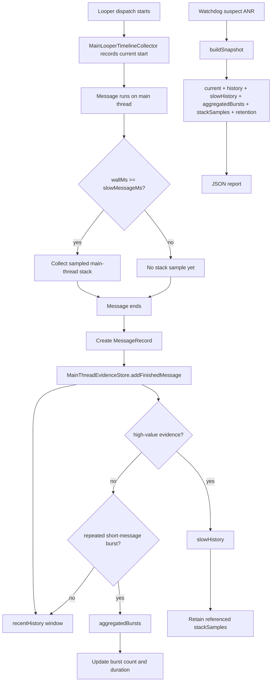

# ANR Evidence Retention Design

## Background

Current SDK reports are event snapshots, not full Handler logs. This is intentional, but the current implementation keeps completed main-thread messages mainly through a count-based `MessageRingBuffer`. With the default `historyBufferSize = 120`, a real historical slow message can be evicted if many short messages execute after it before the watchdog snapshot is built.

That means a JSON report can still contain the final main-thread stack, pending queue, and recent history, but lose the true historical root-cause message and the stack samples that explain it. This is especially likely in message storm scenarios.

The design goal is to reduce that evidence loss without turning the SDK into an unbounded logger.

## Goals

- Preserve historical slow messages even when ordinary short messages flood the main thread afterward.
- Keep slow-message stack samples linked to the message records that caused them.
- Represent short-message storms as aggregates instead of letting repeated short messages occupy the whole history window.
- Extend the JSON protocol compatibly by adding fields under `mainThread` while keeping existing fields readable.
- Expose retention and truncation metadata so report readers know whether evidence was dropped or aggregated.
- Keep runtime overhead bounded and compatible with the existing SDK architecture.

## Non-Goals

- Do not record every Handler message from process start.
- Do not change minSdk, compileSdk, AGP, Kotlin version, or add dependencies.
- Do not introduce server-side processing or change upload semantics.
- Do not rewrite the whole JSON schema.
- Do not implement native hooks, bytecode instrumentation, or hidden API expansion.

## Current Gap

The current data path is:

```text
Looper Printer -> MainLooperTimelineCollector -> MessageRingBuffer -> AnrSnapshot -> JSON history
```

The risk is that `MessageRingBuffer` is a single recent-message window. It treats ordinary short messages and high-value slow messages as records competing for the same capacity. Once a slow message is evicted, a later ANR snapshot cannot reconstruct that message or reliably explain its process stack samples.

The design documents already describe short-message aggregation, slow-message splitting, and component-message prioritization. This design aligns implementation with that intent.

## Chosen Approach

Use a compatible protocol extension plus a layered in-memory evidence store.

Existing JSON fields remain:

```json
{
  "mainThread": {
    "current": {},
    "history": [],
    "stackFrames": [],
    "stackSamples": []
  }
}
```

New fields are added under `mainThread`:

```json
{
  "mainThread": {
    "slowHistory": [],
    "aggregatedBursts": [],
    "retention": {}
  }
}
```

Semantic split:

- `history`: the recent main-thread dispatch window, preserving current compatibility.
- `slowHistory`: high-value historical messages that should not be evicted by ordinary short messages.
- `aggregatedBursts`: summaries of repeated short-message bursts.
- `retention`: limits, dropped counts, aggregation counts, and truncation state.

## Architecture

Add a main-thread evidence store:

```text
MainLooperTimelineCollector
  parses Looper Printer logs, tracks current dispatch, produces MessageRecord and stack sample records

MainThreadEvidenceStore
  owns recentHistory, slowHistory, aggregatedBursts, retained stack samples, and retention counters

AnrMonitorRuntime
  reads a stable evidence snapshot during buildSnapshot()

AnrReportJsonEncoder
  emits compatible mainThread JSON with the new fields

AttributionAnalyzer
  uses slowHistory before ordinary history when identifying historical slow-message root cause
```

The timeline collector should remain focused on Looper parsing and current-message state. Evidence retention decisions should move into `MainThreadEvidenceStore`, where they can be tested without Android Looper dependencies.

## Data Flow



## Retention Rules

### Recent History

- Keep using `historyBufferSize` as the recent-history limit.
- Preserve the existing `mainThread.history` meaning as a recent ordered window.
- Count records evicted from recent history in `retention.historyDroppedCount`.

### Slow History

Add a bounded slow-message buffer. A finished message enters `slowHistory` when any condition is true:

- `wallMs >= slowMessageMs`.
- `sampleStackIds` is not empty.
- `isCriticalComponent == true` and `wallMs >= shortMessageAggregateMs`.

Default capacity:

```text
slowHistoryLimit = 20
```

If this buffer overflows, evict the oldest slow-history record and increment `retention.slowHistoryDroppedCount`. This makes evidence loss visible instead of silent.

### Aggregated Bursts

Repeated short messages should be summarized instead of filling history. A burst is keyed by:

```text
targetClass + callbackClass + what + messageType
```

A burst can be emitted when repeated messages are contiguous and either:

- count reaches `messageBurstCountThreshold = 20`, or
- accumulated wall time reaches `shortMessageAggregateMs`.

Default capacity:

```text
aggregatedBurstLimit = 20
```

Aggregated records use existing `MessageRecord` shape with:

```text
kind = AGGREGATED
count > 1
wallMs = accumulated wall time
cpuMs = accumulated CPU time
startUptimeMs/endUptimeMs = aggregation range
```

### Stack Samples

Stack samples must be retained if referenced by:

- the current message snapshot,
- any message in `slowHistory`.

Unreferenced samples can be dropped first when limits are exceeded. Default capacity:

```text
retainedStackSampleLimit = 60
```

When trimming is required, keep referenced samples before unreferenced samples. If referenced samples alone exceed the limit, retain the newest referenced samples and mark truncation in `retention.truncated`.

## JSON Fields

`slowHistory` uses the same message encoding as `history`:

```json
{
  "seq": 1024,
  "kind": "HISTORY",
  "messageType": "looper_dispatch",
  "what": 159,
  "targetClass": "android.app.ActivityThread$H",
  "callbackClass": null,
  "isCriticalComponent": true,
  "startUptimeMs": 123000,
  "endUptimeMs": 132800,
  "wallMs": 9800,
  "cpuMs": 120,
  "count": 1,
  "sampleStackIds": ["stack-a", "stack-b"]
}
```

`aggregatedBursts` also uses message encoding, with `kind = AGGREGATED`:

```json
{
  "seq": 1100,
  "kind": "AGGREGATED",
  "messageType": "looper_dispatch",
  "what": 0,
  "targetClass": "com.example.MainHandler",
  "callbackClass": "com.example.RefreshRunnable",
  "isCriticalComponent": false,
  "startUptimeMs": 133000,
  "endUptimeMs": 134200,
  "wallMs": 1200,
  "cpuMs": 900,
  "count": 240,
  "sampleStackIds": []
}
```

`retention` explains evidence completeness:

```json
{
  "historyLimit": 120,
  "slowHistoryLimit": 20,
  "aggregatedBurstLimit": 20,
  "stackSampleLimit": 60,
  "historyDroppedCount": 380,
  "slowHistoryDroppedCount": 0,
  "aggregatedMessageCount": 240,
  "aggregationEnabled": true,
  "truncated": true
}
```

## Attribution Changes

Attribution should prefer high-value stores:

```text
1. Barrier and pending evidence still remain high priority where applicable.
2. Current message slow remains CURRENT_MESSAGE_SLOW.
3. Historical slow-message analysis should inspect slowHistory before ordinary history.
4. Message storm analysis should inspect aggregatedBursts and pending queue repetition.
5. If retention indicates dropped slow-history records, UNKNOWN_INSUFFICIENT_EVIDENCE should mention the evidence gap.
```

This avoids over-trusting a clean-looking recent `history` window when `retention` says older evidence was dropped.

## Edge Cases

- If a slow message was never sampled, it can still enter `slowHistory` based on wall time.
- If a message was sampled but later evicted from recent history, it remains explainable through `slowHistory` and retained `stackSamples`.
- If a message storm continues after a slow message, the storm is summarized and cannot silently erase the slow message.
- If Looper Printer is replaced by another SDK, existing conflict diagnostics remain the source of truth; this design does not solve printer slot loss.
- If pending queue reflection fails, retention metadata still helps explain whether main-thread historical evidence was complete.
- If JSON budget is tight, low-value ordinary history is trimmed before `slowHistory` and referenced stack samples.

## Testing Plan

Unit tests:

- `MainThreadEvidenceStore` keeps a slow message after 500 later short messages.
- Slow messages retain referenced stack sample IDs and sample records.
- Critical component messages above `shortMessageAggregateMs` enter `slowHistory`.
- Repeated short messages create an `AGGREGATED` burst with expected count, wall time, CPU time, and range.
- Retention counters increment when recent history, slow history, bursts, or stack samples are trimmed.
- Snapshot results are immutable copies and cannot mutate store state.

Encoder tests:

- `AnrReportJsonEncoder` emits `slowHistory`, `aggregatedBursts`, and `retention`.
- Existing `history`, `current`, `stackFrames`, and `stackSamples` fields remain present.
- JSON contains `AGGREGATED` records with `count > 1`.

Analyzer tests:

- Historical slow-message attribution prefers `slowHistory` when recent `history` no longer contains the slow message.
- Message storm attribution can use `aggregatedBursts`.
- Evidence gaps are reported when slow-history truncation occurs.

Acceptance-style tests:

- A real slow message followed by hundreds of short messages still appears in JSON `slowHistory`.
- A short-message storm does not fill the entire useful evidence window.
- Current-message slow and Barrier scenarios keep their existing attribution behavior.

## Documentation Updates

Update these files when implementing:

- `README.md`: add `slowHistory`, `aggregatedBursts`, and `retention` to JSON report explanation.
- `docs-anr/102-ANR监控SDK服务端消费协议.md`: define new fields and service-side semantics.
- `docs-anr/104-ANR监控JSON日志根因排查指南.md`: update reading order to include `slowHistory` before ordinary `history`.
- `docs-anr/99-ANR监控SDK设计开发文档.md`: align the previously described aggregation and slow-message splitting strategy with implementation.
- Relevant acceptance records if behavior changes existing sample interpretation.

## Validation Commands

Because this changes SDK Kotlin and JSON protocol behavior, run at least:

```bash
./gradlew :anr-monitor-sdk:testDebugUnitTest
./gradlew :anr-monitor-sdk:compileDebugKotlin
```

If app-facing docs or demo scenarios change, also run:

```bash
./gradlew :app:testDebugUnitTest
```

## Rollout Strategy

Implement in small steps:

1. Add domain models for evidence retention snapshot.
2. Add `MainThreadEvidenceStore` and unit tests.
3. Wire `MainLooperTimelineCollector` and `AnrMonitorRuntime` to the store.
4. Extend report models and JSON encoder.
5. Update attribution.
6. Update docs and acceptance guidance.

This keeps behavior reviewable and allows tests to prove each layer before changing report consumers.

## Success Criteria

- Historical slow messages survive ordinary short-message churn.
- JSON reports clearly distinguish recent history from high-value retained slow evidence.
- Stack samples referenced by retained slow messages remain available.
- Message storms are represented as aggregates instead of silently evicting root-cause evidence.
- Existing consumers that only read `mainThread.history` continue to work.
- New fields expose enough retention metadata to avoid false confidence when evidence is incomplete.
